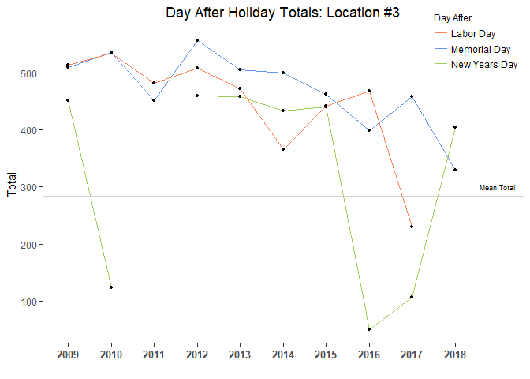
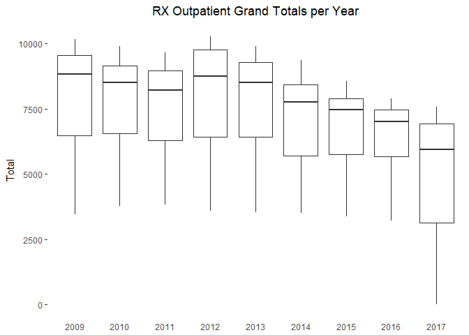
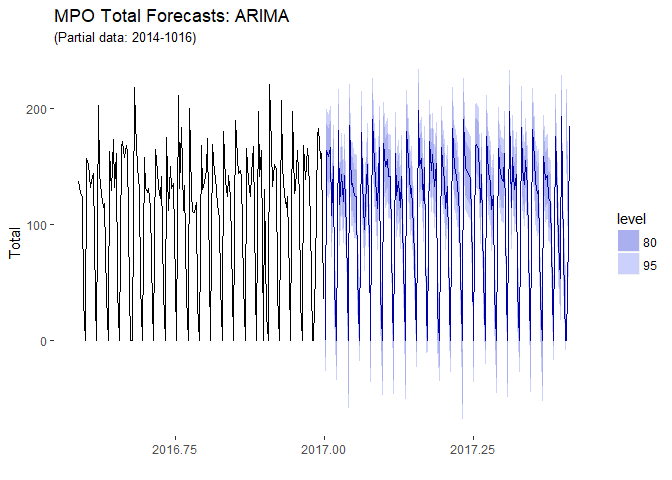
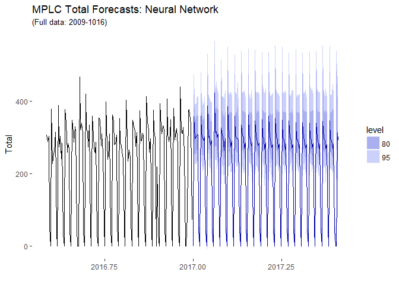
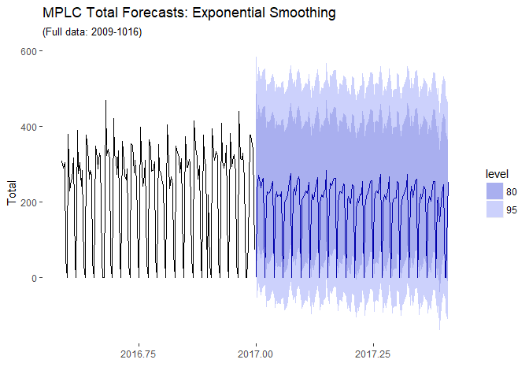

Time Series Analysis: Outpatient Pharmacy RX Volume
================
Joel Neitman
September 9, 2005

``` r
library(stats)
library(forecast)
library(zoo)
```

    ## 
    ## Attaching package: 'zoo'

    ## The following objects are masked from 'package:base':
    ## 
    ##     as.Date, as.Date.numeric

``` r
library(scales)
library(xts)
library(dplyr)
```

    ## 
    ## Attaching package: 'dplyr'

    ## The following objects are masked from 'package:xts':
    ## 
    ##     first, last

    ## The following objects are masked from 'package:stats':
    ## 
    ##     filter, lag

    ## The following objects are masked from 'package:base':
    ## 
    ##     intersect, setdiff, setequal, union

``` r
library(lubridate)
```

    ## 
    ## Attaching package: 'lubridate'

    ## The following object is masked from 'package:base':
    ## 
    ##     date

``` r
library(ggplot2)
library(RColorBrewer)
library(MASS)
```

    ## 
    ## Attaching package: 'MASS'

    ## The following object is masked from 'package:dplyr':
    ## 
    ##     select

``` r
library(tseries)
```

Load data and exploratory analysis

``` r
MPO = read.csv("MPO_totals_only.csv")
MPCC = read.csv("MPCC_totals_only.csv")
MPLC = read.csv("MPLC_totals_only.csv")
MPDT = read.csv("MPDT_totals_only.csv")

#set to a calendar date format
MPO$date = as.Date(MPO$Date, format = "%m/%d/%Y")
MPO_DF = data.frame(date = MPO$date, Total = MPO$Total)

MPCC$date = as.Date(MPCC$Date, format = "%m/%d/%Y")
MPCC_DF = data.frame(date = MPCC$date, Total = MPCC$Total)

MPLC$date = as.Date(MPLC$Date, format = "%m/%d/%Y")
MPLC_DF = data.frame(date = MPLC$date, Total = MPLC$Total)

MPDT$Date = as.Date(MPDT$Date, format = "%m/%d/%Y")
MPDT_DF = data.frame("date" = MPDT$Date, "Total" = MPDT$Total)
```

Load most current data

``` r
MPO_NEW = read.csv("MPO_NEW.csv")
MPCC_NEW = read.csv("MPCC_NEW.csv")
MPLC_NEW = read.csv("MPLC_NEW.csv")

MPO_NEW$Date = as.Date(MPO_NEW$Date, format = "%m/%d/%Y")
MPO_DF_NEW = data.frame(date = MPO_NEW$Date, Total = MPO_NEW$Total)

MPCC_NEW$Date = as.Date(MPCC_NEW$Date, format = "%m/%d/%Y")
MPCC_DF_NEW = data.frame(date = MPCC_NEW$Date, Total = MPCC_NEW$Total)

MPLC_NEW$Date = as.Date(MPLC_NEW$Date, format = "%m/%d/%Y")
MPLC_DF_NEW = data.frame(date = MPLC_NEW$Date, Total = MPLC_NEW$Total)
```

Add in missing dates from the extractions to have a complete timeframe for each location.

``` r
all_dates = seq(as.Date(as.yearmon(min(MPO_DF$date))), as.Date("2018-05-31"), by = "day")

MPO_posts_by_date_clean = merge(data.frame(date = all_dates), MPO_DF, by.x = "date", by.y = "date", all.x = T, all.y = T)
MPO_posts_by_date_clean$Total[is.na(MPO_posts_by_date_clean$Total)] = NA
MPO_DF_Full = MPO_posts_by_date_clean

MPCC_posts_by_date_clean = merge(data.frame(date = all_dates), MPCC_DF, by.x = "date", by.y = "date", all.x = T, all.y = T)
MPCC_posts_by_date_clean$Total[is.na(MPCC_posts_by_date_clean$Total)] = NA
MPCC_DF_Full = MPCC_posts_by_date_clean

MPLC_posts_by_date_clean = merge(data.frame(date = all_dates), MPLC_DF, by.x = "date", by.y = "date", all.x = T, all.y = T)
MPLC_posts_by_date_clean$Total[is.na(MPLC_posts_by_date_clean$Total)] = NA
MPLC_DF_Full = MPLC_posts_by_date_clean

MPDT_posts_by_date_clean = merge(data.frame(date = all_dates), MPDT_DF, by.x = "date", by.y = "date", all.x = T, all.y = T)
MPDT_posts_by_date_clean$Total[is.na(MPDT_posts_by_date_clean$Total)] = NA
MPDT_DF_Full = MPDT_posts_by_date_clean
```

Merge all old and current data; reorder levels of weekday names; make all sundays for mpo and mplc NA

``` r
all_dates2 = seq(as.Date(as.yearmon(min(MPO_DF_NEW$date))), as.Date("2018-07-18"), by = "day")

MPO_ALL = merge(data.frame(date = all_dates2), MPO_DF_NEW, by.x = "date", by.y = "date", all.x = T, all.y = T)
MPO_ALL = MPO_ALL[which(MPO_ALL$date == "2018-06-01"):length(MPO_ALL$date),]
MPO_ALL = rbind(MPO_DF_Full, MPO_ALL)

MPCC_ALL = merge(data.frame(date = all_dates2), MPCC_DF_NEW, by.x = "date", by.y = "date", all.x = T, all.y = T)
MPCC_ALL = MPCC_ALL[which(MPCC_ALL$date == "2018-06-01"):length(MPCC_ALL$date),]
MPCC_ALL = rbind(MPCC_DF_Full, MPCC_ALL)

MPLC_ALL = merge(data.frame(date = all_dates2), MPLC_DF_NEW, by.x = "date", by.y = "date", all.x = T, all.y = T)
MPLC_ALL = MPLC_ALL[which(MPLC_ALL$date == "2018-06-01"):length(MPLC_ALL$date),]
MPLC_ALL = rbind(MPLC_DF_Full, MPLC_ALL)

MPO_DF_Full = MPO_ALL
MPCC_DF_Full = MPCC_ALL
MPLC_DF_Full = MPLC_ALL

MPO_DF_Full$day = as.factor(weekdays(MPO_DF_Full$date))
MPO_DF_Full$day=factor(MPO_DF_Full$day , levels=levels(MPO_DF_Full$day)[c(4,2,6,7,5,1,3)])
MPO_DF_Full$month = as.factor(month(MPO_DF_Full$date))

MPCC_DF_Full$day = as.factor(weekdays(MPCC_DF_Full$date))
MPCC_DF_Full$day=factor(MPCC_DF_Full$day , levels=levels(MPCC_DF_Full$day)[c(4,2,6,7,5,1,3)])
MPCC_DF_Full$month = as.factor(month(MPCC_DF_Full$date))

MPLC_DF_Full$day = as.factor(weekdays(MPLC_DF_Full$date))
MPLC_DF_Full$day=factor(MPLC_DF_Full$day , levels=levels(MPLC_DF_Full$day)[c(4,2,6,7,5,1,3)])
MPLC_DF_Full$month = as.factor(month(MPLC_DF_Full$date))

MPDT_DF_Full$day = as.factor(weekdays(MPDT_DF_Full$date))
MPDT_DF_Full$day=factor(MPDT_DF_Full$day , levels=levels(MPDT_DF_Full$day)[c(4,2,6,7,5,1,3)])
MPDT_DF_Full$month = as.factor(month(MPDT_DF_Full$date))

MPO_DF_Full$Total[which(MPO_DF_Full$day == "Sunday")] = NA
MPLC_DF_Full$Total[which(MPLC_DF_Full$day == "Sunday")] = NA
```

Remove holidays

``` r
library(timeDate);library(chron)
```

    ## 
    ## Attaching package: 'chron'

    ## The following object is masked from 'package:tseries':
    ## 
    ##     is.weekend

    ## The following objects are masked from 'package:lubridate':
    ## 
    ##     days, hours, minutes, seconds, years

``` r
hlist <- c("USChristmasDay","USMemorialDay","USIndependenceDay","USLaborDay",
    "USNewYearsDay","USThanksgivingDay")        
myholidays  <- dates(as.character(holiday(2009:2018,hlist)),format="Y-M-D")
MPO_DF_Full$Total[is.holiday(MPO_DF_Full$date,myholidays)] = NA
MPO_DF_Full$Total[which(month(MPO_DF_Full$date) == 12 & day(MPO_DF_Full$date) == 24)] = NA

MPCC_DF_Full$Total[is.holiday(MPCC_DF_Full$date,myholidays)] = NA
MPCC_DF_Full$Total[which(month(MPCC_DF_Full$date) == 12 & day(MPCC_DF_Full$date) == 24)] = NA

MPLC_DF_Full$Total[is.holiday(MPLC_DF_Full$date,myholidays)] = NA
MPLC_DF_Full$Total[which(month(MPLC_DF_Full$date) == 12 & day(MPLC_DF_Full$date) == 24)] = NA

MPDT_DF_Full$Total[is.holiday(MPDT_DF_Full$date,myholidays)] = NA
MPDT_DF_Full$Total[which(month(MPDT_DF_Full$date) == 12 & day(MPDT_DF_Full$date) == 24)] = NA
```

Plot all data starting from 2009 -- scatterplot

``` r
plot(MPO_DF_Full$Total, pch = 20, cex = .6, xaxt = "n", yaxt = "n", bty = "n", ylab = "Total", xlab = "", cex.lab = .9)
axis(1, lty = 0, at = seq(0,3288,365),labels = c("'09", "'10", "'11", "'12", "'13", "'14", "'15", "'16", "'17", "'18"), cex.axis = .7)
axis(2, cex.axis = .7, lty = 1, las = 2)
axis(2, col = "white", tck = 0, labels = F)
title(main = "Location #1 Daily RX Totals Between 1/1/2009 and 7/18/2018", cex.main = .8)
abline(v = seq(1, 3287, 365), col = alpha("blue", .7), lty = 2)
```


``` r
# text(-90,333, labels = "a.", cex = .8, font = 2)

plot(MPCC_DF_Full$Total, pch = 20, cex = .6, xaxt = "n", yaxt = "n", bty = "n", ylab = "Total", xlab = "", cex.lab = .9)
axis(1, lty = 0, at = seq(0,3288,365),labels = c("'09", "'10", "'11", "'12", "'13", "'14", "'15", "'16", "'17", "'18"), cex.axis = .7)
axis(2, cex.axis = .7, lty = 1, las = 2)
axis(2, col = "white", tck = 0, labels = F)
title(main = "Location #2 Daily RX Totals Between 1/1/2009 and 7/18/2018", cex.main = .8)
abline(v = seq(1, 3287, 365), col = alpha("blue", .7), lty = 2)
```


``` r
# text(-90,619, labels = "b.", cex = .8, font = 2)


plot(MPLC_DF_Full$Total, pch = 20, cex = .6, xaxt = "n", yaxt = "n", bty = "n", ylab = "Total", xlab = "Time (Days per Year)", cex.lab = .9)
axis(1, lty = 0, at = seq(0,3288,365),labels = c("'09", "'10", "'11", "'12", "'13", "'14", "'15", "'16", "'17", "'18"), cex.axis = .7)
axis(2, cex.axis = .7, lty = 1, las = 2)
axis(2, col = "white", tck = 0, labels = F)
title(main = "Location #3 Daily RX Totals Between 1/1/2009 and 7/18/2018", cex.main = .8)
abline(v = seq(1, 3287, 365), col = alpha("blue", .7), lty = 2)
```


``` r
# text(-90,580, labels = "c.", cex = .8, font = 2)
```

Plot data from 2016 to 2018 then plot data from the start of 2018 -- line

``` r
par(mfrow = c(2,1))
MPO.16 = MPO_DF_Full[which(MPO_DF_Full$date == "2016-01-01"):length(MPO_DF_Full$date),]
plot(MPO.16$Total ~ MPO.16$date, type = "line", bty = "n", xlab = "Time (day per year)", yaxt = "n", xaxt = "n", ylab = "Total", ylim = c(0,300), lwd = 1, cex.axis = .8)
```

    ## Warning in plot.xy(xy, type, ...): plot type 'line' will be truncated to
    ## first character

``` r
axis(2, las = 2, labels = T, cex.axis = .6)
axis(2, col = "white", tck = 0, labels = F)
axis(1, col = "white", tck = 0, labels = c("2016", "2017", "2018"), at = c(16801,17166,17532), cex.axis = .8)
abline(v = c(16801,17166,17532), lty = 2, col = alpha("blue", .7))
title(main = "Location #1 RX Totals Since 2016", cex.main = .8, cex.sub = .6)

MPO.18 = MPO_DF_Full[which(MPO_DF_Full$date == "2018-01-01"):length(MPO_DF_Full$date),]
plot(MPO.18$Total ~ MPO.18$date, type = "line", bty = "n", xlab = "Time (day per month)", ylab = "Total", ylim = c(0,200), lwd = 2, cex.axis = .8, xaxt = "n", yaxt = "n")
```

    ## Warning in plot.xy(xy, type, ...): plot type 'line' will be truncated to
    ## first character

``` r
axis(2, las = 2, labels = T, cex.axis = .6)
axis(2, col = "white", tck = 0, labels = F)
axis(1, col = "white", tck = 0, labels = c("Jan", "Feb", "Mar", "Apr", "May","Jun","Jul"), at = c(17532,17563,17591,17622,17652,17683,17713), cex.axis = .8)
abline(v = c(17532,17563,17591,17622,17652,17683,17713), lty = 2, col = alpha("blue", .7))
title(main = "Location #1 RX Totals in 2018", cex.main = .8, cex.sub = .6)
```


``` r
par(mfrow = c(2,1))
MPCC.16 = MPCC_DF_Full[which(MPCC_DF_Full$date == "2016-01-01"):length(MPCC_DF_Full$date),]
plot(MPCC.16$Total ~ MPCC.16$date, type = "line", bty = "n", xlab = "Time (day per year)", yaxt = "n", xaxt = "n", ylab = "Total", ylim = c(0,600), lwd = 1, cex.axis = .8)
```

    ## Warning in plot.xy(xy, type, ...): plot type 'line' will be truncated to
    ## first character

``` r
axis(2, las = 2, labels = T, cex.axis = .6)
axis(2, col = "white", tck = 0, labels = F)
axis(1, col = "white", tck = 0, labels = c("2016", "2017", "2018"), at = c(16801,17166,17532), cex.axis = .8)
abline(v = c(16801,17166,17532), lty = 2, col = alpha("blue", .7))
title(main = "Location #2 RX Totals Since 2016", cex.main = .8, cex.sub = .6)

MPCC.18 = MPCC_DF_Full[which(MPCC_DF_Full$date == "2018-01-01"):length(MPCC_DF_Full$date),]
plot(MPCC.18$Total ~ MPCC.18$date, type = "line", bty = "n", xlab = "Time (day per month)", ylab = "Total", ylim = c(0,600), lwd = 2, cex.axis = .8, xaxt = "n", yaxt = "n")
```

    ## Warning in plot.xy(xy, type, ...): plot type 'line' will be truncated to
    ## first character

``` r
axis(2, las = 2, labels = T, cex.axis = .6)
axis(2, col = "white", tck = 0, labels = F)
axis(1, col = "white", tck = 0, labels = c("Jan", "Feb", "Mar", "Apr", "May","Jun","Jul"), at = c(17532,17563,17591,17622,17652,17683,17713), cex.axis = .8)
abline(v = c(17532,17563,17591,17622,17652,17683,17713), lty = 2, col = alpha("blue", .7))
title(main = "Location #2 RX Totals in 2018", cex.main = .8, cex.sub = .6)
```


``` r
par(mfrow = c(2,1))
MPLC.16 = MPLC_DF_Full[which(MPLC_DF_Full$date == "2016-01-01"):length(MPLC_DF_Full$date),]
plot(MPLC.16$Total ~ MPLC.16$date, type = "line", bty = "n", xlab = "Time (day per year)", yaxt = "n", xaxt = "n", ylab = "Total", ylim = c(0,500), lwd = 1, cex.axis = .8)
```

    ## Warning in plot.xy(xy, type, ...): plot type 'line' will be truncated to
    ## first character

``` r
axis(2, las = 2, labels = T, cex.axis = .6)
axis(2, col = "white", tck = 0, labels = F)
axis(1, col = "white", tck = 0, labels = c("2016", "2017", "2018"), at = c(16801,17166,17532), cex.axis = .8)
abline(v = c(16801,17166,17532), lty = 2, col = alpha("blue", .7))
title(main = "Location #3 RX Totals Since 2016", cex.main = .8, cex.sub = .6)

MPLC.18 = MPLC_DF_Full[which(MPLC_DF_Full$date == "2018-01-01"):length(MPLC_DF_Full$date),]
plot(MPLC.18$Total ~ MPLC.18$date, type = "line", bty = "n", xlab = "Time (day per month)", yaxt = "n", ylab = "Total", ylim = c(0,500), lwd = 2, cex.axis = .8, xaxt = "n")
```

    ## Warning in plot.xy(xy, type, ...): plot type 'line' will be truncated to
    ## first character

``` r
axis(2, las = 2, labels = T, cex.axis = .6)
axis(2, col = "white", tck = 0, labels = F)
axis(1, col = "white", tck = 0, labels = c("Jan", "Feb", "Mar", "Apr", "May","Jun","Jul"), at = c(17532,17563,17591,17622,17652,17683,17713), cex.axis = .8)
abline(v = c(17532,17563,17591,17622,17652,17683,17713), lty = 2, col = alpha("blue", .7))
title(main = "Location #3 RX Totals in 2018", cex.main = .8, cex.sub = .6)
```


Plot data grouped by MONTH & YEAR up until 7/18/2018 -- boxplots

``` r
par(mar = c(4, 4, 1.5,1.5))
boxplot(MPO_DF_Full$Total ~ month(MPO_DF_Full$date) + year(MPO_DF_Full$date), medpch = 20, medlty = 0, boxlty = 0, whisklty = 1, whisklwd = 1.8, staplelty = 0, frame.plot = F, ylab = "Total", ylim = c(0,350), xlim = c(0,130), xaxt = "n", yaxt = "n", cex = .8, main = "Location #1 Monthly RX Totals Between 1/1/2009 and 7/18/2018", cex.main = .9, xlab = "Time (Months per Year)", outline = T, outcol = "gray", outpch = 20, outcex = .4)
axis(1, lty = 0, labels = c("'09", "'10", "'11", "'12", "'13", "'14", "'15", "'16", "'17", "'18"), at = seq(1, 113, 12), cex.axis = 0.7, pos = 1)
axis(2, labels = F)
axis(2, las = 2, cex.axis = .7, col = "white", tck = 0)
abline(v = seq(1, 120, 12), col = alpha("blue", .7), lty = 2)
abline(v = 103, col = alpha("red", .7))
legend(85,364, legend = c("New year", "Epic"), col = c(alpha("blue", .8), alpha("red", .8)), lty = c(2,1), cex = .8, box.lty = 0, ncol = 1, xpd = T)
```


``` r
#outliers removed

dat1 = data.frame("date" = MPO_DF_Full$date[which(year(MPO_DF_Full$date) == 2015)], value = MPO_DF_Full$Total[which(year(MPO_DF_Full$date) == 2015)])
dat2 = data.frame("date" = MPO_DF_Full$date[which(year(MPO_DF_Full$date) == 2016)], value = MPO_DF_Full$Total[which(year(MPO_DF_Full$date) == 2016)])
dat22 = data.frame("date" = MPO_DF_Full$date[which(year(MPO_DF_Full$date) == 2017)], value = MPO_DF_Full$Total[which(year(MPO_DF_Full$date) == 2017)])
dat3 = rbind(dat1,dat2,dat22)
dat3 = aggregate(dat3$value~month(dat3$date) + year(dat3$date),FUN = sum)
ggplot(dat3) + geom_bar(aes(x = dat3$`month(dat3$date)`, y = dat3$`dat3$value`, fill = as.factor(dat3$`year(dat3$date)`)), stat = "identity", position = "dodge", width = .6) +
  scale_x_discrete(limits = seq(1,12,1), labels = month.abb) +
  theme(
    panel.background = element_blank(),
    plot.title = element_text(hjust = .5)
  ) +
  labs(x ="", y="Total") +
  scale_fill_manual(name = "Year", values = c("coral", "cornflowerblue", "chartreuse3"))+
  ggtitle("Month Totals per Year: Location #1")
```


``` r
par(mar = c(4, 4, 1.5,1.5))
boxplot(MPCC_DF_Full$Total ~ month(MPCC_DF_Full$date) + year(MPCC_DF_Full$date), medpch = 20, medlty = 0, boxlty = 0, whisklty = 1, whisklwd = 1.8, staplelty = 0, frame.plot = F, ylab = "Total", ylim = c(0,650), xlim = c(0,130), xaxt = "n", yaxt = "n", cex = .8, main = "Location #2 Monthly RX Totals Between 1/1/2009 and 7/18/2018", cex.main = .9, xlab = "Time (Months per Year)", outline = T, outcol = "gray", outpch = 20, outcex = .4)
axis(1, lty = 0, labels = c("'09", "'10", "'11", "'12", "'13", "'14", "'15", "'16", "'17", "'18"), at = seq(1, 113, 12), cex.axis = 0.7, pos = 1)
axis(2, labels = F)
axis(2, las = 2, cex.axis = .7, col = "white", tck = 0)
abline(v = seq(1, 120, 12), col = alpha("blue", .7), lty = 2)
abline(v = 103, col = alpha("red", .7))
legend(85,680, legend = c("New year", "Epic"), col = c(alpha("blue", .8), alpha("red", .8)), lty = c(2,1), cex = .8, box.lty = 0, ncol = 1, xpd = T)
```


``` r
#outliers removed

dat1 = data.frame("date" = MPCC_DF_Full$date[which(year(MPCC_DF_Full$date) == 2015)], value = MPCC_DF_Full$Total[which(year(MPCC_DF_Full$date) == 2015)])
dat2 = data.frame("date" = MPCC_DF_Full$date[which(year(MPCC_DF_Full$date) == 2016)], value = MPCC_DF_Full$Total[which(year(MPCC_DF_Full$date) == 2016)])
dat22 = data.frame("date" = MPCC_DF_Full$date[which(year(MPCC_DF_Full$date) == 2017)], value = MPCC_DF_Full$Total[which(year(MPCC_DF_Full$date) == 2017)])
dat3 = rbind(dat1,dat2,dat22)
dat3 = aggregate(dat3$value~month(dat3$date) + year(dat3$date),FUN = sum)
ggplot(dat3) + geom_bar(aes(x = dat3$`month(dat3$date)`, y = dat3$`dat3$value`, fill = as.factor(dat3$`year(dat3$date)`)), stat = "identity", position = "dodge", width = .6) +
  scale_x_discrete(limits = seq(1,12,1), labels = month.abb) +
  theme(
    panel.background = element_blank(),
    plot.title = element_text(hjust = .5)
  ) +
  labs(x ="", y="Total") +
  scale_fill_manual(name = "Year", values = c("coral", "cornflowerblue", "chartreuse3"))+
  ggtitle("Month Totals per Year: Location #2")
```


``` r
par(mar = c(4, 4, 1.5,1.5))
boxplot(MPLC_DF_Full$Total ~ month(MPLC_DF_Full$date) + year(MPLC_DF_Full$date), medpch = 20, medlty = 0, boxlty = 0, whisklty = 1, whisklwd = 1.8, staplelty = 0, frame.plot = F, ylab = "Total", ylim = c(0,600), xlim = c(0,130), xaxt = "n", yaxt = "n", cex = .8, main = "Location #3 Monthly RX Totals Between 1/1/2009 and 7/18/2018", cex.main = .9, xlab = "Time (Months per Year)", outline = T, outcol = "gray", outpch = 20, outcex = .4)
axis(1, lty = 0, labels = c("'09", "'10", "'11", "'12", "'13", "'14", "'15", "'16", "'17", "'18"), at = seq(1, 113, 12), cex.axis = 0.7, pos = 1)
axis(2, labels = F)
axis(2, las = 2, cex.axis = .7, col = "white", tck = 0)
abline(v = seq(1, 120, 12), col = alpha("blue", .7), lty = 2)
abline(v = 103, col = alpha("red", .7))
legend(85,630, legend = c("New year", "Epic"), col = c(alpha("blue", .8), alpha("red", .8)), lty = c(2,1), cex = .8, box.lty = 0, ncol = 1, xpd = T)
```


``` r
#outliers removed


dat1 = data.frame("date" = MPLC_DF_Full$date[which(year(MPLC_DF_Full$date) == 2015)], value = MPLC_DF_Full$Total[which(year(MPLC_DF_Full$date) == 2015)])
dat2 = data.frame("date" = MPLC_DF_Full$date[which(year(MPLC_DF_Full$date) == 2016)], value = MPLC_DF_Full$Total[which(year(MPLC_DF_Full$date) == 2016)])
dat22 = data.frame("date" = MPLC_DF_Full$date[which(year(MPLC_DF_Full$date) == 2017)], value = MPLC_DF_Full$Total[which(year(MPLC_DF_Full$date) == 2017)])
dat3 = rbind(dat1,dat2,dat22)
dat3 = aggregate(dat3$value~month(dat3$date) + year(dat3$date),FUN = sum)

ggplot(dat3) + geom_bar(aes(x = dat3$`month(dat3$date)`, y = dat3$`dat3$value`, fill = as.factor(dat3$`year(dat3$date)`)), stat = "identity", position = "dodge", width = .6) +
  scale_x_discrete(limits = seq(1,12,1), labels = month.abb) +
  theme(
    panel.background = element_blank(),
    plot.title = element_text(hjust = .5)
  ) +
  labs(x ="", y="Total") +
  scale_fill_manual(name = "Year", values = c("coral", "cornflowerblue", "chartreuse3"))+
  ggtitle("Month Totals per Year: Location #3")
```


Plot data grouped by MONTH up until the end of 2017 -- boxplots

``` r
mylabs = c("Jan", "Feb", "Mar", "Apr", "May", "Jun", "Jul", "Aug", "Sep", "Oct", "Nov", "Dec")
MPO_month_box = ggplot(MPO_DF_Full[which(MPO_DF_Full$date <= "2017-12-31"),], aes(x = month, y = Total, group = month)) + geom_boxplot(outlier.size = .9, outlier.color = NA, na.rm = T)
MPO_month_box = MPO_month_box + scale_x_discrete("", limit = seq(1,12,1), labels = mylabs)
MPO_month_box = MPO_month_box + theme(
  panel.grid.major = element_blank(),
  panel.grid.minor = element_blank(),
  panel.border = element_blank(),
  panel.background = element_blank()
)
MPO_month_box = MPO_month_box + ggtitle("Location #1 RX Total Plot per Month Between 2009 to 2017") + theme(
  plot.title = element_text(hjust = .5, vjust = -4, size = 15, face = "bold"),
  axis.ticks.x = element_blank(),
  axis.text.x = element_text(face = "bold", size = 12),
  axis.text.y = element_text(face = "bold", size = 10)
  )
#outliers removed

MPO_month_box
```


``` r
MPCC_month_box = ggplot(MPCC_DF_Full[which(MPO_DF_Full$date <= "2017-12-31"),], aes(x = month, y = Total, group = month)) + geom_boxplot(outlier.size = .9, outlier.color = NA, na.rm = T)
MPCC_month_box = MPCC_month_box + scale_x_discrete("", limit = seq(1,12,1), labels = mylabs)
MPCC_month_box = MPCC_month_box + theme(
  panel.grid.major = element_blank(),
  panel.grid.minor = element_blank(),
  panel.border = element_blank(),
  panel.background = element_blank()
)
MPCC_month_box = MPCC_month_box + ggtitle("Location #2 RX Total Plot per Month Between 2009 to 2017") + theme(
  plot.title = element_text(hjust = .5, vjust = -4, size = 15, face = "bold"),
  axis.ticks.x = element_blank(),
  axis.text.x = element_text(face = "bold", size = 12),
  axis.text.y = element_text(face = "bold", size = 10)
  )
#outliers removed

MPCC_month_box
```


``` r
MPLC_month_box = ggplot(MPLC_DF_Full[which(MPO_DF_Full$date <= "2017-12-31"),], aes(x = month, y = Total, group = month)) + geom_boxplot(outlier.size = .9, outlier.color = NA, na.rm = T)
MPLC_month_box = MPLC_month_box + scale_x_discrete("", limit = seq(1,12,1), labels = mylabs)
MPLC_month_box = MPLC_month_box + theme(
  panel.grid.major = element_blank(),
  panel.grid.minor = element_blank(),
  panel.border = element_blank(),
  panel.background = element_blank()
)
MPLC_month_box = MPLC_month_box + ggtitle("Location #3 RX Total Plot per Month Between 2009 to 2017") + theme(
  plot.title = element_text(hjust = .5, vjust = -4, size = 15, face = "bold"),
  axis.ticks.x = element_blank(),
  axis.text.x = element_text(face = "bold", size = 12),
  axis.text.y = element_text(face = "bold", size = 10)
  )
#outliers removed

MPLC_month_box
```


Plot data grouped by DAY up until the end of 2017 -- boxplots

``` r
library(kableExtra)
#MPO
MPO_month_box_week = ggplot(MPO_DF_Full, aes(x = day, y = Total, group = day)) + geom_point(aes(color = day), alpha = .2, position = "jitter", na.rm = T) + geom_boxplot(outlier.size = 1.5, alpha = .4, outlier.colour = "black", na.rm = T)
MPO_month_box_week = MPO_month_box_week + theme(
  panel.background = element_blank(),
  axis.title.x = element_blank()
) 
MPO_month_box_week = MPO_month_box_week + ggtitle("Location #1 RX Total Plot per Day Between 1/1/2009 and 7/18/2018") + theme(
  plot.title = element_text(hjust = .5, vjust = -4, size = 11, face = "bold"),
  axis.ticks.x = element_blank()
  )

MPO_month_box_week + theme(legend.position = "none")
```


``` r
ggplot(MPO_DF_Full[which(year(MPLC_DF_Full$date) >= 2017),], aes(x = as.factor(day))) + geom_boxplot(aes(y=Total), na.rm = T, outlier.size = 1.5, alpha = .4, outlier.colour = "black") +
  theme(
    panel.background = element_blank(),
    plot.title = element_text(size = 10, hjust = .5, face = "bold"),
    legend.position = "none",
    axis.text.x = element_text(face = "bold", size = 9)
  ) +
  labs(x = "") +
  ggtitle("Location #1 RX Total Plot per Day Between 1/1/2017 and 7/18/2018") 
```


``` r
# +   
#   geom_point(aes(y=Total, color = day), alpha = .2, position = "jitter", na.rm = T) 


#MPCC
MPCC_month_box_week = ggplot(MPCC_DF_Full, aes(x = day, y = Total, group = day))+ geom_point(aes(color = day), alpha = .2, position = "jitter", na.rm = T) + geom_boxplot(outlier.size = 1.5, alpha = .4, outlier.colour = "black", na.rm = T)
MPCC_month_box_week = MPCC_month_box_week + theme(
  panel.background = element_blank(),
  axis.title.x = element_blank()
)
MPCC_month_box_week = MPCC_month_box_week + ggtitle("Location #2 RX Total Plot per Day Between 1/1/2009 and 7/18/2018") + theme(
  plot.title = element_text(hjust = .5, vjust = -4, size = 11, face = "bold"),
  axis.ticks.x = element_blank()
  )

MPCC_month_box_week+ theme(legend.position = "none")
```


``` r
ggplot(MPCC_DF_Full[which(year(MPLC_DF_Full$date) >= 2017),], aes(x = as.factor(day))) + geom_boxplot(aes(y=Total), na.rm = T, outlier.size = 1.5, alpha = .4, outlier.colour = "black") +
  theme(
    panel.background = element_blank(),
    plot.title = element_text(size = 10, hjust = .5, face = "bold"),
    legend.position = "none",
        axis.text.x = element_text(face = "bold", size = 9)
  ) +
  labs(x = "") +
  ggtitle("Location #2 RX Total Plot per Day Between 1/1/2017 and 7/18/2018")
```


``` r
# +   
#   geom_point(aes(y=Total, color = day), alpha = .2, position = "jitter", na.rm = T)


#MPLC
MPLC_month_box_week = ggplot(MPLC_DF_Full, aes(x = day, y = Total, group = day))+ geom_point(aes(color = day), alpha = .2, position = "jitter", na.rm = T) + geom_boxplot(outlier.size = 1.5, alpha = .4, outlier.colour = "black", na.rm = T)
MPLC_month_box_week = MPLC_month_box_week + theme(
  panel.background = element_blank(),
  axis.title.x = element_blank()
)
MPLC_month_box_week = MPLC_month_box_week + ggtitle("Location #3 RX Total Plot per Day Between 1/1/2009 and 7/18/2018") + theme(
  plot.title = element_text(hjust = .5, vjust = -4, size = 11, face = "bold"),
  axis.ticks.x = element_blank()
  )


MPLC_month_box_week + theme(legend.position = "none")
```


``` r
ggplot(MPLC_DF_Full[which(year(MPLC_DF_Full$date) >= 2017),], aes(x = as.factor(day))) + geom_boxplot(aes(y=Total), na.rm = T, outlier.size = 1.5, alpha = .4, outlier.colour = "black") +
  theme(
    panel.background = element_blank(),
    plot.title = element_text(size = 10, hjust = .5, face = "bold"),
    legend.position = "none",
        axis.text.x = element_text(face = "bold", size = 9)

  ) +
  labs(x = "") +
  ggtitle("Location #3 RX Total Plot per Day Between 1/1/2017 and 7/18/2018")
```


``` r
paste("MPO MON:", median(MPO_DF_Full$Total[which(year(MPO_DF_Full$date) >= 2017 & MPO_DF_Full$day == "Monday")], na.rm = T))
```

    ## [1] "MPO MON: 145"

``` r
paste("MPCC MON:", median(MPCC_DF_Full$Total[which(year(MPCC_DF_Full$date) >= 2017 & MPCC_DF_Full$day == "Monday")], na.rm = T))
```

    ## [1] "MPCC MON: 291"

``` r
paste("MPLC MON:", median(MPLC_DF_Full$Total[which(year(MPLC_DF_Full$date) >= 2017 & MPLC_DF_Full$day == "Monday")], na.rm = T))
```

    ## [1] "MPLC MON: 305"

``` r
paste('')
```

    ## [1] ""

``` r
paste("MPO TUE:", median(MPO_DF_Full$Total[which(year(MPO_DF_Full$date) >= 2017 & MPO_DF_Full$day == "Tuesday")], na.rm = T))
```

    ## [1] "MPO TUE: 123"

``` r
paste("MPCC TUE:", median(MPCC_DF_Full$Total[which(year(MPCC_DF_Full$date) >= 2017 & MPCC_DF_Full$day == "Tuesday")], na.rm = T))
```

    ## [1] "MPCC TUE: 275"

``` r
paste("MPLC TUE:", median(MPLC_DF_Full$Total[which(year(MPLC_DF_Full$date) >= 2017 & MPLC_DF_Full$day == "Tuesday")], na.rm = T))
```

    ## [1] "MPLC TUE: 285.5"

``` r
paste('')
```

    ## [1] ""

``` r
paste("MPO WED:", median(MPO_DF_Full$Total[which(year(MPO_DF_Full$date) >= 2017 & MPO_DF_Full$day == "Wednesday")], na.rm = T))
```

    ## [1] "MPO WED: 123"

``` r
paste("MPCC WED:", median(MPCC_DF_Full$Total[which(year(MPCC_DF_Full$date) >= 2017 & MPCC_DF_Full$day == "Wednesday")], na.rm = T))
```

    ## [1] "MPCC WED: 269"

``` r
paste("MPLC WED:", median(MPLC_DF_Full$Total[which(year(MPLC_DF_Full$date) >= 2017 & MPLC_DF_Full$day == "Wednesday")], na.rm = T))
```

    ## [1] "MPLC WED: 272.5"

``` r
paste('')
```

    ## [1] ""

``` r
paste("MPO THU:", median(MPO_DF_Full$Total[which(year(MPO_DF_Full$date) >= 2017 & MPO_DF_Full$day == "Thursday")], na.rm = T))
```

    ## [1] "MPO THU: 127"

``` r
paste("MPCC THU:", median(MPCC_DF_Full$Total[which(year(MPCC_DF_Full$date) >= 2017 & MPCC_DF_Full$day == "Thursday")], na.rm = T))
```

    ## [1] "MPCC THU: 266"

``` r
paste("MPLC THU:", median(MPLC_DF_Full$Total[which(year(MPLC_DF_Full$date) >= 2017 & MPLC_DF_Full$day == "Thursday")], na.rm = T))
```

    ## [1] "MPLC THU: 285"

``` r
paste('')
```

    ## [1] ""

``` r
paste("MPO FRI:", median(MPO_DF_Full$Total[which(year(MPO_DF_Full$date) >= 2017 & MPO_DF_Full$day == "Friday")], na.rm = T))
```

    ## [1] "MPO FRI: 142.5"

``` r
paste("MPCC FRI:", median(MPCC_DF_Full$Total[which(year(MPCC_DF_Full$date) >= 2017 & MPCC_DF_Full$day == "Friday")], na.rm = T))
```

    ## [1] "MPCC FRI: 281.5"

``` r
paste("MPLC FRI:", median(MPLC_DF_Full$Total[which(year(MPLC_DF_Full$date) >= 2017 & MPLC_DF_Full$day == "Friday")], na.rm = T))
```

    ## [1] "MPLC FRI: 309.5"

Identify all outliers and boldface days after a holiday

``` r
MPO_mon_out = boxplot(MPO_DF_Full$Total[which(MPO_DF_Full$day == "Monday")], plot = F)$out
MPO_MON_OUT_df = data.frame("Date" = MPO_DF_Full$date[which(MPO_DF_Full$Total %in% MPO_mon_out & MPO_DF_Full$day == "Monday")], "Total" = MPO_mon_out)
MPO_MON_OUT_df = MPO_MON_OUT_df[order(MPO_MON_OUT_df$Total, decreasing = T),]


MPO_tues_out = boxplot(MPO_DF_Full$Total[which(MPO_DF_Full$day == "Tuesday")], plot = F)$out
MPO_TUE_OUT_df = data.frame("Date" = MPO_DF_Full$date[which(MPO_DF_Full$Total %in% MPO_tues_out & MPO_DF_Full$day == "Tuesday")], "Total" = MPO_tues_out)
MPO_TUE_OUT_df = MPO_TUE_OUT_df[order(MPO_TUE_OUT_df$Total, decreasing = T),]


MPO_wed_out = boxplot(MPO_DF_Full$Total[which(MPO_DF_Full$day == "Wednesday")], plot = F)$out
MPO_WED_OUT_df = data.frame("Date" = MPO_DF_Full$date[which(MPO_DF_Full$Total %in% MPO_wed_out & MPO_DF_Full$day == "Wednesday")], "Total" = MPO_wed_out)
MPO_WED_OUT_df = MPO_WED_OUT_df[order(MPO_WED_OUT_df$Total, decreasing = T),]


MPO_thurs_out = boxplot(MPO_DF_Full$Total[which(MPO_DF_Full$day == "Thursday")], plot = F)$out
MPO_THU_OUT_df = data.frame("Date" = MPO_DF_Full$date[which(MPO_DF_Full$Total %in% MPO_thurs_out & MPO_DF_Full$day == "Thursday")], "Total" = MPO_thurs_out)
MPO_THU_OUT_df = MPO_THU_OUT_df[order(MPO_THU_OUT_df$Total, decreasing = T),]


MPO_fri_out = boxplot(MPO_DF_Full$Total[which(MPO_DF_Full$day == "Friday")], plot = F)$out
MPO_FRI_OUT_df = data.frame("Date" = MPO_DF_Full$date[which(MPO_DF_Full$Total %in% MPO_fri_out & MPO_DF_Full$day == "Friday")], "Total" = MPO_fri_out)
MPO_FRI_OUT_df = MPO_FRI_OUT_df[order(MPO_FRI_OUT_df$Total, decreasing = T),]

MPO_OUT = rbind(MPO_MON_OUT_df, MPO_TUE_OUT_df, MPO_WED_OUT_df, MPO_THU_OUT_df, MPO_FRI_OUT_df)
MPO_OUT = MPO_OUT[order(month(MPO_OUT$Date),day(MPO_OUT$Date), year(MPO_OUT$Date)),]
MPO_OUT$day = weekdays(MPO_OUT$Date)
MPO_OUT = data.frame("Date" = MPO_OUT$Date, "Day" = MPO_OUT$day, "Total" = MPO_OUT$Total)
kable(MPO_OUT, format = "html") %>%
  kable_styling(bootstrap_options = c("basic"), full_width = F) %>%
  row_spec(., c(which(month(MPO_OUT$Date)==1)), background = "#DA70D6", color = "gray47") %>%
  row_spec(., c(which(month(MPO_OUT$Date)==2)), background = "#FFA500", color = "gray47") %>%
  row_spec(., c(which(month(MPO_OUT$Date)==3)), background = "#F0E68C", color = "gray47") %>%
  row_spec(., c(which(month(MPO_OUT$Date)==4)), background = "#C0C0C0", color = "gray47") %>%
  row_spec(., c(which(month(MPO_OUT$Date)==5)), background = "#9ACD32", color = "gray47") %>%
  row_spec(., c(which(month(MPO_OUT$Date)==6)), background = "lightskyblue", color = "gray47") %>%
  row_spec(., c(which(month(MPO_OUT$Date)==7)), background = "#FFA07A", color = "gray47") %>%
  row_spec(., c(which(month(MPO_OUT$Date)==8)), background = "#B0E0E6", color = "gray47") %>%
  row_spec(., c(which(month(MPO_OUT$Date)==9)), background = "#FFD700", color = "gray47") %>%
  row_spec(., c(which(month(MPO_OUT$Date)==10)), background = "#B0C4DE", color = "gray47") %>%
  row_spec(., c(which(month(MPO_OUT$Date)==11)), background = "#FFDAB9", color = "gray47") %>%
  row_spec(., c(which(month(MPO_OUT$Date)==12)), background = "#00FA9A", color = "gray47") %>%
  row_spec(., row = c(1:4, 17:22, 29:31, 34:37, 42:44), bold = T, color = "black") %>%
  row_spec(., row = 45, bold = T, color = "red")
```

<table class="table" style="width: auto !important; margin-left: auto; margin-right: auto;">
<thead>
<tr>
<th style="text-align:left;">
Date
</th>
<th style="text-align:left;">
Day
</th>
<th style="text-align:right;">
Total
</th>
</tr>
</thead>
<tbody>
<tr>
<td style="text-align:left;color: gray47;background-color: #DA70D6;font-weight: bold;color: black;">
2009-01-02
</td>
<td style="text-align:left;color: gray47;background-color: #DA70D6;font-weight: bold;color: black;">
Friday
</td>
<td style="text-align:right;color: gray47;background-color: #DA70D6;font-weight: bold;color: black;">
278
</td>
</tr>
<tr>
<td style="text-align:left;color: gray47;background-color: #DA70D6;font-weight: bold;color: black;">
2013-01-02
</td>
<td style="text-align:left;color: gray47;background-color: #DA70D6;font-weight: bold;color: black;">
Wednesday
</td>
<td style="text-align:right;color: gray47;background-color: #DA70D6;font-weight: bold;color: black;">
230
</td>
</tr>
<tr>
<td style="text-align:left;color: gray47;background-color: #DA70D6;font-weight: bold;color: black;">
2014-01-02
</td>
<td style="text-align:left;color: gray47;background-color: #DA70D6;font-weight: bold;color: black;">
Thursday
</td>
<td style="text-align:right;color: gray47;background-color: #DA70D6;font-weight: bold;color: black;">
242
</td>
</tr>
<tr>
<td style="text-align:left;color: gray47;background-color: #DA70D6;font-weight: bold;color: black;">
2017-01-02
</td>
<td style="text-align:left;color: gray47;background-color: #DA70D6;font-weight: bold;color: black;">
Monday
</td>
<td style="text-align:right;color: gray47;background-color: #DA70D6;font-weight: bold;color: black;">
57
</td>
</tr>
<tr>
<td style="text-align:left;color: gray47;background-color: #DA70D6;">
2013-01-03
</td>
<td style="text-align:left;color: gray47;background-color: #DA70D6;">
Thursday
</td>
<td style="text-align:right;color: gray47;background-color: #DA70D6;">
217
</td>
</tr>
<tr>
<td style="text-align:left;color: gray47;background-color: #DA70D6;">
2010-01-04
</td>
<td style="text-align:left;color: gray47;background-color: #DA70D6;">
Monday
</td>
<td style="text-align:right;color: gray47;background-color: #DA70D6;">
325
</td>
</tr>
<tr>
<td style="text-align:left;color: gray47;background-color: #DA70D6;">
2018-01-15
</td>
<td style="text-align:left;color: gray47;background-color: #DA70D6;">
Monday
</td>
<td style="text-align:right;color: gray47;background-color: #DA70D6;">
113
</td>
</tr>
<tr>
<td style="text-align:left;color: gray47;background-color: #DA70D6;">
2018-01-22
</td>
<td style="text-align:left;color: gray47;background-color: #DA70D6;">
Monday
</td>
<td style="text-align:right;color: gray47;background-color: #DA70D6;">
46
</td>
</tr>
<tr>
<td style="text-align:left;color: gray47;background-color: #DA70D6;">
2010-01-28
</td>
<td style="text-align:left;color: gray47;background-color: #DA70D6;">
Thursday
</td>
<td style="text-align:right;color: gray47;background-color: #DA70D6;">
218
</td>
</tr>
<tr>
<td style="text-align:left;color: gray47;background-color: #DA70D6;">
2018-01-29
</td>
<td style="text-align:left;color: gray47;background-color: #DA70D6;">
Monday
</td>
<td style="text-align:right;color: gray47;background-color: #DA70D6;">
92
</td>
</tr>
<tr>
<td style="text-align:left;color: gray47;background-color: #FFA500;">
2018-02-19
</td>
<td style="text-align:left;color: gray47;background-color: #FFA500;">
Monday
</td>
<td style="text-align:right;color: gray47;background-color: #FFA500;">
107
</td>
</tr>
<tr>
<td style="text-align:left;color: gray47;background-color: #F0E68C;">
2011-03-31
</td>
<td style="text-align:left;color: gray47;background-color: #F0E68C;">
Thursday
</td>
<td style="text-align:right;color: gray47;background-color: #F0E68C;">
257
</td>
</tr>
<tr>
<td style="text-align:left;color: gray47;background-color: #C0C0C0;">
2018-04-03
</td>
<td style="text-align:left;color: gray47;background-color: #C0C0C0;">
Tuesday
</td>
<td style="text-align:right;color: gray47;background-color: #C0C0C0;">
53
</td>
</tr>
<tr>
<td style="text-align:left;color: gray47;background-color: #C0C0C0;">
2018-04-19
</td>
<td style="text-align:left;color: gray47;background-color: #C0C0C0;">
Thursday
</td>
<td style="text-align:right;color: gray47;background-color: #C0C0C0;">
83
</td>
</tr>
<tr>
<td style="text-align:left;color: gray47;background-color: #C0C0C0;">
2018-04-30
</td>
<td style="text-align:left;color: gray47;background-color: #C0C0C0;">
Monday
</td>
<td style="text-align:right;color: gray47;background-color: #C0C0C0;">
100
</td>
</tr>
<tr>
<td style="text-align:left;color: gray47;background-color: #9ACD32;">
2017-05-18
</td>
<td style="text-align:left;color: gray47;background-color: #9ACD32;">
Thursday
</td>
<td style="text-align:right;color: gray47;background-color: #9ACD32;">
79
</td>
</tr>
<tr>
<td style="text-align:left;color: gray47;background-color: #9ACD32;font-weight: bold;color: black;">
2009-05-26
</td>
<td style="text-align:left;color: gray47;background-color: #9ACD32;font-weight: bold;color: black;">
Tuesday
</td>
<td style="text-align:right;color: gray47;background-color: #9ACD32;font-weight: bold;color: black;">
264
</td>
</tr>
<tr>
<td style="text-align:left;color: gray47;background-color: #9ACD32;font-weight: bold;color: black;">
2014-05-27
</td>
<td style="text-align:left;color: gray47;background-color: #9ACD32;font-weight: bold;color: black;">
Tuesday
</td>
<td style="text-align:right;color: gray47;background-color: #9ACD32;font-weight: bold;color: black;">
247
</td>
</tr>
<tr>
<td style="text-align:left;color: gray47;background-color: #9ACD32;font-weight: bold;color: black;">
2013-05-28
</td>
<td style="text-align:left;color: gray47;background-color: #9ACD32;font-weight: bold;color: black;">
Tuesday
</td>
<td style="text-align:right;color: gray47;background-color: #9ACD32;font-weight: bold;color: black;">
269
</td>
</tr>
<tr>
<td style="text-align:left;color: gray47;background-color: #9ACD32;font-weight: bold;color: black;">
2012-05-29
</td>
<td style="text-align:left;color: gray47;background-color: #9ACD32;font-weight: bold;color: black;">
Tuesday
</td>
<td style="text-align:right;color: gray47;background-color: #9ACD32;font-weight: bold;color: black;">
243
</td>
</tr>
<tr>
<td style="text-align:left;color: gray47;background-color: #9ACD32;font-weight: bold;color: black;">
2011-05-31
</td>
<td style="text-align:left;color: gray47;background-color: #9ACD32;font-weight: bold;color: black;">
Tuesday
</td>
<td style="text-align:right;color: gray47;background-color: #9ACD32;font-weight: bold;color: black;">
274
</td>
</tr>
<tr>
<td style="text-align:left;color: gray47;background-color: #9ACD32;font-weight: bold;color: black;">
2016-05-31
</td>
<td style="text-align:left;color: gray47;background-color: #9ACD32;font-weight: bold;color: black;">
Tuesday
</td>
<td style="text-align:right;color: gray47;background-color: #9ACD32;font-weight: bold;color: black;">
247
</td>
</tr>
<tr>
<td style="text-align:left;color: gray47;background-color: lightskyblue;">
2010-06-01
</td>
<td style="text-align:left;color: gray47;background-color: lightskyblue;">
Tuesday
</td>
<td style="text-align:right;color: gray47;background-color: lightskyblue;">
327
</td>
</tr>
<tr>
<td style="text-align:left;color: gray47;background-color: lightskyblue;">
2016-06-09
</td>
<td style="text-align:left;color: gray47;background-color: lightskyblue;">
Thursday
</td>
<td style="text-align:right;color: gray47;background-color: lightskyblue;">
83
</td>
</tr>
<tr>
<td style="text-align:left;color: gray47;background-color: lightskyblue;">
2018-06-11
</td>
<td style="text-align:left;color: gray47;background-color: lightskyblue;">
Monday
</td>
<td style="text-align:right;color: gray47;background-color: lightskyblue;">
111
</td>
</tr>
<tr>
<td style="text-align:left;color: gray47;background-color: lightskyblue;">
2018-06-18
</td>
<td style="text-align:left;color: gray47;background-color: lightskyblue;">
Monday
</td>
<td style="text-align:right;color: gray47;background-color: lightskyblue;">
107
</td>
</tr>
<tr>
<td style="text-align:left;color: gray47;background-color: lightskyblue;">
2015-06-19
</td>
<td style="text-align:left;color: gray47;background-color: lightskyblue;">
Friday
</td>
<td style="text-align:right;color: gray47;background-color: lightskyblue;">
77
</td>
</tr>
<tr>
<td style="text-align:left;color: gray47;background-color: lightskyblue;">
2011-06-30
</td>
<td style="text-align:left;color: gray47;background-color: lightskyblue;">
Thursday
</td>
<td style="text-align:right;color: gray47;background-color: lightskyblue;">
245
</td>
</tr>
<tr>
<td style="text-align:left;color: gray47;background-color: #FFA07A;font-weight: bold;color: black;">
2013-07-03
</td>
<td style="text-align:left;color: gray47;background-color: #FFA07A;font-weight: bold;color: black;">
Wednesday
</td>
<td style="text-align:right;color: gray47;background-color: #FFA07A;font-weight: bold;color: black;">
238
</td>
</tr>
<tr>
<td style="text-align:left;color: gray47;background-color: #FFA07A;font-weight: bold;color: black;">
2010-07-05
</td>
<td style="text-align:left;color: gray47;background-color: #FFA07A;font-weight: bold;color: black;">
Monday
</td>
<td style="text-align:right;color: gray47;background-color: #FFA07A;font-weight: bold;color: black;">
106
</td>
</tr>
<tr>
<td style="text-align:left;color: gray47;background-color: #FFA07A;font-weight: bold;color: black;">
2011-07-05
</td>
<td style="text-align:left;color: gray47;background-color: #FFA07A;font-weight: bold;color: black;">
Tuesday
</td>
<td style="text-align:right;color: gray47;background-color: #FFA07A;font-weight: bold;color: black;">
255
</td>
</tr>
<tr>
<td style="text-align:left;color: gray47;background-color: #FFA07A;">
2017-07-10
</td>
<td style="text-align:left;color: gray47;background-color: #FFA07A;">
Monday
</td>
<td style="text-align:right;color: gray47;background-color: #FFA07A;">
99
</td>
</tr>
<tr>
<td style="text-align:left;color: gray47;background-color: #FFA07A;">
2017-07-20
</td>
<td style="text-align:left;color: gray47;background-color: #FFA07A;">
Thursday
</td>
<td style="text-align:right;color: gray47;background-color: #FFA07A;">
87
</td>
</tr>
<tr>
<td style="text-align:left;color: gray47;background-color: #FFD700;font-weight: bold;color: black;">
2013-09-03
</td>
<td style="text-align:left;color: gray47;background-color: #FFD700;font-weight: bold;color: black;">
Tuesday
</td>
<td style="text-align:right;color: gray47;background-color: #FFD700;font-weight: bold;color: black;">
282
</td>
</tr>
<tr>
<td style="text-align:left;color: gray47;background-color: #FFD700;font-weight: bold;color: black;">
2012-09-04
</td>
<td style="text-align:left;color: gray47;background-color: #FFD700;font-weight: bold;color: black;">
Tuesday
</td>
<td style="text-align:right;color: gray47;background-color: #FFD700;font-weight: bold;color: black;">
268
</td>
</tr>
<tr>
<td style="text-align:left;color: gray47;background-color: #FFD700;font-weight: bold;color: black;">
2009-09-08
</td>
<td style="text-align:left;color: gray47;background-color: #FFD700;font-weight: bold;color: black;">
Tuesday
</td>
<td style="text-align:right;color: gray47;background-color: #FFD700;font-weight: bold;color: black;">
261
</td>
</tr>
<tr>
<td style="text-align:left;color: gray47;background-color: #FFD700;font-weight: bold;color: black;">
2015-09-08
</td>
<td style="text-align:left;color: gray47;background-color: #FFD700;font-weight: bold;color: black;">
Tuesday
</td>
<td style="text-align:right;color: gray47;background-color: #FFD700;font-weight: bold;color: black;">
248
</td>
</tr>
<tr>
<td style="text-align:left;color: gray47;background-color: #B0C4DE;">
2010-10-01
</td>
<td style="text-align:left;color: gray47;background-color: #B0C4DE;">
Friday
</td>
<td style="text-align:right;color: gray47;background-color: #B0C4DE;">
233
</td>
</tr>
<tr>
<td style="text-align:left;color: gray47;background-color: #B0C4DE;">
2009-10-29
</td>
<td style="text-align:left;color: gray47;background-color: #B0C4DE;">
Thursday
</td>
<td style="text-align:right;color: gray47;background-color: #B0C4DE;">
226
</td>
</tr>
<tr>
<td style="text-align:left;color: gray47;background-color: #00FA9A;">
2017-12-07
</td>
<td style="text-align:left;color: gray47;background-color: #00FA9A;">
Thursday
</td>
<td style="text-align:right;color: gray47;background-color: #00FA9A;">
217
</td>
</tr>
<tr>
<td style="text-align:left;color: gray47;background-color: #00FA9A;">
2009-12-09
</td>
<td style="text-align:left;color: gray47;background-color: #00FA9A;">
Wednesday
</td>
<td style="text-align:right;color: gray47;background-color: #00FA9A;">
68
</td>
</tr>
<tr>
<td style="text-align:left;color: gray47;background-color: #00FA9A;font-weight: bold;color: black;">
2012-12-26
</td>
<td style="text-align:left;color: gray47;background-color: #00FA9A;font-weight: bold;color: black;">
Wednesday
</td>
<td style="text-align:right;color: gray47;background-color: #00FA9A;font-weight: bold;color: black;">
303
</td>
</tr>
<tr>
<td style="text-align:left;color: gray47;background-color: #00FA9A;font-weight: bold;color: black;">
2013-12-26
</td>
<td style="text-align:left;color: gray47;background-color: #00FA9A;font-weight: bold;color: black;">
Thursday
</td>
<td style="text-align:right;color: gray47;background-color: #00FA9A;font-weight: bold;color: black;">
221
</td>
</tr>
<tr>
<td style="text-align:left;color: gray47;background-color: #00FA9A;font-weight: bold;color: black;">
2016-12-26
</td>
<td style="text-align:left;color: gray47;background-color: #00FA9A;font-weight: bold;color: black;">
Monday
</td>
<td style="text-align:right;color: gray47;background-color: #00FA9A;font-weight: bold;color: black;">
59
</td>
</tr>
<tr>
<td style="text-align:left;color: gray47;background-color: #00FA9A;font-weight: bold;color: red;">
2012-12-27
</td>
<td style="text-align:left;color: gray47;background-color: #00FA9A;font-weight: bold;color: red;">
Thursday
</td>
<td style="text-align:right;color: gray47;background-color: #00FA9A;font-weight: bold;color: red;">
216
</td>
</tr>
</tbody>
</table>
``` r
MPCC_mon_out = boxplot(MPCC_DF_Full$Total[which(MPCC_DF_Full$day == "Monday")], plot = F)$out
MPCC_MON_OUT_df = data.frame("Date" = MPCC_DF_Full$date[which(MPCC_DF_Full$Total %in% MPCC_mon_out & MPCC_DF_Full$day == "Monday")], "Total" = MPCC_mon_out)
MPCC_MON_OUT_df = MPCC_MON_OUT_df[order(MPCC_MON_OUT_df$Total, decreasing = T),]


MPCC_tues_out = boxplot(MPCC_DF_Full$Total[which(MPCC_DF_Full$day == "Tuesday")], plot = F)$out
MPCC_TUE_OUT_df = data.frame("Date" = MPCC_DF_Full$date[which(MPCC_DF_Full$Total %in% MPCC_tues_out & MPCC_DF_Full$day == "Tuesday")], "Total" = MPCC_tues_out)
MPCC_TUE_OUT_df = MPCC_TUE_OUT_df[order(MPCC_TUE_OUT_df$Total, decreasing = T),]


MPCC_wed_out = boxplot(MPCC_DF_Full$Total[which(MPCC_DF_Full$day == "Wednesday")], plot = F)$out
MPCC_WED_OUT_df = data.frame("Date" = MPCC_DF_Full$date[which(MPCC_DF_Full$Total %in% MPCC_wed_out & MPCC_DF_Full$day == "Wednesday")], "Total" = MPCC_wed_out)
MPCC_WED_OUT_df = MPCC_WED_OUT_df[order(MPCC_WED_OUT_df$Total, decreasing = T),]


MPCC_thurs_out = boxplot(MPCC_DF_Full$Total[which(MPCC_DF_Full$day == "Thursday")], plot = F)$out
MPCC_THU_OUT_df = data.frame("Date" = MPCC_DF_Full$date[which(MPCC_DF_Full$Total %in% MPCC_thurs_out & MPCC_DF_Full$day == "Thursday")], "Total" = MPCC_thurs_out)
MPCC_THU_OUT_df = MPCC_THU_OUT_df[order(MPCC_THU_OUT_df$Total, decreasing = T),]


MPCC_fri_out = boxplot(MPCC_DF_Full$Total[which(MPCC_DF_Full$day == "Friday")], plot = F)$out
MPCC_FRI_OUT_df = data.frame("Date" = MPCC_DF_Full$date[which(MPCC_DF_Full$Total %in% MPCC_fri_out & MPCC_DF_Full$day == "Friday")], "Total" = MPCC_fri_out)
MPCC_FRI_OUT_df = MPCC_FRI_OUT_df[order(MPCC_FRI_OUT_df$Total, decreasing = T),]

MPCC_OUT = rbind(MPCC_MON_OUT_df, MPCC_TUE_OUT_df, MPCC_WED_OUT_df, MPCC_THU_OUT_df, MPCC_FRI_OUT_df)
MPCC_OUT = MPCC_OUT[order(month(MPCC_OUT$Date),day(MPCC_OUT$Date), year(MPCC_OUT$Date)),]
MPCC_OUT$day = weekdays(MPCC_OUT$Date)
MPCC_OUT = data.frame("Date" = MPCC_OUT$Date, "Day" = MPCC_OUT$day, "Total" = MPCC_OUT$Total)
kable(MPCC_OUT, format = "html") %>%
  kable_styling(bootstrap_options = c("basic"), full_width = F) %>%
  row_spec(., c(which(month(MPCC_OUT$Date)==1)), background = "#DA70D6", color = "gray47") %>%
  row_spec(., c(which(month(MPCC_OUT$Date)==3)), background = "#F0E68C", color = "gray47") %>%
  row_spec(., c(which(month(MPCC_OUT$Date)==5)), background = "#9ACD32", color = "gray47") %>%
  row_spec(., c(which(month(MPCC_OUT$Date)==6)), background = "lightskyblue", color = "gray47") %>%
  row_spec(., c(which(month(MPCC_OUT$Date)==7)), background = "#FFA07A", color = "gray47") %>%
  row_spec(., c(which(month(MPCC_OUT$Date)==8)), background = "#B0E0E6", color = "gray47") %>%
  row_spec(., c(which(month(MPCC_OUT$Date)==9)), background = "#FFD700", color = "gray47") %>%
  row_spec(., c(which(month(MPCC_OUT$Date)==10)), background = "#B0C4DE", color = "gray47") %>%
  row_spec(., c(which(month(MPCC_OUT$Date)==11)), background = "#FFDAB9", color = "gray47") %>%
  row_spec(., c(which(month(MPCC_OUT$Date)==12)), background = "#00FA9A", color = "gray47") %>%
  row_spec(., row = c(1:4, 8:11, 13, 18:21, 24:25), bold = T, color = "black") %>%
  row_spec(., row = c(26,27), bold = T, color = "red")
```

<table class="table" style="width: auto !important; margin-left: auto; margin-right: auto;">
<thead>
<tr>
<th style="text-align:left;">
Date
</th>
<th style="text-align:left;">
Day
</th>
<th style="text-align:right;">
Total
</th>
</tr>
</thead>
<tbody>
<tr>
<td style="text-align:left;color: gray47;background-color: #DA70D6;font-weight: bold;color: black;">
2009-01-02
</td>
<td style="text-align:left;color: gray47;background-color: #DA70D6;font-weight: bold;color: black;">
Friday
</td>
<td style="text-align:right;color: gray47;background-color: #DA70D6;font-weight: bold;color: black;">
586
</td>
</tr>
<tr>
<td style="text-align:left;color: gray47;background-color: #DA70D6;font-weight: bold;color: black;">
2013-01-02
</td>
<td style="text-align:left;color: gray47;background-color: #DA70D6;font-weight: bold;color: black;">
Wednesday
</td>
<td style="text-align:right;color: gray47;background-color: #DA70D6;font-weight: bold;color: black;">
588
</td>
</tr>
<tr>
<td style="text-align:left;color: gray47;background-color: #DA70D6;font-weight: bold;color: black;">
2014-01-02
</td>
<td style="text-align:left;color: gray47;background-color: #DA70D6;font-weight: bold;color: black;">
Thursday
</td>
<td style="text-align:right;color: gray47;background-color: #DA70D6;font-weight: bold;color: black;">
548
</td>
</tr>
<tr>
<td style="text-align:left;color: gray47;background-color: #DA70D6;font-weight: bold;color: black;">
2017-01-02
</td>
<td style="text-align:left;color: gray47;background-color: #DA70D6;font-weight: bold;color: black;">
Monday
</td>
<td style="text-align:right;color: gray47;background-color: #DA70D6;font-weight: bold;color: black;">
177
</td>
</tr>
<tr>
<td style="text-align:left;color: gray47;background-color: #DA70D6;">
2018-01-11
</td>
<td style="text-align:left;color: gray47;background-color: #DA70D6;">
Thursday
</td>
<td style="text-align:right;color: gray47;background-color: #DA70D6;">
188
</td>
</tr>
<tr>
<td style="text-align:left;color: gray47;background-color: #DA70D6;">
2018-01-22
</td>
<td style="text-align:left;color: gray47;background-color: #DA70D6;">
Monday
</td>
<td style="text-align:right;color: gray47;background-color: #DA70D6;">
121
</td>
</tr>
<tr>
<td style="text-align:left;color: gray47;background-color: #F0E68C;">
2012-03-01
</td>
<td style="text-align:left;color: gray47;background-color: #F0E68C;">
Thursday
</td>
<td style="text-align:right;color: gray47;background-color: #F0E68C;">
488
</td>
</tr>
<tr>
<td style="text-align:left;color: gray47;background-color: #9ACD32;font-weight: bold;color: black;">
2009-05-26
</td>
<td style="text-align:left;color: gray47;background-color: #9ACD32;font-weight: bold;color: black;">
Tuesday
</td>
<td style="text-align:right;color: gray47;background-color: #9ACD32;font-weight: bold;color: black;">
493
</td>
</tr>
<tr>
<td style="text-align:left;color: gray47;background-color: #9ACD32;font-weight: bold;color: black;">
2014-05-27
</td>
<td style="text-align:left;color: gray47;background-color: #9ACD32;font-weight: bold;color: black;">
Tuesday
</td>
<td style="text-align:right;color: gray47;background-color: #9ACD32;font-weight: bold;color: black;">
509
</td>
</tr>
<tr>
<td style="text-align:left;color: gray47;background-color: #9ACD32;font-weight: bold;color: black;">
2012-05-29
</td>
<td style="text-align:left;color: gray47;background-color: #9ACD32;font-weight: bold;color: black;">
Tuesday
</td>
<td style="text-align:right;color: gray47;background-color: #9ACD32;font-weight: bold;color: black;">
537
</td>
</tr>
<tr>
<td style="text-align:left;color: gray47;background-color: #9ACD32;font-weight: bold;color: black;">
2011-05-31
</td>
<td style="text-align:left;color: gray47;background-color: #9ACD32;font-weight: bold;color: black;">
Tuesday
</td>
<td style="text-align:right;color: gray47;background-color: #9ACD32;font-weight: bold;color: black;">
519
</td>
</tr>
<tr>
<td style="text-align:left;color: gray47;background-color: lightskyblue;">
2010-06-01
</td>
<td style="text-align:left;color: gray47;background-color: lightskyblue;">
Tuesday
</td>
<td style="text-align:right;color: gray47;background-color: lightskyblue;">
486
</td>
</tr>
<tr>
<td style="text-align:left;color: gray47;background-color: #FFA07A;font-weight: bold;color: black;">
2015-07-03
</td>
<td style="text-align:left;color: gray47;background-color: #FFA07A;font-weight: bold;color: black;">
Friday
</td>
<td style="text-align:right;color: gray47;background-color: #FFA07A;font-weight: bold;color: black;">
110
</td>
</tr>
<tr>
<td style="text-align:left;color: gray47;background-color: #FFA07A;">
2017-07-07
</td>
<td style="text-align:left;color: gray47;background-color: #FFA07A;">
Friday
</td>
<td style="text-align:right;color: gray47;background-color: #FFA07A;">
172
</td>
</tr>
<tr>
<td style="text-align:left;color: gray47;background-color: #FFA07A;">
2017-07-11
</td>
<td style="text-align:left;color: gray47;background-color: #FFA07A;">
Tuesday
</td>
<td style="text-align:right;color: gray47;background-color: #FFA07A;">
198
</td>
</tr>
<tr>
<td style="text-align:left;color: gray47;background-color: #B0E0E6;">
2017-08-14
</td>
<td style="text-align:left;color: gray47;background-color: #B0E0E6;">
Monday
</td>
<td style="text-align:right;color: gray47;background-color: #B0E0E6;">
211
</td>
</tr>
<tr>
<td style="text-align:left;color: gray47;background-color: #B0E0E6;">
2016-08-25
</td>
<td style="text-align:left;color: gray47;background-color: #B0E0E6;">
Thursday
</td>
<td style="text-align:right;color: gray47;background-color: #B0E0E6;">
187
</td>
</tr>
<tr>
<td style="text-align:left;color: gray47;background-color: #FFD700;font-weight: bold;color: black;">
2014-09-02
</td>
<td style="text-align:left;color: gray47;background-color: #FFD700;font-weight: bold;color: black;">
Tuesday
</td>
<td style="text-align:right;color: gray47;background-color: #FFD700;font-weight: bold;color: black;">
478
</td>
</tr>
<tr>
<td style="text-align:left;color: gray47;background-color: #FFD700;font-weight: bold;color: black;">
2013-09-03
</td>
<td style="text-align:left;color: gray47;background-color: #FFD700;font-weight: bold;color: black;">
Tuesday
</td>
<td style="text-align:right;color: gray47;background-color: #FFD700;font-weight: bold;color: black;">
484
</td>
</tr>
<tr>
<td style="text-align:left;color: gray47;background-color: #FFD700;font-weight: bold;color: black;">
2012-09-04
</td>
<td style="text-align:left;color: gray47;background-color: #FFD700;font-weight: bold;color: black;">
Tuesday
</td>
<td style="text-align:right;color: gray47;background-color: #FFD700;font-weight: bold;color: black;">
503
</td>
</tr>
<tr>
<td style="text-align:left;color: gray47;background-color: #FFD700;font-weight: bold;color: black;">
2011-09-06
</td>
<td style="text-align:left;color: gray47;background-color: #FFD700;font-weight: bold;color: black;">
Tuesday
</td>
<td style="text-align:right;color: gray47;background-color: #FFD700;font-weight: bold;color: black;">
491
</td>
</tr>
<tr>
<td style="text-align:left;color: gray47;background-color: #B0C4DE;">
2009-10-20
</td>
<td style="text-align:left;color: gray47;background-color: #B0C4DE;">
Tuesday
</td>
<td style="text-align:right;color: gray47;background-color: #B0C4DE;">
482
</td>
</tr>
<tr>
<td style="text-align:left;color: gray47;background-color: #00FA9A;">
2009-12-22
</td>
<td style="text-align:left;color: gray47;background-color: #00FA9A;">
Tuesday
</td>
<td style="text-align:right;color: gray47;background-color: #00FA9A;">
482
</td>
</tr>
<tr>
<td style="text-align:left;color: gray47;background-color: #00FA9A;font-weight: bold;color: black;">
2012-12-26
</td>
<td style="text-align:left;color: gray47;background-color: #00FA9A;font-weight: bold;color: black;">
Wednesday
</td>
<td style="text-align:right;color: gray47;background-color: #00FA9A;font-weight: bold;color: black;">
552
</td>
</tr>
<tr>
<td style="text-align:left;color: gray47;background-color: #00FA9A;font-weight: bold;color: black;">
2016-12-26
</td>
<td style="text-align:left;color: gray47;background-color: #00FA9A;font-weight: bold;color: black;">
Monday
</td>
<td style="text-align:right;color: gray47;background-color: #00FA9A;font-weight: bold;color: black;">
154
</td>
</tr>
<tr>
<td style="text-align:left;color: gray47;background-color: #00FA9A;font-weight: bold;color: red;">
2012-12-27
</td>
<td style="text-align:left;color: gray47;background-color: #00FA9A;font-weight: bold;color: red;">
Thursday
</td>
<td style="text-align:right;color: gray47;background-color: #00FA9A;font-weight: bold;color: red;">
476
</td>
</tr>
<tr>
<td style="text-align:left;color: gray47;background-color: #00FA9A;font-weight: bold;color: red;">
2010-12-30
</td>
<td style="text-align:left;color: gray47;background-color: #00FA9A;font-weight: bold;color: red;">
Thursday
</td>
<td style="text-align:right;color: gray47;background-color: #00FA9A;font-weight: bold;color: red;">
460
</td>
</tr>
</tbody>
</table>
``` r
MPLC_mon_out = boxplot(MPLC_DF_Full$Total[which(MPLC_DF_Full$day == "Monday")], plot = F)$out
MPLC_MON_OUT_df = data.frame("Date" = MPLC_DF_Full$date[which(MPLC_DF_Full$Total %in% MPLC_mon_out & MPLC_DF_Full$day == "Monday")], "Total" = MPLC_mon_out)
MPLC_MON_OUT_df = MPLC_MON_OUT_df[order(MPLC_MON_OUT_df$Total, decreasing = T),]


MPLC_tues_out = boxplot(MPLC_DF_Full$Total[which(MPLC_DF_Full$day == "Tuesday")], plot = F)$out
MPLC_TUE_OUT_df = data.frame("Date" = MPLC_DF_Full$date[which(MPLC_DF_Full$Total %in% MPLC_tues_out & MPLC_DF_Full$day == "Tuesday")], "Total" = MPLC_tues_out)
MPLC_TUE_OUT_df = MPLC_TUE_OUT_df[order(MPLC_TUE_OUT_df$Total, decreasing = T),]


MPLC_wed_out = boxplot(MPLC_DF_Full$Total[which(MPLC_DF_Full$day == "Wednesday")], plot = F)$out
MPLC_WED_OUT_df = data.frame("Date" = MPLC_DF_Full$date[which(MPLC_DF_Full$Total %in% MPLC_wed_out & MPLC_DF_Full$day == "Wednesday")], "Total" = MPLC_wed_out)
MPLC_WED_OUT_df = MPLC_WED_OUT_df[order(MPLC_WED_OUT_df$Total, decreasing = T),]


MPLC_thurs_out = boxplot(MPLC_DF_Full$Total[which(MPLC_DF_Full$day == "Thursday")], plot = F)$out
MPLC_THU_OUT_df = data.frame("Date" = MPLC_DF_Full$date[which(MPLC_DF_Full$Total %in% MPLC_thurs_out & MPLC_DF_Full$day == "Thursday")], "Total" = MPLC_thurs_out)
MPLC_THU_OUT_df = MPLC_THU_OUT_df[order(MPLC_THU_OUT_df$Total, decreasing = T),]


MPLC_fri_out = boxplot(MPLC_DF_Full$Total[which(MPLC_DF_Full$day == "Friday")], plot = F)$out
MPLC_FRI_OUT_df = data.frame("Date" = MPLC_DF_Full$date[which(MPLC_DF_Full$Total %in% MPLC_fri_out & MPLC_DF_Full$day == "Friday")], "Total" = MPLC_fri_out)
MPLC_FRI_OUT_df = MPLC_FRI_OUT_df[order(MPLC_FRI_OUT_df$Total, decreasing = T),]

MPLC_OUT = rbind(MPLC_MON_OUT_df, MPLC_TUE_OUT_df, MPLC_WED_OUT_df, MPLC_THU_OUT_df, MPLC_FRI_OUT_df)
MPLC_OUT = MPLC_OUT[order(month(MPLC_OUT$Date),day(MPLC_OUT$Date), year(MPLC_OUT$Date)),]
MPLC_OUT$day = weekdays(MPLC_OUT$Date)
MPLC_OUT = data.frame("Date" = MPLC_OUT$Date, "Day" = MPLC_OUT$day, "Total" = MPLC_OUT$Total)
kable(MPLC_OUT, format = "html") %>%
  kable_styling(bootstrap_options = c("basic"), full_width = F) %>%
  row_spec(., c(which(month(MPLC_OUT$Date)==1)), background = "#DA70D6", color = "gray47") %>%
  row_spec(., c(which(month(MPLC_OUT$Date)==5)), background = "#9ACD32", color = "gray47") %>%
  row_spec(., c(which(month(MPLC_OUT$Date)==6)), background = "lightskyblue", color = "gray47") %>%
  row_spec(., c(which(month(MPLC_OUT$Date)==7)), background = "#FFA07A", color = "gray47") %>%
  row_spec(., c(which(month(MPLC_OUT$Date)==8)), background = "#B0E0E6", color = "gray47") %>%
  row_spec(., c(which(month(MPLC_OUT$Date)==9)), background = "#FFD700", color = "gray47") %>%
  row_spec(., c(which(month(MPLC_OUT$Date)==10)), background = "#B0C4DE", color = "gray47") %>%
  row_spec(., c(which(month(MPLC_OUT$Date)==11)), background = "#FFDAB9", color = "gray47") %>%
  row_spec(., c(which(month(MPLC_OUT$Date)==12)), background = "#00FA9A", color = "gray47") %>%
  row_spec(., row = c(1:5, 10:17, 19:21, 36:42, 60:62), bold = T, color = "black") %>%
  row_spec(., row = c(63:67), bold = T, color = "red")
```

<table class="table" style="width: auto !important; margin-left: auto; margin-right: auto;">
<thead>
<tr>
<th style="text-align:left;">
Date
</th>
<th style="text-align:left;">
Day
</th>
<th style="text-align:right;">
Total
</th>
</tr>
</thead>
<tbody>
<tr>
<td style="text-align:left;color: gray47;background-color: #DA70D6;font-weight: bold;color: black;">
2009-01-02
</td>
<td style="text-align:left;color: gray47;background-color: #DA70D6;font-weight: bold;color: black;">
Friday
</td>
<td style="text-align:right;color: gray47;background-color: #DA70D6;font-weight: bold;color: black;">
452
</td>
</tr>
<tr>
<td style="text-align:left;color: gray47;background-color: #DA70D6;font-weight: bold;color: black;">
2013-01-02
</td>
<td style="text-align:left;color: gray47;background-color: #DA70D6;font-weight: bold;color: black;">
Wednesday
</td>
<td style="text-align:right;color: gray47;background-color: #DA70D6;font-weight: bold;color: black;">
459
</td>
</tr>
<tr>
<td style="text-align:left;color: gray47;background-color: #DA70D6;font-weight: bold;color: black;">
2014-01-02
</td>
<td style="text-align:left;color: gray47;background-color: #DA70D6;font-weight: bold;color: black;">
Thursday
</td>
<td style="text-align:right;color: gray47;background-color: #DA70D6;font-weight: bold;color: black;">
434
</td>
</tr>
<tr>
<td style="text-align:left;color: gray47;background-color: #DA70D6;font-weight: bold;color: black;">
2015-01-02
</td>
<td style="text-align:left;color: gray47;background-color: #DA70D6;font-weight: bold;color: black;">
Friday
</td>
<td style="text-align:right;color: gray47;background-color: #DA70D6;font-weight: bold;color: black;">
441
</td>
</tr>
<tr>
<td style="text-align:left;color: gray47;background-color: #DA70D6;font-weight: bold;color: black;">
2017-01-02
</td>
<td style="text-align:left;color: gray47;background-color: #DA70D6;font-weight: bold;color: black;">
Monday
</td>
<td style="text-align:right;color: gray47;background-color: #DA70D6;font-weight: bold;color: black;">
107
</td>
</tr>
<tr>
<td style="text-align:left;color: gray47;background-color: #DA70D6;">
2013-01-04
</td>
<td style="text-align:left;color: gray47;background-color: #DA70D6;">
Friday
</td>
<td style="text-align:right;color: gray47;background-color: #DA70D6;">
448
</td>
</tr>
<tr>
<td style="text-align:left;color: gray47;background-color: #DA70D6;">
2009-01-05
</td>
<td style="text-align:left;color: gray47;background-color: #DA70D6;">
Monday
</td>
<td style="text-align:right;color: gray47;background-color: #DA70D6;">
571
</td>
</tr>
<tr>
<td style="text-align:left;color: gray47;background-color: #DA70D6;">
2018-01-22
</td>
<td style="text-align:left;color: gray47;background-color: #DA70D6;">
Monday
</td>
<td style="text-align:right;color: gray47;background-color: #DA70D6;">
218
</td>
</tr>
<tr>
<td style="text-align:left;color: gray47;background-color: #9ACD32;">
2010-05-12
</td>
<td style="text-align:left;color: gray47;background-color: #9ACD32;">
Wednesday
</td>
<td style="text-align:right;color: gray47;background-color: #9ACD32;">
427
</td>
</tr>
<tr>
<td style="text-align:left;color: gray47;background-color: #9ACD32;font-weight: bold;color: black;">
2009-05-26
</td>
<td style="text-align:left;color: gray47;background-color: #9ACD32;font-weight: bold;color: black;">
Tuesday
</td>
<td style="text-align:right;color: gray47;background-color: #9ACD32;font-weight: bold;color: black;">
510
</td>
</tr>
<tr>
<td style="text-align:left;color: gray47;background-color: #9ACD32;font-weight: bold;color: black;">
2015-05-26
</td>
<td style="text-align:left;color: gray47;background-color: #9ACD32;font-weight: bold;color: black;">
Tuesday
</td>
<td style="text-align:right;color: gray47;background-color: #9ACD32;font-weight: bold;color: black;">
463
</td>
</tr>
<tr>
<td style="text-align:left;color: gray47;background-color: #9ACD32;font-weight: bold;color: black;">
2014-05-27
</td>
<td style="text-align:left;color: gray47;background-color: #9ACD32;font-weight: bold;color: black;">
Tuesday
</td>
<td style="text-align:right;color: gray47;background-color: #9ACD32;font-weight: bold;color: black;">
500
</td>
</tr>
<tr>
<td style="text-align:left;color: gray47;background-color: #9ACD32;font-weight: bold;color: black;">
2009-05-28
</td>
<td style="text-align:left;color: gray47;background-color: #9ACD32;font-weight: bold;color: black;">
Thursday
</td>
<td style="text-align:right;color: gray47;background-color: #9ACD32;font-weight: bold;color: black;">
445
</td>
</tr>
<tr>
<td style="text-align:left;color: gray47;background-color: #9ACD32;font-weight: bold;color: black;">
2013-05-28
</td>
<td style="text-align:left;color: gray47;background-color: #9ACD32;font-weight: bold;color: black;">
Tuesday
</td>
<td style="text-align:right;color: gray47;background-color: #9ACD32;font-weight: bold;color: black;">
505
</td>
</tr>
<tr>
<td style="text-align:left;color: gray47;background-color: #9ACD32;font-weight: bold;color: black;">
2012-05-29
</td>
<td style="text-align:left;color: gray47;background-color: #9ACD32;font-weight: bold;color: black;">
Tuesday
</td>
<td style="text-align:right;color: gray47;background-color: #9ACD32;font-weight: bold;color: black;">
557
</td>
</tr>
<tr>
<td style="text-align:left;color: gray47;background-color: #9ACD32;font-weight: bold;color: black;">
2017-05-30
</td>
<td style="text-align:left;color: gray47;background-color: #9ACD32;font-weight: bold;color: black;">
Tuesday
</td>
<td style="text-align:right;color: gray47;background-color: #9ACD32;font-weight: bold;color: black;">
459
</td>
</tr>
<tr>
<td style="text-align:left;color: gray47;background-color: #9ACD32;font-weight: bold;color: black;">
2011-05-31
</td>
<td style="text-align:left;color: gray47;background-color: #9ACD32;font-weight: bold;color: black;">
Tuesday
</td>
<td style="text-align:right;color: gray47;background-color: #9ACD32;font-weight: bold;color: black;">
451
</td>
</tr>
<tr>
<td style="text-align:left;color: gray47;background-color: lightskyblue;">
2010-06-01
</td>
<td style="text-align:left;color: gray47;background-color: lightskyblue;">
Tuesday
</td>
<td style="text-align:right;color: gray47;background-color: lightskyblue;">
536
</td>
</tr>
<tr>
<td style="text-align:left;color: gray47;background-color: #FFA07A;font-weight: bold;color: black;">
2015-07-03
</td>
<td style="text-align:left;color: gray47;background-color: #FFA07A;font-weight: bold;color: black;">
Friday
</td>
<td style="text-align:right;color: gray47;background-color: #FFA07A;font-weight: bold;color: black;">
97
</td>
</tr>
<tr>
<td style="text-align:left;color: gray47;background-color: #FFA07A;font-weight: bold;color: black;">
2018-07-03
</td>
<td style="text-align:left;color: gray47;background-color: #FFA07A;font-weight: bold;color: black;">
Tuesday
</td>
<td style="text-align:right;color: gray47;background-color: #FFA07A;font-weight: bold;color: black;">
513
</td>
</tr>
<tr>
<td style="text-align:left;color: gray47;background-color: #FFA07A;font-weight: bold;color: black;">
2011-07-05
</td>
<td style="text-align:left;color: gray47;background-color: #FFA07A;font-weight: bold;color: black;">
Tuesday
</td>
<td style="text-align:right;color: gray47;background-color: #FFA07A;font-weight: bold;color: black;">
442
</td>
</tr>
<tr>
<td style="text-align:left;color: gray47;background-color: #FFA07A;">
2017-07-10
</td>
<td style="text-align:left;color: gray47;background-color: #FFA07A;">
Monday
</td>
<td style="text-align:right;color: gray47;background-color: #FFA07A;">
139
</td>
</tr>
<tr>
<td style="text-align:left;color: gray47;background-color: #FFA07A;">
2017-07-11
</td>
<td style="text-align:left;color: gray47;background-color: #FFA07A;">
Tuesday
</td>
<td style="text-align:right;color: gray47;background-color: #FFA07A;">
199
</td>
</tr>
<tr>
<td style="text-align:left;color: gray47;background-color: #FFA07A;">
2017-07-12
</td>
<td style="text-align:left;color: gray47;background-color: #FFA07A;">
Wednesday
</td>
<td style="text-align:right;color: gray47;background-color: #FFA07A;">
197
</td>
</tr>
<tr>
<td style="text-align:left;color: gray47;background-color: #FFA07A;">
2017-07-20
</td>
<td style="text-align:left;color: gray47;background-color: #FFA07A;">
Thursday
</td>
<td style="text-align:right;color: gray47;background-color: #FFA07A;">
175
</td>
</tr>
<tr>
<td style="text-align:left;color: gray47;background-color: #FFA07A;">
2017-07-24
</td>
<td style="text-align:left;color: gray47;background-color: #FFA07A;">
Monday
</td>
<td style="text-align:right;color: gray47;background-color: #FFA07A;">
187
</td>
</tr>
<tr>
<td style="text-align:left;color: gray47;background-color: #FFA07A;">
2017-07-25
</td>
<td style="text-align:left;color: gray47;background-color: #FFA07A;">
Tuesday
</td>
<td style="text-align:right;color: gray47;background-color: #FFA07A;">
192
</td>
</tr>
<tr>
<td style="text-align:left;color: gray47;background-color: #FFA07A;">
2017-07-31
</td>
<td style="text-align:left;color: gray47;background-color: #FFA07A;">
Monday
</td>
<td style="text-align:right;color: gray47;background-color: #FFA07A;">
234
</td>
</tr>
<tr>
<td style="text-align:left;color: gray47;background-color: #B0E0E6;">
2017-08-07
</td>
<td style="text-align:left;color: gray47;background-color: #B0E0E6;">
Monday
</td>
<td style="text-align:right;color: gray47;background-color: #B0E0E6;">
178
</td>
</tr>
<tr>
<td style="text-align:left;color: gray47;background-color: #B0E0E6;">
2017-08-09
</td>
<td style="text-align:left;color: gray47;background-color: #B0E0E6;">
Wednesday
</td>
<td style="text-align:right;color: gray47;background-color: #B0E0E6;">
187
</td>
</tr>
<tr>
<td style="text-align:left;color: gray47;background-color: #B0E0E6;">
2017-08-14
</td>
<td style="text-align:left;color: gray47;background-color: #B0E0E6;">
Monday
</td>
<td style="text-align:right;color: gray47;background-color: #B0E0E6;">
174
</td>
</tr>
<tr>
<td style="text-align:left;color: gray47;background-color: #B0E0E6;">
2017-08-16
</td>
<td style="text-align:left;color: gray47;background-color: #B0E0E6;">
Wednesday
</td>
<td style="text-align:right;color: gray47;background-color: #B0E0E6;">
196
</td>
</tr>
<tr>
<td style="text-align:left;color: gray47;background-color: #B0E0E6;">
2017-08-21
</td>
<td style="text-align:left;color: gray47;background-color: #B0E0E6;">
Monday
</td>
<td style="text-align:right;color: gray47;background-color: #B0E0E6;">
219
</td>
</tr>
<tr>
<td style="text-align:left;color: gray47;background-color: #B0E0E6;">
2017-08-28
</td>
<td style="text-align:left;color: gray47;background-color: #B0E0E6;">
Monday
</td>
<td style="text-align:right;color: gray47;background-color: #B0E0E6;">
216
</td>
</tr>
<tr>
<td style="text-align:left;color: gray47;background-color: #B0E0E6;">
2017-08-29
</td>
<td style="text-align:left;color: gray47;background-color: #B0E0E6;">
Tuesday
</td>
<td style="text-align:right;color: gray47;background-color: #B0E0E6;">
210
</td>
</tr>
<tr>
<td style="text-align:left;color: gray47;background-color: #FFD700;font-weight: bold;color: black;">
2013-09-03
</td>
<td style="text-align:left;color: gray47;background-color: #FFD700;font-weight: bold;color: black;">
Tuesday
</td>
<td style="text-align:right;color: gray47;background-color: #FFD700;font-weight: bold;color: black;">
473
</td>
</tr>
<tr>
<td style="text-align:left;color: gray47;background-color: #FFD700;font-weight: bold;color: black;">
2012-09-04
</td>
<td style="text-align:left;color: gray47;background-color: #FFD700;font-weight: bold;color: black;">
Tuesday
</td>
<td style="text-align:right;color: gray47;background-color: #FFD700;font-weight: bold;color: black;">
508
</td>
</tr>
<tr>
<td style="text-align:left;color: gray47;background-color: #FFD700;font-weight: bold;color: black;">
2011-09-06
</td>
<td style="text-align:left;color: gray47;background-color: #FFD700;font-weight: bold;color: black;">
Tuesday
</td>
<td style="text-align:right;color: gray47;background-color: #FFD700;font-weight: bold;color: black;">
482
</td>
</tr>
<tr>
<td style="text-align:left;color: gray47;background-color: #FFD700;font-weight: bold;color: black;">
2016-09-06
</td>
<td style="text-align:left;color: gray47;background-color: #FFD700;font-weight: bold;color: black;">
Tuesday
</td>
<td style="text-align:right;color: gray47;background-color: #FFD700;font-weight: bold;color: black;">
468
</td>
</tr>
<tr>
<td style="text-align:left;color: gray47;background-color: #FFD700;font-weight: bold;color: black;">
2010-09-07
</td>
<td style="text-align:left;color: gray47;background-color: #FFD700;font-weight: bold;color: black;">
Tuesday
</td>
<td style="text-align:right;color: gray47;background-color: #FFD700;font-weight: bold;color: black;">
535
</td>
</tr>
<tr>
<td style="text-align:left;color: gray47;background-color: #FFD700;font-weight: bold;color: black;">
2009-09-08
</td>
<td style="text-align:left;color: gray47;background-color: #FFD700;font-weight: bold;color: black;">
Tuesday
</td>
<td style="text-align:right;color: gray47;background-color: #FFD700;font-weight: bold;color: black;">
514
</td>
</tr>
<tr>
<td style="text-align:left;color: gray47;background-color: #FFD700;font-weight: bold;color: black;">
2015-09-08
</td>
<td style="text-align:left;color: gray47;background-color: #FFD700;font-weight: bold;color: black;">
Tuesday
</td>
<td style="text-align:right;color: gray47;background-color: #FFD700;font-weight: bold;color: black;">
442
</td>
</tr>
<tr>
<td style="text-align:left;color: gray47;background-color: #FFD700;">
2017-09-11
</td>
<td style="text-align:left;color: gray47;background-color: #FFD700;">
Monday
</td>
<td style="text-align:right;color: gray47;background-color: #FFD700;">
232
</td>
</tr>
<tr>
<td style="text-align:left;color: gray47;background-color: #FFD700;">
2017-09-18
</td>
<td style="text-align:left;color: gray47;background-color: #FFD700;">
Monday
</td>
<td style="text-align:right;color: gray47;background-color: #FFD700;">
188
</td>
</tr>
<tr>
<td style="text-align:left;color: gray47;background-color: #FFD700;">
2017-09-25
</td>
<td style="text-align:left;color: gray47;background-color: #FFD700;">
Monday
</td>
<td style="text-align:right;color: gray47;background-color: #FFD700;">
208
</td>
</tr>
<tr>
<td style="text-align:left;color: gray47;background-color: #B0C4DE;">
2009-10-01
</td>
<td style="text-align:left;color: gray47;background-color: #B0C4DE;">
Thursday
</td>
<td style="text-align:right;color: gray47;background-color: #B0C4DE;">
428
</td>
</tr>
<tr>
<td style="text-align:left;color: gray47;background-color: #B0C4DE;">
2017-10-02
</td>
<td style="text-align:left;color: gray47;background-color: #B0C4DE;">
Monday
</td>
<td style="text-align:right;color: gray47;background-color: #B0C4DE;">
234
</td>
</tr>
<tr>
<td style="text-align:left;color: gray47;background-color: #B0C4DE;">
2017-10-05
</td>
<td style="text-align:left;color: gray47;background-color: #B0C4DE;">
Thursday
</td>
<td style="text-align:right;color: gray47;background-color: #B0C4DE;">
192
</td>
</tr>
<tr>
<td style="text-align:left;color: gray47;background-color: #B0C4DE;">
2017-10-10
</td>
<td style="text-align:left;color: gray47;background-color: #B0C4DE;">
Tuesday
</td>
<td style="text-align:right;color: gray47;background-color: #B0C4DE;">
189
</td>
</tr>
<tr>
<td style="text-align:left;color: gray47;background-color: #B0C4DE;">
2017-10-23
</td>
<td style="text-align:left;color: gray47;background-color: #B0C4DE;">
Monday
</td>
<td style="text-align:right;color: gray47;background-color: #B0C4DE;">
226
</td>
</tr>
<tr>
<td style="text-align:left;color: gray47;background-color: #B0C4DE;">
2017-10-30
</td>
<td style="text-align:left;color: gray47;background-color: #B0C4DE;">
Monday
</td>
<td style="text-align:right;color: gray47;background-color: #B0C4DE;">
226
</td>
</tr>
<tr>
<td style="text-align:left;color: gray47;background-color: #FFDAB9;">
2017-11-06
</td>
<td style="text-align:left;color: gray47;background-color: #FFDAB9;">
Monday
</td>
<td style="text-align:right;color: gray47;background-color: #FFDAB9;">
234
</td>
</tr>
<tr>
<td style="text-align:left;color: gray47;background-color: #FFDAB9;">
2017-11-08
</td>
<td style="text-align:left;color: gray47;background-color: #FFDAB9;">
Wednesday
</td>
<td style="text-align:right;color: gray47;background-color: #FFDAB9;">
188
</td>
</tr>
<tr>
<td style="text-align:left;color: gray47;background-color: #FFDAB9;">
2017-11-13
</td>
<td style="text-align:left;color: gray47;background-color: #FFDAB9;">
Monday
</td>
<td style="text-align:right;color: gray47;background-color: #FFDAB9;">
219
</td>
</tr>
<tr>
<td style="text-align:left;color: gray47;background-color: #FFDAB9;">
2017-11-15
</td>
<td style="text-align:left;color: gray47;background-color: #FFDAB9;">
Wednesday
</td>
<td style="text-align:right;color: gray47;background-color: #FFDAB9;">
182
</td>
</tr>
<tr>
<td style="text-align:left;color: gray47;background-color: #FFDAB9;">
2017-11-20
</td>
<td style="text-align:left;color: gray47;background-color: #FFDAB9;">
Monday
</td>
<td style="text-align:right;color: gray47;background-color: #FFDAB9;">
227
</td>
</tr>
<tr>
<td style="text-align:left;color: gray47;background-color: #FFDAB9;">
2017-11-27
</td>
<td style="text-align:left;color: gray47;background-color: #FFDAB9;">
Monday
</td>
<td style="text-align:right;color: gray47;background-color: #FFDAB9;">
223
</td>
</tr>
<tr>
<td style="text-align:left;color: gray47;background-color: #FFDAB9;">
2012-11-30
</td>
<td style="text-align:left;color: gray47;background-color: #FFDAB9;">
Friday
</td>
<td style="text-align:right;color: gray47;background-color: #FFDAB9;">
439
</td>
</tr>
<tr>
<td style="text-align:left;color: gray47;background-color: #00FA9A;">
2017-12-01
</td>
<td style="text-align:left;color: gray47;background-color: #00FA9A;">
Friday
</td>
<td style="text-align:right;color: gray47;background-color: #00FA9A;">
438
</td>
</tr>
<tr>
<td style="text-align:left;color: gray47;background-color: #00FA9A;font-weight: bold;color: black;">
2012-12-26
</td>
<td style="text-align:left;color: gray47;background-color: #00FA9A;font-weight: bold;color: black;">
Wednesday
</td>
<td style="text-align:right;color: gray47;background-color: #00FA9A;font-weight: bold;color: black;">
461
</td>
</tr>
<tr>
<td style="text-align:left;color: gray47;background-color: #00FA9A;font-weight: bold;color: black;">
2013-12-26
</td>
<td style="text-align:left;color: gray47;background-color: #00FA9A;font-weight: bold;color: black;">
Thursday
</td>
<td style="text-align:right;color: gray47;background-color: #00FA9A;font-weight: bold;color: black;">
442
</td>
</tr>
<tr>
<td style="text-align:left;color: gray47;background-color: #00FA9A;font-weight: bold;color: black;">
2016-12-26
</td>
<td style="text-align:left;color: gray47;background-color: #00FA9A;font-weight: bold;color: black;">
Monday
</td>
<td style="text-align:right;color: gray47;background-color: #00FA9A;font-weight: bold;color: black;">
87
</td>
</tr>
<tr>
<td style="text-align:left;color: gray47;background-color: #00FA9A;font-weight: bold;color: red;">
2012-12-28
</td>
<td style="text-align:left;color: gray47;background-color: #00FA9A;font-weight: bold;color: red;">
Friday
</td>
<td style="text-align:right;color: gray47;background-color: #00FA9A;font-weight: bold;color: red;">
441
</td>
</tr>
<tr>
<td style="text-align:left;color: gray47;background-color: #00FA9A;font-weight: bold;color: red;">
2010-12-29
</td>
<td style="text-align:left;color: gray47;background-color: #00FA9A;font-weight: bold;color: red;">
Wednesday
</td>
<td style="text-align:right;color: gray47;background-color: #00FA9A;font-weight: bold;color: red;">
424
</td>
</tr>
<tr>
<td style="text-align:left;color: gray47;background-color: #00FA9A;font-weight: bold;color: red;">
2011-12-29
</td>
<td style="text-align:left;color: gray47;background-color: #00FA9A;font-weight: bold;color: red;">
Thursday
</td>
<td style="text-align:right;color: gray47;background-color: #00FA9A;font-weight: bold;color: red;">
468
</td>
</tr>
<tr>
<td style="text-align:left;color: gray47;background-color: #00FA9A;font-weight: bold;color: red;">
2017-12-29
</td>
<td style="text-align:left;color: gray47;background-color: #00FA9A;font-weight: bold;color: red;">
Friday
</td>
<td style="text-align:right;color: gray47;background-color: #00FA9A;font-weight: bold;color: red;">
475
</td>
</tr>
<tr>
<td style="text-align:left;color: gray47;background-color: #00FA9A;font-weight: bold;color: red;">
2009-12-30
</td>
<td style="text-align:left;color: gray47;background-color: #00FA9A;font-weight: bold;color: red;">
Wednesday
</td>
<td style="text-align:right;color: gray47;background-color: #00FA9A;font-weight: bold;color: red;">
431
</td>
</tr>
</tbody>
</table>
``` r
after_memorial = myholidays[which(month(myholidays) == 5)] + 1
after_labor = myholidays[which(month(myholidays) == 9)] + 1
after_new = myholidays[which(month(myholidays) == 1)] + 1

df = data.frame("Date" = 1:10, "Memorial_Day" = MPO_DF_Full$Total[which(MPO_DF_Full$date %in% after_memorial)], "Labor_Day" = c(MPO_DF_Full$Total[which(MPO_DF_Full$date %in% after_labor)],NA), "NY_Day" = MPO_DF_Full$Total[which(MPO_DF_Full$date %in% after_new)])
ggplot(data = df, aes(Date)) + geom_line(aes(y = df$Memorial_Day, col = "Memorial Day"), na.rm = T) + geom_line(aes(y = df$Labor_Day, col = "Labor Day"), na.rm = T) + geom_line(aes(y = df$NY_Day, col = "New Years Day"), na.rm = T) + geom_hline(yintercept = mean(MPO_DF_Full$Total, na.rm = T), col = "lightgray") +
  theme(
    panel.background = element_blank(),
    legend.key = element_blank(),
    legend.position = c(.9,.95),
    legend.text = element_text(size = 9),
    legend.key.size = unit(1, "line"),
    legend.title = element_text(size = 9),
    plot.title = element_text(hjust = .5),
    axis.text.x = element_text(face = "bold", size = 10)
  ) +
  labs(title = "Day After Holiday Totals: Location #1", x = "", y = "Total", colour = "Day After") +
  scale_color_manual(values = c("coral", "cornflowerblue", "darkolivegreen3")) +
  scale_x_discrete(limits = c(1:10), label = seq(2009,2018,1)) +
  annotate("text", 11, mean(MPO_DF_Full$Total, na.rm = T), vjust = -1, label = "Mean Total", size = 2.5) +
  geom_point(y = df$Memorial_Day, size = .9, na.rm = T) +
  geom_point(y = df$Labor_Day, size = .9, na.rm = T) +
  geom_point(y = df$NY_Day, size = .9, na.rm = T)
```


``` r
df = data.frame("Date" = 1:10, "Memorial_Day" = MPCC_DF_Full$Total[which(MPCC_DF_Full$date %in% after_memorial)], "Labor_Day" = c(MPCC_DF_Full$Total[which(MPCC_DF_Full$date %in% after_labor)],NA), "NY_Day" = MPCC_DF_Full$Total[which(MPCC_DF_Full$date %in% after_new)])
ggplot(data = df, aes(Date)) + geom_line(aes(y = df$Memorial_Day, col = "Memorial Day"), na.rm = T) + geom_line(aes(y = df$Labor_Day, col = "Labor Day"), na.rm = T) + geom_line(aes(y = df$NY_Day, col = "New Years Day"), na.rm = T) + geom_hline(yintercept = mean(MPCC_DF_Full$Total, na.rm = T), col = "lightgray") +
  theme(
    panel.background = element_blank(),
    legend.key = element_blank(),
    legend.position = c(.9,.95),
    legend.text = element_text(size = 9),
    legend.key.size = unit(1, "line"),
    legend.title = element_text(size = 9),
    plot.title = element_text(hjust = .5),
    axis.text.x = element_text(face = "bold", size = 10)
  ) +
  labs(title = "Day After Holiday Totals: Location #2", x = "", y = "Total", colour = "Day After") +
  scale_color_manual(values = c("coral", "cornflowerblue", "darkolivegreen3")) +
  scale_x_discrete(limits = c(1:10), label = seq(2009,2018,1)) +
  annotate("text", 11, mean(MPCC_DF_Full$Total, na.rm = T), vjust = -1, label = "Mean Total", size = 2.5) +
  geom_point(y = df$Memorial_Day, size = .9, na.rm = T) +
  geom_point(y = df$Labor_Day, size = .9, na.rm = T) +
  geom_point(y = df$NY_Day, size = .9, na.rm = T)
```


``` r
df = data.frame("Date" = 1:10, "Memorial_Day" = MPLC_DF_Full$Total[which(MPLC_DF_Full$date %in% after_memorial)], "Labor_Day" = c(MPLC_DF_Full$Total[which(MPLC_DF_Full$date %in% after_labor)],NA), "NY_Day" = MPLC_DF_Full$Total[which(MPLC_DF_Full$date %in% after_new)])
ggplot(data = df, aes(Date)) + geom_line(aes(y = df$Memorial_Day, col = "Memorial Day"), na.rm = T) + geom_line(aes(y = df$Labor_Day, col = "Labor Day"), na.rm = T) + geom_line(aes(y = df$NY_Day, col = "New Years Day"), na.rm = T) + geom_hline(yintercept = mean(MPLC_DF_Full$Total, na.rm = T), col = "lightgray") +
  theme(
    panel.background = element_blank(),
    legend.key = element_blank(),
    legend.position = c(.9,.95),
    legend.text = element_text(size = 9),
    legend.key.size = unit(1, "line"),
    legend.title = element_text(size = 9),
    plot.title = element_text(hjust = .5),
    axis.text.x = element_text(face = "bold", size = 10)
  ) +
  labs(title = "Day After Holiday Totals: Location #3", x = "", y = "Total", colour = "Day After") +
  scale_color_manual(values = c("coral", "cornflowerblue", "darkolivegreen3")) +
  scale_x_discrete(limits = c(1:10), label = seq(2009,2018,1)) +
  annotate("text", 11, mean(MPLC_DF_Full$Total, na.rm = T), vjust = -1, label = "Mean Total", size = 2.5) +
  geom_point(y = df$Memorial_Day, size = .9, na.rm = T) +
  geom_point(y = df$Labor_Day, size = .9, na.rm = T) +
  geom_point(y = df$NY_Day, size = .9, na.rm = T)
```



Plots of yearly totals partitioned monthly for each location -- barplot

``` r
library(imputeTS)
```

    ## 
    ## Attaching package: 'imputeTS'

    ## The following object is masked from 'package:tseries':
    ## 
    ##     na.remove

    ## The following object is masked from 'package:zoo':
    ## 
    ##     na.locf

``` r
MPO_bar = ggplot(MPO_DF_Full[which(MPO_DF_Full$date <= "2017-12-31"),], aes( y = na.replace(Total,0), x = as.factor(year(date)))) + geom_bar(stat = "identity", fill = "coral")
MPO_bar = MPO_bar  + theme(
  panel.background = element_blank(),
  plot.title = element_text(hjust = .5)
) + ggtitle("Location #1 Totals per Year") + ylab("Total") +xlab("")

MPCC_bar = ggplot(MPCC_DF_Full[which(MPO_DF_Full$date <= "2017-12-31"),], aes(y = na.replace(Total,0), x = as.factor(year(date)))) + geom_bar(stat = "identity", fill = "darkturquoise")
MPCC_bar = MPCC_bar + theme(
  panel.background = element_blank(),
    plot.title = element_text(hjust = .5)
) + ggtitle("Location #2 Totals per Year") + ylab("Total") + ylab("Total") +xlab("")


MPLC_bar = ggplot(MPLC_DF_Full[which(MPO_DF_Full$date <= "2017-12-31"),], aes(y = na.replace(Total,0), x = as.factor(year(date)))) + geom_bar(stat = "identity", fill = "darkolivegreen3")
MPLC_bar = MPLC_bar + theme(
  panel.background = element_blank(),
  plot.title = element_text(hjust = .5)
) + ggtitle("Location #3 Totals per Year") + ylab("Total")+xlab("")

MPO_bar
```


``` r
MPCC_bar
```


``` r
MPLC_bar
```


Plot of grand totals -- barplot and boxplot

``` r
library(reshape2)

newDF = data.frame(date = MPO_DF_Full$date[which(year(MPO_DF_Full$date) <= 2017)], mpoT = MPO_DF_Full$Total[which(year(MPO_DF_Full$date) <= 2017)], mpccT = MPCC_DF_Full$Total[which(year(MPCC_DF_Full$date) <= 2017)], mplcT = MPLC_DF_Full$Total[which(year(MPLC_DF_Full$date) <= 2017)], mpdtT = MPDT_DF_Full$Total[which(year(MPDT_DF_Full$date) <= 2017)])

longdf = melt(newDF, id = c("date"))
longdf$value[is.na(longdf$value)] = 0
agDF = aggregate(longdf$value, by = list(cc = longdf$variable, cd = as.yearmon(longdf$date)), FUN = sum)

ggplot(agDF, aes(x = cc)) +
  geom_bar(aes(x = as.factor(year(cd)), y = x, fill = as.factor(cc)), 
           stat="identity", width = 0.7)+
  xlab("") + ylab("Total") +
  theme(
    panel.background = element_blank(),
    axis.ticks.x = element_blank(),
    legend.title = element_text(size = 10),
    legend.title.align = .5
  ) +
  scale_fill_manual(values = c("coral", "darkturquoise", "darkolivegreen3", "orchid2"), name = "Pharmacy", labels = c("Location 1", "Location 2", "Location 3", "Location 4")) +
  ggtitle("Outpatient Pharmacy Yearly RX Totals")+ theme(
    plot.title = element_text(hjust = .5, size = 11, face = "bold"),
    axis.ticks.y = element_blank()
  ) + scale_y_discrete(limits = c(0, 100000, 200000, 300000), labels = c("0", "100k", "200k", "300k"))
```


``` r
ggplot(agDF, aes(x = cc, y = x)) + geom_boxplot(aes(x = as.factor(year(cd)))) +   ggtitle("RX Outpatient Grand Totals per Year") +
theme(
  panel.background = element_blank(),
  axis.title.x = element_blank(),
  axis.ticks.x = element_blank(),
  plot.title = element_text(hjust = .5)
) + ylab("Total")
```



``` r
library(formattable)
```

    ## 
    ## Attaching package: 'formattable'

    ## The following object is masked from 'package:MASS':
    ## 
    ##     area

    ## The following objects are masked from 'package:scales':
    ## 
    ##     comma, percent, scientific

``` r
agDF = aggregate(list(Total = agDF$x), list(Year = year(agDF$cd)), FUN = sum)
agDF = data.frame(Year = agDF$Year, "RX Grand Total" = agDF$Total)
agDF %>%
  mutate(
  Year = Year,
  RX.Grand.Total = color_tile("coral3", "chartreuse3")(RX.Grand.Total)) %>%
  kable("html", escape = F) %>%
  kable_styling(full_width = F) %>%
  column_spec(column = 2, bold = T, color = "black")
```

<table class="table" style="width: auto !important; margin-left: auto; margin-right: auto;">
<thead>
<tr>
<th style="text-align:right;">
Year
</th>
<th style="text-align:left;">
RX.Grand.Total
</th>
</tr>
</thead>
<tbody>
<tr>
<td style="text-align:right;">
2009
</td>
<td style="text-align:left;font-weight: bold;color: black;">
<span style="display: block; padding: 0 4px; border-radius: 4px; background-color: #69c902">372120</span>
</td>
</tr>
<tr>
<td style="text-align:right;">
2010
</td>
<td style="text-align:left;font-weight: bold;color: black;">
<span style="display: block; padding: 0 4px; border-radius: 4px; background-color: #70c106">363334</span>
</td>
</tr>
<tr>
<td style="text-align:right;">
2011
</td>
<td style="text-align:left;font-weight: bold;color: black;">
<span style="display: block; padding: 0 4px; border-radius: 4px; background-color: #78b80c">353032</span>
</td>
</tr>
<tr>
<td style="text-align:right;">
2012
</td>
<td style="text-align:left;font-weight: bold;color: black;">
<span style="display: block; padding: 0 4px; border-radius: 4px; background-color: #66cd00">376194</span>
</td>
</tr>
<tr>
<td style="text-align:right;">
2013
</td>
<td style="text-align:left;font-weight: bold;color: black;">
<span style="display: block; padding: 0 4px; border-radius: 4px; background-color: #71bf07">361607</span>
</td>
</tr>
<tr>
<td style="text-align:right;">
2014
</td>
<td style="text-align:left;font-weight: bold;color: black;">
<span style="display: block; padding: 0 4px; border-radius: 4px; background-color: #89a517">332340</span>
</td>
</tr>
<tr>
<td style="text-align:right;">
2015
</td>
<td style="text-align:left;font-weight: bold;color: black;">
<span style="display: block; padding: 0 4px; border-radius: 4px; background-color: #969720">316782</span>
</td>
</tr>
<tr>
<td style="text-align:right;">
2016
</td>
<td style="text-align:left;font-weight: bold;color: black;">
<span style="display: block; padding: 0 4px; border-radius: 4px; background-color: #a38829">300480</span>
</td>
</tr>
<tr>
<td style="text-align:right;">
2017
</td>
<td style="text-align:left;font-weight: bold;color: black;">
<span style="display: block; padding: 0 4px; border-radius: 4px; background-color: #cd5b45">249321</span>
</td>
</tr>
</tbody>
</table>
START-----STATISTICAL COMPARISONS-----START

----MPO month

``` r
library(rcompanion)
```

    ## 
    ## Attaching package: 'rcompanion'

    ## The following object is masked from 'package:forecast':
    ## 
    ##     accuracy

``` r
library(MASS)
MPO_november = MPO_DF_Full$Total[which(month(MPO_DF_Full$date) == 11 & year(MPO_DF_Full$date) <= 2016)]
MPO_june = MPO_DF_Full$Total[which(month(MPO_DF_Full$date) == 6 & year(MPO_DF_Full$date) <= 2016)]

# boxplot(MPO_november, MPO_december, MPO_june)
# 
# shapiro.test(MPO_november)
# shapiro.test(MPO_december)
# shapiro.test(MPO_june)

wilcox.test(MPO_november, MPO_june, paired = T)
```

    ## 
    ##  Wilcoxon signed rank test with continuity correction
    ## 
    ## data:  MPO_november and MPO_june
    ## V = 11630, p-value = 2.492e-16
    ## alternative hypothesis: true location shift is not equal to 0

day

``` r
MPO_monday = MPO_DF_Full$Total[which(weekdays(MPO_DF_Full$date) == "Monday" & year(MPO_DF_Full$date) >= 2017)]
MPO_tuesday = MPO_DF_Full$Total[which(weekdays(MPO_DF_Full$date) == "Tuesday"& year(MPO_DF_Full$date) >= 2017)]
MPO_wednesday = MPO_DF_Full$Total[which(weekdays(MPO_DF_Full$date) == "Wednesday"& year(MPO_DF_Full$date) >= 2017)]
MPO_thursday = MPO_DF_Full$Total[which(weekdays(MPO_DF_Full$date) == "Thursday"& year(MPO_DF_Full$date) >= 2017)]
MPO_friday = MPO_DF_Full$Total[which(weekdays(MPO_DF_Full$date) == "Friday"& year(MPO_DF_Full$date) >= 2017)]

# #assess normality; attempt normality with transformations
# plotNormalHistogram(MPO_monday)
# plotNormalHistogram(MPO_tuesday)
# shapiro.test(MPO_monday)
# shapiro.test(MPO_tuesday)
# 
# plotNormalHistogram(sqrt(diff(MPO_monday)))
# plotNormalHistogram(sqrt(diff(MPO_tuesday)))
# 
# shapiro.test(sqrt(diff(MPO_monday)))
# shapiro.test(sqrt(diff(MPO_tuesday)))
# 
# plotNormalHistogram(transformTukey(MPO_monday, plotit = F))
# plotNormalHistogram(transformTukey(MPO_tuesday, plotit = F))

#use non-parametric paired test
wilcox.test(MPO_monday, MPO_tuesday, paired = T)
```

    ## 
    ##  Wilcoxon signed rank test with continuity correction
    ## 
    ## data:  MPO_monday and MPO_tuesday
    ## V = 2272.5, p-value = 1.884e-06
    ## alternative hypothesis: true location shift is not equal to 0

``` r
wilcox.test(MPO_monday, MPO_wednesday, paired = T)
```

    ## 
    ##  Wilcoxon signed rank test with continuity correction
    ## 
    ## data:  MPO_monday and MPO_wednesday
    ## V = 2243, p-value = 1.581e-05
    ## alternative hypothesis: true location shift is not equal to 0

``` r
wilcox.test(MPO_monday[1:80], MPO_thursday, paired = T)
```

    ## 
    ##  Wilcoxon signed rank test with continuity correction
    ## 
    ## data:  MPO_monday[1:80] and MPO_thursday
    ## V = 2102.5, p-value = 3.602e-05
    ## alternative hypothesis: true location shift is not equal to 0

``` r
wilcox.test(MPO_monday[1:80], MPO_friday, paired = T)
```

    ## 
    ##  Wilcoxon signed rank test with continuity correction
    ## 
    ## data:  MPO_monday[1:80] and MPO_friday
    ## V = 1634.5, p-value = 0.2697
    ## alternative hypothesis: true location shift is not equal to 0

``` r
wilcox.test(MPO_tuesday, MPO_wednesday, paired = T)
```

    ## 
    ##  Wilcoxon signed rank test with continuity correction
    ## 
    ## data:  MPO_tuesday and MPO_wednesday
    ## V = 1580.5, p-value = 1
    ## alternative hypothesis: true location shift is not equal to 0

``` r
wilcox.test(MPO_tuesday[1:80], MPO_thursday, paired = T)
```

    ## 
    ##  Wilcoxon signed rank test with continuity correction
    ## 
    ## data:  MPO_tuesday[1:80] and MPO_thursday
    ## V = 1568.5, p-value = 0.7356
    ## alternative hypothesis: true location shift is not equal to 0

``` r
wilcox.test(MPO_tuesday[1:80], MPO_friday, paired = T)
```

    ## 
    ##  Wilcoxon signed rank test with continuity correction
    ## 
    ## data:  MPO_tuesday[1:80] and MPO_friday
    ## V = 782, p-value = 0.0001594
    ## alternative hypothesis: true location shift is not equal to 0

``` r
wilcox.test(MPO_wednesday[1:80], MPO_thursday, paired = T)
```

    ## 
    ##  Wilcoxon signed rank test with continuity correction
    ## 
    ## data:  MPO_wednesday[1:80] and MPO_thursday
    ## V = 1370.5, p-value = 0.7755
    ## alternative hypothesis: true location shift is not equal to 0

``` r
wilcox.test(MPO_wednesday[1:80], MPO_friday, paired = T)
```

    ## 
    ##  Wilcoxon signed rank test with continuity correction
    ## 
    ## data:  MPO_wednesday[1:80] and MPO_friday
    ## V = 703, p-value = 3.055e-05
    ## alternative hypothesis: true location shift is not equal to 0

``` r
wilcox.test(MPO_thursday, MPO_friday, paired = T)
```

    ## 
    ##  Wilcoxon signed rank test with continuity correction
    ## 
    ## data:  MPO_thursday and MPO_friday
    ## V = 800.5, p-value = 0.00023
    ## alternative hypothesis: true location shift is not equal to 0

``` r
# par(mfrow = c(3,3))
# plot(x = MPO_DF_Full$date[which(MPO_DF_Full$day == "Monday")], y = MPO_monday, col = "lightgray", xlab = "Year", ylab = "Total", main = "Totals on Mondays", bty = "n", ylim = c(0,350), yaxt = "n")
# axis(side = 2, at = c(0,150,300))
# axis(side = 1, col = "white", labels = NA)
# #with(MPO_DF_Full, lines(loess.smooth(MPO_DF_Full$date[which(MPO_DF_Full$day == "Monday")], MPO_monday), col = "blue"))
# 
# plot(x = MPO_DF_Full$date[which(MPO_DF_Full$day == "Tuesday")], y = MPO_tuesday, col = "lightgray", xlab = "Year", ylab = "Total", main = " Totals on Tuesdays", bty = "n", ylim = c(0,350), yaxt = "n")
# axis(side = 2, at = c(0,150,300))
# axis(side = 1, col = "white", labels = NA)
# #with(MPO_DF_Full, lines(loess.smooth(MPO_DF_Full$date[which(MPO_DF_Full$day == "Tuesday")], MPO_tuesday), col = "blue"))
# 
# plot(x = MPO_DF_Full$date[which(MPO_DF_Full$day == "Wednesday")], y = MPO_wednesday, col = "lightgray", xlab = "Year", ylab = "Total", main = "Totals on Wednesdays", bty = "n", ylim = c(0,350), yaxt = "n")
# axis(side = 2, at = c(0,150,300))
# axis(side = 1, col = "white", labels = NA)
# #with(MPO_DF_Full, lines(loess.smooth(MPO_DF_Full$date[which(MPO_DF_Full$day == "Wednesday")], MPO_wednesday), col = "blue"))
# 
# plot(x = MPO_DF_Full$date[which(MPO_DF_Full$day == "Thursday")], y = MPO_thursday, col = "lightgray", xlab = "Year", ylab = "Total", main = "Totals on Thursdays", bty = "n", ylim = c(0,350), yaxt = "n")
# axis(side = 2, at = c(0,150,300))
# axis(side = 1, col = "white", labels = NA)
# #with(MPO_DF_Full, lines(loess.smooth(MPO_DF_Full$date[which(MPO_DF_Full$day == "Thursday")], MPO_thursday), col = "blue"))
# 
# plot(x = MPO_DF_Full$date[which(MPO_DF_Full$day == "Friday")], y = MPO_friday, col = "lightgray", xlab = "Year", ylab = "Total", main = "Totals on Fridays", bty = "n", ylim = c(0,350), yaxt = "n")
# axis(side = 2, at = c(0,150,300))
# axis(side = 1, col = "white", labels = NA)
# #with(MPO_DF_Full, lines(loess.smooth(MPO_DF_Full$date[which(MPO_DF_Full$day == "Friday")], MPO_friday), col = "blue"))
```

``` r
mpo_MT = wilcox.test(MPO_monday, MPO_tuesday, paired = T)$p.value
mpo_MW = wilcox.test(MPO_monday, MPO_wednesday, paired = T)$p.value
mpo_MTh = wilcox.test(MPO_monday[1:80], MPO_thursday, paired = T)$p.value
mpo_MF = wilcox.test(MPO_monday[1:80], MPO_friday, paired = T)$p.value

mpo_TW = wilcox.test(MPO_tuesday, MPO_wednesday, paired = T)$p.value
mpo_TTh = wilcox.test(MPO_tuesday[1:80], MPO_thursday, paired = T)$p.value
mpo_TF = wilcox.test(MPO_tuesday[1:80], MPO_friday, paired = T)$p.value

mpo_WTh = wilcox.test(MPO_wednesday[1:80], MPO_thursday, paired = T)$p.value
mpo_WF = wilcox.test(MPO_wednesday[1:80], MPO_friday, paired = T)$p.value

mpo_ThF = wilcox.test(MPO_thursday, MPO_friday, paired = T)$p.value


mpo_mat = t(matrix(c("Monday", mpo_MT, mpo_MW, mpo_MTh, mpo_MF, "", "Tuesday", mpo_TW, mpo_TTh, mpo_TF, "", "", "Wednesday", mpo_WTh, mpo_WF, "", "", "", "Thursday", mpo_ThF, paste(""), "", "", "", "Friday"), nrow = 5, ncol = 5))
rownames(mpo_mat) = colnames(mpo_mat) = c("Monday", "Tuesday", "Wednesday", "Thursday", "Friday")
kable(mpo_mat, format = "html", caption = "Location 1") %>%
  kable_styling(.,bootstrap_options = "striped")
```

<table class="table table-striped" style="margin-left: auto; margin-right: auto;">
<caption>
Location 1
</caption>
<thead>
<tr>
<th style="text-align:left;">
</th>
<th style="text-align:left;">
Monday
</th>
<th style="text-align:left;">
Tuesday
</th>
<th style="text-align:left;">
Wednesday
</th>
<th style="text-align:left;">
Thursday
</th>
<th style="text-align:left;">
Friday
</th>
</tr>
</thead>
<tbody>
<tr>
<td style="text-align:left;">
Monday
</td>
<td style="text-align:left;">
Monday
</td>
<td style="text-align:left;">
1.88439730381912e-06
</td>
<td style="text-align:left;">
1.5805234616389e-05
</td>
<td style="text-align:left;">
3.60184707233785e-05
</td>
<td style="text-align:left;">
0.269714177937609
</td>
</tr>
<tr>
<td style="text-align:left;">
Tuesday
</td>
<td style="text-align:left;">
</td>
<td style="text-align:left;">
Tuesday
</td>
<td style="text-align:left;">
1
</td>
<td style="text-align:left;">
0.735606512776179
</td>
<td style="text-align:left;">
0.00015943710755148
</td>
</tr>
<tr>
<td style="text-align:left;">
Wednesday
</td>
<td style="text-align:left;">
</td>
<td style="text-align:left;">
</td>
<td style="text-align:left;">
Wednesday
</td>
<td style="text-align:left;">
0.775488044785154
</td>
<td style="text-align:left;">
3.05549299899378e-05
</td>
</tr>
<tr>
<td style="text-align:left;">
Thursday
</td>
<td style="text-align:left;">
</td>
<td style="text-align:left;">
</td>
<td style="text-align:left;">
</td>
<td style="text-align:left;">
Thursday
</td>
<td style="text-align:left;">
0.000229996084291497
</td>
</tr>
<tr>
<td style="text-align:left;">
Friday
</td>
<td style="text-align:left;">
</td>
<td style="text-align:left;">
</td>
<td style="text-align:left;">
</td>
<td style="text-align:left;">
</td>
<td style="text-align:left;">
Friday
</td>
</tr>
</tbody>
</table>
year

``` r
MPO_2015 = MPO_DF_Full[which(year(MPO_DF_Full$date) == 2015),]
MPO_2016 = MPO_DF_Full[which(year(MPO_DF_Full$date) == 2016),]
MPO_2017 = MPO_DF_Full[which(year(MPO_DF_Full$date) == 2017),]


# plotNormalHistogram(MPO_2015)
# plotNormalHistogram(MPO_2016)
# plotNormalHistogram(MPO_2017)
# 
# plotNormalHistogram(transformTukey(MPO_2015, plotit = F))
# plotNormalHistogram(transformTukey(MPO_2016, plotit = F))

MPO_2016_leap = which(MPO_2016$date == "2016-02-29")

wilcox.test(MPO_2015$Total, MPO_2016$Total[-MPO_2016_leap], paired = T)
```

    ## 
    ##  Wilcoxon signed rank test with continuity correction
    ## 
    ## data:  MPO_2015$Total and MPO_2016$Total[-MPO_2016_leap]
    ## V = 20545, p-value = 3.965e-05
    ## alternative hypothesis: true location shift is not equal to 0

``` r
wilcox.test(MPO_2016$Total[-MPO_2016_leap], MPO_2017$Total, paired = T)
```

    ## 
    ##  Wilcoxon signed rank test with continuity correction
    ## 
    ## data:  MPO_2016$Total[-MPO_2016_leap] and MPO_2017$Total
    ## V = 26175, p-value < 2.2e-16
    ## alternative hypothesis: true location shift is not equal to 0

----MPCC month

``` r
MPCC_november = MPCC_DF_Full$Total[which(month(MPCC_DF_Full$date) == 11 & year(MPCC_DF_Full$date) <= 2017)]
MPCC_june = MPCC_DF_Full$Total[which(month(MPCC_DF_Full$date) == 6 & year(MPCC_DF_Full$date) <= 2017)]

wilcox.test(MPCC_november, MPCC_june, paired = T)
```

    ## 
    ##  Wilcoxon signed rank test with continuity correction
    ## 
    ## data:  MPCC_november and MPCC_june
    ## V = 21186, p-value = 0.0003119
    ## alternative hypothesis: true location shift is not equal to 0

day

``` r
MPCC_monday = MPCC_DF_Full$Total[which(weekdays(MPCC_DF_Full$date) == "Monday" & year(MPCC_DF_Full$date) >= 2017)]
MPCC_tuesday = MPCC_DF_Full$Total[which(weekdays(MPCC_DF_Full$date) == "Tuesday"& year(MPCC_DF_Full$date) >= 2017)]
MPCC_wednesday = MPCC_DF_Full$Total[which(weekdays(MPCC_DF_Full$date) == "Wednesday"& year(MPCC_DF_Full$date) >= 2017)]
MPCC_thursday = MPCC_DF_Full$Total[which(weekdays(MPCC_DF_Full$date) == "Thursday"& year(MPCC_DF_Full$date) >= 2017)]
MPCC_friday = MPCC_DF_Full$Total[which(weekdays(MPCC_DF_Full$date) == "Friday"& year(MPCC_DF_Full$date) >= 2017)]

#use non-parametric paired test
wilcox.test(MPCC_monday, MPCC_tuesday, paired = T)
```

    ## 
    ##  Wilcoxon signed rank test with continuity correction
    ## 
    ## data:  MPCC_monday and MPCC_tuesday
    ## V = 1813.5, p-value = 0.011
    ## alternative hypothesis: true location shift is not equal to 0

``` r
wilcox.test(MPCC_monday, MPCC_wednesday, paired = T)
```

    ## 
    ##  Wilcoxon signed rank test with continuity correction
    ## 
    ## data:  MPCC_monday and MPCC_wednesday
    ## V = 2114, p-value = 9.179e-05
    ## alternative hypothesis: true location shift is not equal to 0

``` r
wilcox.test(MPCC_monday[1:80], MPCC_thursday, paired = T)
```

    ## 
    ##  Wilcoxon signed rank test with continuity correction
    ## 
    ## data:  MPCC_monday[1:80] and MPCC_thursday
    ## V = 2179.5, p-value = 2.006e-05
    ## alternative hypothesis: true location shift is not equal to 0

``` r
wilcox.test(MPCC_monday[1:80], MPCC_friday, paired = T)
```

    ## 
    ##  Wilcoxon signed rank test with continuity correction
    ## 
    ## data:  MPCC_monday[1:80] and MPCC_friday
    ## V = 1632.5, p-value = 0.1877
    ## alternative hypothesis: true location shift is not equal to 0

``` r
wilcox.test(MPCC_tuesday, MPCC_wednesday, paired = T)
```

    ## 
    ##  Wilcoxon signed rank test with continuity correction
    ## 
    ## data:  MPCC_tuesday and MPCC_wednesday
    ## V = 1831, p-value = 0.0948
    ## alternative hypothesis: true location shift is not equal to 0

``` r
wilcox.test(MPCC_tuesday[1:80], MPCC_thursday, paired = T)
```

    ## 
    ##  Wilcoxon signed rank test with continuity correction
    ## 
    ## data:  MPCC_tuesday[1:80] and MPCC_thursday
    ## V = 1892.5, p-value = 0.04738
    ## alternative hypothesis: true location shift is not equal to 0

``` r
wilcox.test(MPCC_tuesday[1:80], MPCC_friday, paired = T)
```

    ## 
    ##  Wilcoxon signed rank test with continuity correction
    ## 
    ## data:  MPCC_tuesday[1:80] and MPCC_friday
    ## V = 1182, p-value = 0.1464
    ## alternative hypothesis: true location shift is not equal to 0

``` r
wilcox.test(MPCC_wednesday[1:80], MPCC_thursday, paired = T)
```

    ## 
    ##  Wilcoxon signed rank test with continuity correction
    ## 
    ## data:  MPCC_wednesday[1:80] and MPCC_thursday
    ## V = 1577, p-value = 0.8577
    ## alternative hypothesis: true location shift is not equal to 0

``` r
wilcox.test(MPCC_wednesday[1:80], MPCC_friday, paired = T)
```

    ## 
    ##  Wilcoxon signed rank test with continuity correction
    ## 
    ## data:  MPCC_wednesday[1:80] and MPCC_friday
    ## V = 1077.5, p-value = 0.02124
    ## alternative hypothesis: true location shift is not equal to 0

``` r
wilcox.test(MPCC_thursday, MPCC_friday, paired = T)
```

    ## 
    ##  Wilcoxon signed rank test with continuity correction
    ## 
    ## data:  MPCC_thursday and MPCC_friday
    ## V = 1052.5, p-value = 0.01001
    ## alternative hypothesis: true location shift is not equal to 0

``` r
# par(mfrow = c(3,3))
# plot(x = MPCC_DF_Full$date[which(MPCC_DF_Full$day == "Monday")], y = MPCC_monday, col = "lightgray", xlab = "Year", ylab = "Total", main = "Totals on Mondays", bty = "n", ylim = c(0,600), yaxt = "n")
# axis(side = 2, at = c(0,200,400,600))
# axis(side = 1, col = "white", labels = NA)
# 
# #with(MPCC_DF_Full, lines(loess.smooth(MPCC_DF_Full$date[which(MPCC_DF_Full$day == "Monday")], MPO_monday), col = "blue"))
# 
# plot(x = MPCC_DF_Full$date[which(MPCC_DF_Full$day == "Tuesday")], y = MPCC_tuesday, col = "lightgray", xlab = "Year", ylab = "Total", main = " Totals on Tuesdays", bty = "n", ylim = c(0,600), yaxt = "n")
# axis(side = 2, at = c(0,200,400,600))
# axis(side = 1, col = "white", labels = NA)
# #with(MPCC_DF_Full, lines(loess.smooth(MPCC_DF_Full$date[which(MPCC_DF_Full$day == "Tuesday")], MPO_tuesday), col = "blue"))
# 
# plot(x = MPCC_DF_Full$date[which(MPCC_DF_Full$day == "Wednesday")], y = MPCC_wednesday, col = "lightgray", xlab = "Year", ylab = "Total", main = "Totals on Wednesdays", bty = "n", ylim = c(0,600), yaxt = "n")
# axis(side = 2, at = c(0,200,400,600))
# axis(side = 1, col = "white", labels = NA)
# #with(MPCC_DF_Full, lines(loess.smooth(MPCC_DF_Full$date[which(MPCC_DF_Full$day == "Wednesday")], MPO_wednesday), col = "blue"))
# 
# plot(x = MPCC_DF_Full$date[which(MPCC_DF_Full$day == "Thursday")], y = MPCC_thursday, col = "lightgray", xlab = "Year", ylab = "Total", main = "Totals on Thursdays", bty = "n", ylim = c(0,600), yaxt = "n")
# axis(side = 2, at = c(0,200,400,600))
# axis(side = 1, col = "white", labels = NA)
# #with(MPCC_DF_Full, lines(loess.smooth(MPCC_DF_Full$date[which(MPCC_DF_Full$day == "Thursday")], MPO_thursday), col = "blue"))
# 
# plot(x = MPCC_DF_Full$date[which(MPCC_DF_Full$day == "Friday")], y = MPCC_friday, col = "lightgray", xlab = "Year", ylab = "Total", main = "Totals on Fridays", bty = "n", ylim = c(0,600), yaxt = "n")
# axis(side = 2, at = c(0,200,400,600))
# axis(side = 1, col = "white", labels = NA)
# #with(MPCC_DF_Full, lines(loess.smooth(MPCC_DF_Full$date[which(MPCC_DF_Full$day == "Friday")], MPO_friday), col = "blue"))
```

``` r
mpcc_MT = wilcox.test(MPCC_monday, MPCC_tuesday, paired = T)$p.value
mpcc_MW = wilcox.test(MPCC_monday, MPCC_wednesday, paired = T)$p.value
mpcc_MTh = wilcox.test(MPCC_monday[1:80], MPCC_thursday, paired = T)$p.value
mpcc_MF = wilcox.test(MPCC_monday[1:80], MPCC_friday, paired = T)$p.value

mpcc_TW = wilcox.test(MPCC_tuesday, MPCC_wednesday, paired = T)$p.value
mpcc_TTh = wilcox.test(MPCC_tuesday[1:80], MPCC_thursday, paired = T)$p.value
mpcc_TF = wilcox.test(MPCC_tuesday[1:80], MPCC_friday, paired = T)$p.value

mpcc_WTh = wilcox.test(MPCC_wednesday[1:80], MPCC_thursday, paired = T)$p.value
mpcc_WF = wilcox.test(MPCC_wednesday[1:80], MPCC_friday, paired = T)$p.value

mpcc_ThF = wilcox.test(MPCC_thursday, MPCC_friday, paired = T)$p.value


mpcc_mat = t(matrix(c("Monday", mpcc_MT, mpcc_MW, mpcc_MTh, mpcc_MF, "", "Tuesday", mpcc_TW, mpcc_TTh, mpcc_TF, "", "", "Wednesday", mpcc_WTh, mpcc_WF, "", "", "", "Thursday", mpcc_ThF, paste(""), "", "", "", "Friday"), nrow = 5, ncol = 5))
rownames(mpcc_mat) = colnames(mpcc_mat) = c("Monday", "Tuesday", "Wednesday", "Thursday", "Friday")
kable(mpcc_mat, format = "html", caption = "Location 2") %>%
  kable_styling(.,bootstrap_options = "striped")
```

<table class="table table-striped" style="margin-left: auto; margin-right: auto;">
<caption>
Location 2
</caption>
<thead>
<tr>
<th style="text-align:left;">
</th>
<th style="text-align:left;">
Monday
</th>
<th style="text-align:left;">
Tuesday
</th>
<th style="text-align:left;">
Wednesday
</th>
<th style="text-align:left;">
Thursday
</th>
<th style="text-align:left;">
Friday
</th>
</tr>
</thead>
<tbody>
<tr>
<td style="text-align:left;">
Monday
</td>
<td style="text-align:left;">
Monday
</td>
<td style="text-align:left;">
0.0109988631481549
</td>
<td style="text-align:left;">
9.17912141721742e-05
</td>
<td style="text-align:left;">
2.00565586326703e-05
</td>
<td style="text-align:left;">
0.187746541468459
</td>
</tr>
<tr>
<td style="text-align:left;">
Tuesday
</td>
<td style="text-align:left;">
</td>
<td style="text-align:left;">
Tuesday
</td>
<td style="text-align:left;">
0.0948013044826451
</td>
<td style="text-align:left;">
0.0473763437474577
</td>
<td style="text-align:left;">
0.146403743193221
</td>
</tr>
<tr>
<td style="text-align:left;">
Wednesday
</td>
<td style="text-align:left;">
</td>
<td style="text-align:left;">
</td>
<td style="text-align:left;">
Wednesday
</td>
<td style="text-align:left;">
0.857687634012687
</td>
<td style="text-align:left;">
0.0212379985027718
</td>
</tr>
<tr>
<td style="text-align:left;">
Thursday
</td>
<td style="text-align:left;">
</td>
<td style="text-align:left;">
</td>
<td style="text-align:left;">
</td>
<td style="text-align:left;">
Thursday
</td>
<td style="text-align:left;">
0.0100054919708567
</td>
</tr>
<tr>
<td style="text-align:left;">
Friday
</td>
<td style="text-align:left;">
</td>
<td style="text-align:left;">
</td>
<td style="text-align:left;">
</td>
<td style="text-align:left;">
</td>
<td style="text-align:left;">
Friday
</td>
</tr>
</tbody>
</table>
year

``` r
MPCC_2014 = MPCC_DF_Full[which(year(MPCC_DF_Full$date) == 2014),]
MPCC_2015 = MPCC_DF_Full[which(year(MPCC_DF_Full$date) == 2015),]
MPCC_2016 = MPCC_DF_Full[which(year(MPCC_DF_Full$date) == 2016),]
MPCC_2017 = MPCC_DF_Full[which(year(MPCC_DF_Full$date) == 2017),]

MPCC_2016_leap = which(MPCC_2016$date == "2016-02-29")

wilcox.test(MPCC_2014$Total, MPCC_2015$Total, paired = T)
```

    ## 
    ##  Wilcoxon signed rank test with continuity correction
    ## 
    ## data:  MPCC_2014$Total and MPCC_2015$Total
    ## V = 41684, p-value = 1.386e-08
    ## alternative hypothesis: true location shift is not equal to 0

``` r
wilcox.test(MPCC_2015$Total, MPCC_2016$Total[-MPCC_2016_leap], paired = T)
```

    ## 
    ##  Wilcoxon signed rank test with continuity correction
    ## 
    ## data:  MPCC_2015$Total and MPCC_2016$Total[-MPCC_2016_leap]
    ## V = 36908, p-value = 0.004381
    ## alternative hypothesis: true location shift is not equal to 0

``` r
wilcox.test(MPCC_2016$Total[-MPCC_2016_leap], MPCC_2017$Total, paired = T)
```

    ## 
    ##  Wilcoxon signed rank test with continuity correction
    ## 
    ## data:  MPCC_2016$Total[-MPCC_2016_leap] and MPCC_2017$Total
    ## V = 40004, p-value = 2.877e-06
    ## alternative hypothesis: true location shift is not equal to 0

----MPLC month

``` r
MPLC_november = MPLC_DF_Full$Total[which(month(MPLC_DF_Full$date) == 11 & year(MPLC_DF_Full$date) <= 2017)]
MPLC_june = MPLC_DF_Full$Total[which(month(MPLC_DF_Full$date) == 6 & year(MPLC_DF_Full$date) <= 2017)]

wilcox.test(MPLC_november, MPLC_june, paired = T)
```

    ## 
    ##  Wilcoxon signed rank test with continuity correction
    ## 
    ## data:  MPLC_november and MPLC_june
    ## V = 14058, p-value = 3.885e-15
    ## alternative hypothesis: true location shift is not equal to 0

day

``` r
MPLC_monday = MPLC_DF_Full$Total[which(weekdays(MPLC_DF_Full$date) == "Monday" & year(MPLC_DF_Full$date) >= 2017)]
MPLC_tuesday = MPLC_DF_Full$Total[which(weekdays(MPLC_DF_Full$date) == "Tuesday"& year(MPLC_DF_Full$date) >= 2017)]
MPLC_wednesday = MPLC_DF_Full$Total[which(weekdays(MPLC_DF_Full$date) == "Wednesday"& year(MPLC_DF_Full$date) >= 2017)]
MPLC_thursday = MPLC_DF_Full$Total[which(weekdays(MPLC_DF_Full$date) == "Thursday"& year(MPLC_DF_Full$date) >= 2017)]
MPLC_friday = MPLC_DF_Full$Total[which(weekdays(MPLC_DF_Full$date) == "Friday"& year(MPLC_DF_Full$date) >= 2017)]

#use non-parametric paired test
wilcox.test(MPLC_monday, MPLC_tuesday, paired = T)
```

    ## 
    ##  Wilcoxon signed rank test with continuity correction
    ## 
    ## data:  MPLC_monday and MPLC_tuesday
    ## V = 1756, p-value = 0.08092
    ## alternative hypothesis: true location shift is not equal to 0

``` r
wilcox.test(MPLC_monday, MPLC_wednesday, paired = T)
```

    ## 
    ##  Wilcoxon signed rank test with continuity correction
    ## 
    ## data:  MPLC_monday and MPLC_wednesday
    ## V = 1899, p-value = 0.002588
    ## alternative hypothesis: true location shift is not equal to 0

``` r
wilcox.test(MPLC_monday[1:80], MPLC_thursday, paired = T)
```

    ## 
    ##  Wilcoxon signed rank test with continuity correction
    ## 
    ## data:  MPLC_monday[1:80] and MPLC_thursday
    ## V = 1827.5, p-value = 0.01789
    ## alternative hypothesis: true location shift is not equal to 0

``` r
wilcox.test(MPLC_monday[1:80], MPLC_friday, paired = T)
```

    ## 
    ##  Wilcoxon signed rank test with continuity correction
    ## 
    ## data:  MPLC_monday[1:80] and MPLC_friday
    ## V = 1099.5, p-value = 0.08611
    ## alternative hypothesis: true location shift is not equal to 0

``` r
wilcox.test(MPLC_tuesday, MPLC_wednesday, paired = T)
```

    ## 
    ##  Wilcoxon signed rank test with continuity correction
    ## 
    ## data:  MPLC_tuesday and MPLC_wednesday
    ## V = 1917.5, p-value = 0.06074
    ## alternative hypothesis: true location shift is not equal to 0

``` r
wilcox.test(MPLC_tuesday[1:80], MPLC_thursday, paired = T)
```

    ## 
    ##  Wilcoxon signed rank test with continuity correction
    ## 
    ## data:  MPLC_tuesday[1:80] and MPLC_thursday
    ## V = 1599, p-value = 0.3595
    ## alternative hypothesis: true location shift is not equal to 0

``` r
wilcox.test(MPLC_tuesday[1:80], MPLC_friday, paired = T)
```

    ## 
    ##  Wilcoxon signed rank test with continuity correction
    ## 
    ## data:  MPLC_tuesday[1:80] and MPLC_friday
    ## V = 716.5, p-value = 4.097e-05
    ## alternative hypothesis: true location shift is not equal to 0

``` r
wilcox.test(MPLC_wednesday[1:80], MPLC_thursday, paired = T)
```

    ## 
    ##  Wilcoxon signed rank test with continuity correction
    ## 
    ## data:  MPLC_wednesday[1:80] and MPLC_thursday
    ## V = 1120, p-value = 0.07615
    ## alternative hypothesis: true location shift is not equal to 0

``` r
wilcox.test(MPLC_wednesday[1:80], MPLC_friday, paired = T)
```

    ## 
    ##  Wilcoxon signed rank test with continuity correction
    ## 
    ## data:  MPLC_wednesday[1:80] and MPLC_friday
    ## V = 420.5, p-value = 4.102e-08
    ## alternative hypothesis: true location shift is not equal to 0

``` r
wilcox.test(MPLC_thursday, MPLC_friday, paired = T)
```

    ## 
    ##  Wilcoxon signed rank test with continuity correction
    ## 
    ## data:  MPLC_thursday and MPLC_friday
    ## V = 458.5, p-value = 4.287e-08
    ## alternative hypothesis: true location shift is not equal to 0

``` r
# par(mfrow = c(3,3))
# plot(x = MPLC_DF_Full$date[which(MPLC_DF_Full$day == "Monday")], y = MPLC_monday, col = "lightgray", xlab = "Year", ylab = "Total", main = "Totals on Mondays", bty = "n", ylim = c(0,600), yaxt = "n")
# axis(side = 2, at = c(0,200,400,600))
# axis(side = 1, col = "white", labels = NA)
# #with(MPCC_DF_Full, lines(loess.smooth(MPCC_DF_Full$date[which(MPCC_DF_Full$day == "Monday")], MPO_monday), col = "blue"))
# 
# plot(x = MPLC_DF_Full$date[which(MPLC_DF_Full$day == "Tuesday")], y = MPLC_tuesday, col = "lightgray", xlab = "Year", ylab = "Total", main = " Totals on Tuesdays", bty = "n", ylim = c(0,600), yaxt = "n")
# axis(side = 2, at = c(0,200,400,600))
# axis(side = 1, col = "white", labels = NA)
# #with(MPCC_DF_Full, lines(loess.smooth(MPCC_DF_Full$date[which(MPCC_DF_Full$day == "Tuesday")], MPO_tuesday), col = "blue"))
# 
# plot(x = MPLC_DF_Full$date[which(MPLC_DF_Full$day == "Wednesday")], y = MPLC_wednesday, col = "lightgray", xlab = "Year", ylab = "Total", main = "Totals on Wednesdays", bty = "n", ylim = c(0,600), yaxt = "n")
# axis(side = 2, at = c(0,200,400,600))
# axis(side = 1, col = "white", labels = NA)
# #with(MPCC_DF_Full, lines(loess.smooth(MPCC_DF_Full$date[which(MPCC_DF_Full$day == "Wednesday")], MPO_wednesday), col = "blue"))
# 
# plot(x = MPLC_DF_Full$date[which(MPLC_DF_Full$day == "Thursday")], y = MPLC_thursday, col = "lightgray", xlab = "Year", ylab = "Total", main = "Totals on Thursdays", bty = "n", ylim = c(0,600), yaxt = "n")
# axis(side = 2, at = c(0,200,400,600))
# axis(side = 1, col = "white", labels = NA)
# #with(MPCC_DF_Full, lines(loess.smooth(MPCC_DF_Full$date[which(MPCC_DF_Full$day == "Thursday")], MPO_thursday), col = "blue"))
# 
# plot(x = MPLC_DF_Full$date[which(MPLC_DF_Full$day == "Friday")], y = MPLC_friday, col = "lightgray", xlab = "Year", ylab = "Total", main = "Totals on Fridays", bty = "n", ylim = c(0,600), yaxt = "n")
# axis(side = 2, at = c(0,200,400,600))
# axis(side = 1, col = "white", labels = NA)
# #with(MPCC_DF_Full, lines(loess.smooth(MPCC_DF_Full$date[which(MPCC_DF_Full$day == "Friday")], MPO_friday), col = "blue"))
```

``` r
mplc_MT = wilcox.test(MPLC_monday, MPLC_tuesday, paired = T)$p.value
mplc_MW = wilcox.test(MPLC_monday, MPLC_wednesday, paired = T)$p.value
mplc_MTh = wilcox.test(MPLC_monday[1:80], MPLC_thursday, paired = T)$p.value
mplc_MF = wilcox.test(MPLC_monday[1:80], MPLC_friday, paired = T)$p.value

mplc_TW = wilcox.test(MPLC_tuesday, MPLC_wednesday, paired = T)$p.value
mplc_TTh = wilcox.test(MPLC_tuesday[1:80], MPLC_thursday, paired = T)$p.value
mplc_TF = wilcox.test(MPLC_tuesday[1:80], MPLC_friday, paired = T)$p.value

mplc_WTh = wilcox.test(MPLC_wednesday[1:80], MPLC_thursday, paired = T)$p.value
mplc_WF = wilcox.test(MPLC_wednesday[1:80], MPLC_friday, paired = T)$p.value

mplc_ThF = wilcox.test(MPLC_thursday, MPLC_friday, paired = T)$p.value


mplc_mat = t(matrix(c("Monday", mplc_MT, mplc_MW, mplc_MTh, mplc_MF, "", "Tuesday", mplc_TW, mplc_TTh, mplc_TF, "", "", "Wednesday", mplc_WTh, mplc_WF, "", "", "", "Thursday", mplc_ThF, paste(""), "", "", "", "Friday"), nrow = 5, ncol = 5))
rownames(mplc_mat) = colnames(mplc_mat) = c("Monday", "Tuesday", "Wednesday", "Thursday", "Friday")
kable(mplc_mat, format = "html", caption = "Location 3") %>%
  kable_styling(.,bootstrap_options = "striped")
```

<table class="table table-striped" style="margin-left: auto; margin-right: auto;">
<caption>
Location 3
</caption>
<thead>
<tr>
<th style="text-align:left;">
</th>
<th style="text-align:left;">
Monday
</th>
<th style="text-align:left;">
Tuesday
</th>
<th style="text-align:left;">
Wednesday
</th>
<th style="text-align:left;">
Thursday
</th>
<th style="text-align:left;">
Friday
</th>
</tr>
</thead>
<tbody>
<tr>
<td style="text-align:left;">
Monday
</td>
<td style="text-align:left;">
Monday
</td>
<td style="text-align:left;">
0.0809215361901401
</td>
<td style="text-align:left;">
0.00258846907837587
</td>
<td style="text-align:left;">
0.0178918311719374
</td>
<td style="text-align:left;">
0.0861136033023872
</td>
</tr>
<tr>
<td style="text-align:left;">
Tuesday
</td>
<td style="text-align:left;">
</td>
<td style="text-align:left;">
Tuesday
</td>
<td style="text-align:left;">
0.0607379005496843
</td>
<td style="text-align:left;">
0.359524865861581
</td>
<td style="text-align:left;">
4.09662967800437e-05
</td>
</tr>
<tr>
<td style="text-align:left;">
Wednesday
</td>
<td style="text-align:left;">
</td>
<td style="text-align:left;">
</td>
<td style="text-align:left;">
Wednesday
</td>
<td style="text-align:left;">
0.0761505159586076
</td>
<td style="text-align:left;">
4.1023364563789e-08
</td>
</tr>
<tr>
<td style="text-align:left;">
Thursday
</td>
<td style="text-align:left;">
</td>
<td style="text-align:left;">
</td>
<td style="text-align:left;">
</td>
<td style="text-align:left;">
Thursday
</td>
<td style="text-align:left;">
4.28661654191276e-08
</td>
</tr>
<tr>
<td style="text-align:left;">
Friday
</td>
<td style="text-align:left;">
</td>
<td style="text-align:left;">
</td>
<td style="text-align:left;">
</td>
<td style="text-align:left;">
</td>
<td style="text-align:left;">
Friday
</td>
</tr>
</tbody>
</table>
year

``` r
MPLC_2014 = MPLC_DF_Full[which(year(MPLC_DF_Full$date) == 2014),]
MPLC_2015 = MPLC_DF_Full[which(year(MPLC_DF_Full$date) == 2015),]
MPLC_2016 = MPLC_DF_Full[which(year(MPLC_DF_Full$date) == 2016),]
MPLC_2017 = MPLC_DF_Full[which(year(MPLC_DF_Full$date) == 2017),]

MPLC_2016_leap = which(MPLC_2016$date == "2016-02-29")

wilcox.test(MPLC_2014$Total, MPLC_2015$Total, paired = T)
```

    ## 
    ##  Wilcoxon signed rank test with continuity correction
    ## 
    ## data:  MPLC_2014$Total and MPLC_2015$Total
    ## V = 26678, p-value < 2.2e-16
    ## alternative hypothesis: true location shift is not equal to 0

``` r
wilcox.test(MPLC_2015$Total, MPLC_2016$Total[-MPLC_2016_leap], paired = T)
```

    ## 
    ##  Wilcoxon signed rank test with continuity correction
    ## 
    ## data:  MPLC_2015$Total and MPLC_2016$Total[-MPLC_2016_leap]
    ## V = 20557, p-value = 3.79e-05
    ## alternative hypothesis: true location shift is not equal to 0

``` r
wilcox.test(MPLC_2016$Total[-MPLC_2016_leap], MPLC_2017$Total, paired = T)
```

    ## 
    ##  Wilcoxon signed rank test with continuity correction
    ## 
    ## data:  MPLC_2016$Total[-MPLC_2016_leap] and MPLC_2017$Total
    ## V = 27766, p-value < 2.2e-16
    ## alternative hypothesis: true location shift is not equal to 0

END-----STATISTICAL COMPARISONS-----END

START-----------------------------PREDICTIVE ANALYTICS-----------------------------START

``` r
start_2009_2016 =  which(year(MPO_DF_Full$date) == "2017")

#all data -- training data: start of 2009 to end of 2016 --- testing data: 1/1/2017 to 5/31/17
mpo_train_full = MPO_DF_Full[3:start_2009_2016[1]-1,]  #all the data (minus 2017 and 2018)
mpo_test_full = MPO_DF_Full[start_2009_2016[1]:start_2009_2016[151],]
mpo_train_ts_full = ts(mpo_train_full$Total, start = c(2009,1), freq = 365.25)
mpo_test_ts_full = ts(mpo_test_full$Total, start = c(2017, 1), freq = 365.25)

#partial data -- training data: start of 2014 to end of 2016 --- testing data: 1/1/2017 to 5/31/2017
mpo_train_part = MPO_DF_Full[which(year(MPO_DF_Full$date) == "2014" | year(MPO_DF_Full$date) == "2015" | year(MPO_DF_Full$date) == "2016"),]
mpo_test_part = mpo_test_full

mpo_train_ts_part = msts(mpo_train_part$Total, start = c(2014,1), ts.frequency = 365.25, seasonal.periods = c(7, 30.4, 365.25))
mpo_test_ts_part = msts(mpo_test_part$Total, start = c(2017,1), ts.frequency = 365.25, seasonal.periods = c(7, 30.4, 365.25))

par(mfrow = c(1,2), mar = c(4,3,4,1))
acf(mpo_train_ts_full, na.action = na.remove)
pacf(mpo_train_ts_full, na.action = na.remove)
```


``` r
# 95% confidence interval limits
# ci <- qnorm((1 + 0.95)/2)/sqrt(sum(!is.na(mpo_train_ts_full)))  
# acd <- data.frame(lag=acz$lag, acf=acz$acf)
# ggplot(acd, aes(lag, acf)) + geom_area(fill="grey") +
#     geom_hline(yintercept=c(ci, -ci), linetype="dashed") +
#     theme(
#       panel.background = element_blank(),
#       plot.title = element_text(hjust = .5),
#       plot.subtitle = element_text(hjust = .5)
#     )+
#   ggtitle("ACF Plot for MPO", subtitle = "95% CI")
# # plot(stl(mpo_train_ts_full, na.action = na.exclude, s.window = 365.25))
# # plot(stl(mpo_train_ts_part, na.action = na.exclude, s.window = 365.25))
```

``` r
#all data -- training data: start of 2009 to end of 2016 --- testing data: 1/1/2017 to 5/31/17
mpcc_train_full = MPCC_DF_Full[1:start_2009_2016[1]-1,]  #all the data (minus 2017 and 2018)
mpcc_test_full = MPCC_DF_Full[start_2009_2016[1]:start_2009_2016[151],]
mpcc_train_ts_full = ts(mpcc_train_full$Total, start = c(2009,1), freq = 365.25)
mpcc_test_ts_full = ts(mpcc_test_full$Total, start = c(2017, 1), freq = 365.25)

#partial data -- training data: start of 2014 to end of 2016 --- testing data: 1/1/2017 to 5/31/2017
mpcc_train_part = MPCC_DF_Full[which(year(MPCC_DF_Full$date) == "2014" | year(MPCC_DF_Full$date) == "2015" | year(MPCC_DF_Full$date) == "2016"),]
mpcc_test_part = mpcc_test_full

mpcc_train_ts_part = ts(mpcc_train_part$Total, start = c(2014,1), freq = 365.25)
mpcc_test_ts_part = ts(mpcc_test_part$Total, start = c(2017,1), freq = 365.25)

# acz <- acf(mpcc_train_ts_full, plot=F, na.action = na.remove)
# # 95% confidence interval limits
# ci <- qnorm((1 + 0.95)/2)/sqrt(sum(!is.na(mpcc_train_ts_full)))  
# acd <- data.frame(lag=acz$lag, acf=acz$acf)
# ggplot(acd, aes(lag, acf)) + geom_area(fill="grey") +
#     geom_hline(yintercept=c(ci, -ci), linetype="dashed") +
#     theme(
#       panel.background = element_blank(),
#       plot.title = element_text(hjust = .5),
#       plot.subtitle = element_text(hjust = .5)
#     )+
#   ggtitle("ACF Plot for MPCC", subtitle = "95% CI")
# # plot(stl(mpcc_train_ts_full, na.action = na.remove, s.window = 365))
# # plot(stl(mpcc_train_ts_part, na.action = na.remove, s.window = 365))

par(mfrow = c(1,2), mar = c(4,3,4,1))
acf(mpcc_train_ts_full, na.action = na.remove)
pacf(mpcc_train_ts_full, na.action = na.remove)
```


``` r
#all data -- training data: start of 2009 to end of 2016 --- testing data: 1/1/2017 to 5/31/17
mplc_train_full = MPLC_DF_Full[1:start_2009_2016[1]-1,]  #all the data (minus 2017 and 2018)
mplc_test_full = MPLC_DF_Full[start_2009_2016[1]:start_2009_2016[151],]
mplc_train_ts_full = ts(mplc_train_full$Total, start = c(2009,1), freq = 365.25)
mplc_test_ts_full = ts(mplc_test_full$Total, start = c(2017, 1), freq = 365.25)

#partial data -- training data: start of 2014 to end of 2016 --- testing data: 1/1/2017 to 5/31/2017
mplc_train_part = MPLC_DF_Full[which(year(MPLC_DF_Full$date) == "2014" | year(MPLC_DF_Full$date) == "2015" | year(MPLC_DF_Full$date) == "2016"),]
mplc_test_part = mplc_test_full

mplc_train_ts_part = ts(mplc_train_part$Total, start = c(2014,1), freq = 365.25)
mplc_test_ts_part = ts(mplc_test_part$Total, start = c(2017,1), freq = 365.25)

# acz <- acf(mplc_train_ts_full, plot=F, na.action = na.remove)
# # 95% confidence interval limits
# ci <- qnorm((1 + 0.95)/2)/sqrt(sum(!is.na(mplc_train_ts_full)))  
# acd <- data.frame(lag=acz$lag, acf=acz$acf)
# ggplot(acd, aes(lag, acf)) + geom_area(fill="grey") +
#     geom_hline(yintercept=c(ci, -ci), linetype="dashed") +
#     theme(
#       panel.background = element_blank(),
#       plot.title = element_text(hjust = .5),
#       plot.subtitle = element_text(hjust = .5)
#     )+
#   ggtitle("ACF Plot for MPLC", subtitle = "95% CI")
# # plot(stl(mplc_train_ts_full, na.action = na.remove, s.window = 365))
# # plot(stl(mplc_train_ts_part, na.action = na.remove, s.window = 365))

par(mfrow = c(1,2), mar = c(4,3,4,1))
acf(mplc_train_ts_full, na.action = na.remove)
pacf(mplc_train_ts_full, na.action = na.remove)
```


``` r
mpo_train_ts_full = na.replace(mpo_train_ts_full, 0)
mpo_train_ts_part = na.replace(mpo_train_ts_part, 0)

mpcc_train_ts_full = na.replace(mpcc_train_ts_full, 0)
mpcc_train_ts_part = na.replace(mpcc_train_ts_part, 0)

mplc_train_ts_full = na.replace(mplc_train_ts_full, 0)
mplc_train_ts_part = na.replace(mplc_train_ts_part, 0)
```

START----------------MPO---------------------

``` r
#FULL
set.seed(100)
#Neural Net
fit1o.f = nnetar(mpo_train_ts_full, lambda = .5, scale.inputs = T)
fcast1o.f = forecast(fit1o.f, PI = T, h = 151, bootstrap = T)
#autoplot(fcast1o, include = 151)
#summary(fcast1o)

#exp smoothing
fit2o.f = stlf(mpo_train_ts_full, method = "ets")
fcast2o.f = forecast(fit2o.f, h = 151, bootstrap = T)
#autoplot(fcast2o.f, include = 151, plot.conf = F)
#summary(fit2)

#arima
fit3o.f = stlf(mpo_train_ts_full, method = "arima")
fcast3o.f = forecast(fit3o.f, h = 151, bootstrap = T)
#plot(fcast3o, include = 151)
#summary(fit3o)

#tbats
MPO_msts = msts(na.replace(mpo_train_full$Total, 0), seasonal.periods = c(7, 30.4, 365.25), start = c(2014,1))
fit4o.f = tbats(MPO_msts, use.box.cox = T, use.trend = T, seasonal.periods = c(7, 30.4, 365.25))
fcast4o.f = forecast(fit4o.f, h=151)
#plot(tbats.components(fit4o))


#PARTIAL
#Neural Net
fit1o.p = nnetar(mpo_train_ts_part, lambda = .5, scale.inputs = T)
fcast1o.p = forecast(fit1o.p, PI = T, h = 151, bootstrap = T)
#autoplot(fcast1o, include = 151)
#summary(fcast1o)

#exp smoothing
fit2o.p = stlf(mpo_train_ts_part, method = "ets")
fcast2o.p = forecast(fit2o.p, h = 151, bootstrap = T)
#autoplot(fcast2o.f, include = 151, plot.conf = F)
#summary(fit2)

#arima
fit3o.p = stlf(mpo_train_ts_part, method = "arima")
fcast3o.p = forecast(fit3o.p, h = 151, bootstrap = T)
#plot(fcast3o, include = 151)
#summary(fit3o)

#tbats
MPO_msts = msts(na.replace(mpo_train_part$Total, 0), seasonal.periods = c(7, 30.4, 365.25), start = c(2014,1))
fit4o.p = tbats(MPO_msts, use.box.cox = T, use.trend = T, seasonal.periods = c(7, 30.4, 365.25))
fcast4o.p = forecast(fit4o.p, h=151)
#plot(tbats.components(fit4o))
```

``` r
#FULL
MPO_fcasts1f = fcast1o.f
MPO_fcasts2f = fcast2o.f
MPO_fcasts3f = fcast3o.f
MPO_fcasts4f = fcast4o.f

MPO_fcasts1f$mean[which(is.na(mpo_test_full$Total))] = 0
MPO_fcasts2f$mean[which(is.na(mpo_test_full$Total))] = 0
MPO_fcasts3f$mean[which(is.na(mpo_test_full$Total))] = 0
MPO_fcasts4f$mean[which(is.na(mpo_test_full$Total))] = 0


autoplot(MPO_fcasts1f, include = 151) + 
  ggtitle("MPO Total Forecasts: Neural Network", subtitle = "(Full data: 2009-1016)")+ 
  theme(
  panel.background = element_blank()
  ) +
  ylab("Total") +
  xlab("")
```


``` r
autoplot(MPO_fcasts2f, include = 151) + 
  ggtitle("MPO Total Forecasts: Exponential Smoothing", subtitle = "(Full data: 2009-1016)")+ 
  theme(
  panel.background = element_blank()
  ) +
  ylab("Total") +
  xlab("")
```


``` r
autoplot(MPO_fcasts3f, include = 151) + 
  ggtitle("MPO Total Forecasts: ARIMA", subtitle = "(Full data: 2009-1016)")+ 
  theme(
  panel.background = element_blank()
  ) +
  ylab("Total") +
  xlab("")
```


``` r
autoplot(MPO_fcasts4f, include = 151) +
  ggtitle("MPO Total Forecasts: TBATS", subtitle = "(Full data: 2009-1016)")+
  theme(
  panel.background = element_blank()
  ) +
  ylab("Total") +
  xlab("")
```


``` r
to_NA = function(cast){
  cast$mean[which(cast$mean == 0)] = NA
  return(cast)
}

MPO_fcasts1f = to_NA(MPO_fcasts1f)
MPO_fcasts2f = to_NA(MPO_fcasts2f)
MPO_fcasts3f = to_NA(MPO_fcasts3f)
MPO_fcasts4f = to_NA(MPO_fcasts4f)
```

``` r
#PARTIAL
MPO_fcasts1p = fcast1o.p
MPO_fcasts2p = fcast2o.p
MPO_fcasts3p = fcast3o.p
MPO_fcasts4p = fcast4o.p

MPO_fcasts1p$mean[which(is.na(mpo_test_part$Total))] = 0
MPO_fcasts2p$mean[which(is.na(mpo_test_part$Total))] = 0
MPO_fcasts3p$mean[which(is.na(mpo_test_part$Total))] = 0
MPO_fcasts4p$mean[which(is.na(mpo_test_part$Total))] = 0

autoplot(MPO_fcasts1p, include = 151) + 
  ggtitle("MPO Total Forecasts: Neural Network", subtitle = "(Partial data: 2014-1016)")+ 
  theme(
  panel.background = element_blank()
  ) +
  ylab("Total") +
  xlab("")
```


``` r
autoplot(MPO_fcasts2p, include = 151) + 
  ggtitle("MPO Total Forecasts: Exponential Smoothing", subtitle = "(Partial data: 2014-1016)")+ 
  theme(
  panel.background = element_blank()
  ) +
  ylab("Total") +
  xlab("")
```


``` r
autoplot(MPO_fcasts3p, include = 151) + 
  ggtitle("MPO Total Forecasts: ARIMA", subtitle = "(Partial data: 2014-1016)")+ 
  theme(
  panel.background = element_blank()
  ) +
  ylab("Total") +
  xlab("")
```



``` r
autoplot(MPO_fcasts4p, include = 151) +
  ggtitle("MPO Total Forecasts: TBATS", subtitle = "(Partial data: 2014-1016)")+
  theme(
  panel.background = element_blank()
  ) +
  ylab("Total") +
  xlab("")
```


``` r
to_NA = function(cast){
  cast$mean[which(cast$mean == 0)] = NA
  return(cast)
}

MPO_fcasts1p = to_NA(MPO_fcasts1p)
MPO_fcasts2p = to_NA(MPO_fcasts2p)
MPO_fcasts3p = to_NA(MPO_fcasts3p)
MPO_fcasts4p = to_NA(MPO_fcasts4p)
```

START----------------MPCC---------------------

``` r
#FULL
set.seed(101)
#Neural Net
fit1cc.f = nnetar(mpcc_train_ts_full, lambda = .5, scale.inputs = T)
fcast1cc.f = forecast(fit1cc.f, PI = T, h = 151, bootstrap = T)
#autoplot(fcast1o, include = 151)
#summary(fcast1o)

#exp smoothing
fit2cc.f = stlf(mpcc_train_ts_full, method = "ets")
fcast2cc.f = forecast(fit2cc.f, h = 151, bootstrap = T)
#autoplot(fcast2o.f, include = 151, plot.conf = F)
#summary(fit2)

#arima
fit3cc.f = stlf(mpcc_train_ts_full, method = "arima")
fcast3cc.f = forecast(fit3cc.f, h = 151, bootstrap = T)
#plot(fcast3o, include = 151)
#summary(fit3o)

#tbats
MPCC_msts = msts(na.replace(mpcc_train_full$Total, 0), seasonal.periods = c(7, 30.4, 365.25), start = c(2014,1))
fit4cc.f = tbats(MPCC_msts, use.box.cox = T)
fcast4cc.f = forecast(fit4cc.f, h=151)
#plot(tbats.components(fit4o))


#PARTIAL
#Neural Net
fit1cc.p = nnetar(mpcc_train_ts_part, lambda = .5, scale.inputs = T)
fcast1cc.p = forecast(fit1cc.p, PI = T, h = 151, bootstrap = T)
#autoplot(fcast1o, include = 151)
#summary(fcast1o)

#exp smoothing
fit2cc.p = stlf(mpcc_train_ts_part, method = "ets")
fcast2cc.p = forecast(fit2cc.p, h = 151, bootstrap = T)
#autoplot(fcast2o.f, include = 151, plot.conf = F)
#summary(fit2)

#arima
fit3cc.p = stlf(mpcc_train_ts_part, method = "arima")
fcast3cc.p = forecast(fit3cc.p, h = 151, bootstrap = T)
#plot(fcast3o, include = 151)
#summary(fit3o)

#tbats
MPCC_msts = msts(na.replace(mpcc_train_part$Total, 0), seasonal.periods = c(7, 30.4, 365.25), start = c(2014,1))
fit4cc.p = tbats(MPCC_msts, use.box.cox = T)
fcast4cc.p = forecast(fit4cc.p, h=151)
#plot(tbats.components(fit4o))
```

``` r
#FULL
MPCC_fcasts1f = fcast1cc.f
MPCC_fcasts2f = fcast2cc.f
MPCC_fcasts3f = fcast3cc.f
MPCC_fcasts4f = fcast4cc.f

mpcc_test_part$Total[149] = NA
MPCC_fcasts1f$mean[which(is.na(mpcc_test_full$Total))] = 0
MPCC_fcasts2f$mean[which(is.na(mpcc_test_full$Total))] = 0
MPCC_fcasts3f$mean[which(is.na(mpcc_test_full$Total))] = 0
MPCC_fcasts4f$mean[which(is.na(mpcc_test_full$Total))] = 0


autoplot(MPCC_fcasts1f, include = 151) + 
  ggtitle("MPCC Total Forecasts: Neural Network", subtitle = "(Full data: 2009-1016)")+ 
  theme(
  panel.background = element_blank()
  ) +
  ylab("Total") +
  xlab("")
```


``` r
autoplot(MPCC_fcasts2f, include = 151) + 
  ggtitle("MPCC Total Forecasts: Exponential Smoothing", subtitle = "(Full data: 2009-1016)")+ 
  theme(
  panel.background = element_blank()
  ) +
  ylab("Total") +
  xlab("")
```


``` r
autoplot(MPCC_fcasts3f, include = 151) + 
  ggtitle("MPCC Total Forecasts: ARIMA", subtitle = "(Full data: 2009-1016)")+ 
  theme(
  panel.background = element_blank()
  ) +
  ylab("Total") +
  xlab("")
```


``` r
autoplot(MPCC_fcasts4f, include = 151) +
  ggtitle("MPCC Total Forecasts: TBATS", subtitle = "(Full data: 2009-1016)")+
  theme(
  panel.background = element_blank()
  ) +
  ylab("Total") +
  xlab("")
```


``` r
to_NA = function(cast){
  cast$mean[which(cast$mean == 0)] = NA
  return(cast)
}

MPCC_fcasts1f = to_NA(MPCC_fcasts1f)
MPCC_fcasts2f = to_NA(MPCC_fcasts2f)
MPCC_fcasts3f = to_NA(MPCC_fcasts3f)
MPCC_fcasts4f = to_NA(MPCC_fcasts4f)
```

``` r
#PARTIAL
MPCC_fcasts1p = fcast1cc.p
MPCC_fcasts2p = fcast2cc.p
MPCC_fcasts3p = fcast3cc.p
MPCC_fcasts4p = fcast4cc.p

MPCC_fcasts1p$mean[which(is.na(mpcc_test_part$Total))] = 0
MPCC_fcasts2p$mean[which(is.na(mpcc_test_part$Total))] = 0
MPCC_fcasts3p$mean[which(is.na(mpcc_test_part$Total))] = 0
MPCC_fcasts4p$mean[which(is.na(mpcc_test_part$Total))] = 0


autoplot(MPCC_fcasts1p, include = 151) + 
  ggtitle("MPCC Total Forecasts: Neural Network", subtitle = "(Partial data: 2014-1016)")+ 
  theme(
  panel.background = element_blank()
  ) +
  ylab("Total") +
  xlab("")
```


``` r
autoplot(MPCC_fcasts2p, include = 151) + 
  ggtitle("MPCC Total Forecasts: Exponential Smoothing", subtitle = "(Partial data: 2014-1016)")+ 
  theme(
  panel.background = element_blank()
  ) +
  ylab("Total") +
  xlab("")
```


``` r
autoplot(MPCC_fcasts3p, include = 151) + 
  ggtitle("MPCC Total Forecasts: ARIMA", subtitle = "(Partial data: 2014-1016)")+ 
  theme(
  panel.background = element_blank()
  ) +
  ylab("Total") +
  xlab("")
```


``` r
autoplot(MPCC_fcasts4p, include = 151) +
  ggtitle("MPCC Total Forecasts: TBATS", subtitle = "(Partial data: 2014-1016)")+
  theme(
  panel.background = element_blank()
  ) +
  ylab("Total") +
  xlab("")
```


``` r
to_NA = function(cast){
  cast$mean[which(cast$mean == 0)] = NA
  return(cast)
}

MPCC_fcasts1p = to_NA(MPCC_fcasts1p)
MPCC_fcasts2p = to_NA(MPCC_fcasts2p)
MPCC_fcasts3p = to_NA(MPCC_fcasts3p)
MPCC_fcasts4p = to_NA(MPCC_fcasts4p)
```

START----------------MPLC---------------------

``` r
#FULL
set.seed(102)
#Neural Net
fit1lc.f = nnetar(mplc_train_ts_full, lambda = .5, scale.inputs = T)
fcast1lc.f = forecast(fit1lc.f, PI = T, h = 151, bootstrap = T)
#autoplot(fcast1o, include = 151)
#summary(fcast1o)

#exp smoothing
fit2lc.f = stlf(mplc_train_ts_full, method = "ets")
fcast2lc.f = forecast(fit2lc.f, h = 151, bootstrap = T)
#autoplot(fcast2o.f, include = 151, plot.conf = F)
#summary(fit2)

#arima
fit3lc.f = stlf(mplc_train_ts_full, method = "arima")
fcast3lc.f = forecast(fit3lc.f, h = 151, bootstrap = T)
#plot(fcast3o, include = 151)
#summary(fit3o)

#tbats
MPLC_msts = msts(na.replace(mplc_train_full$Total, 0), seasonal.periods = c(7, 30.4, 365.25), start = c(2014,1))
fit4lc.f = tbats(MPLC_msts, use.box.cox = T, use.trend = T, seasonal.periods = c(7, 30.4, 365.25))
fcast4lc.f = forecast(fit4lc.f, h=151)
#plot(tbats.components(fit4o))


#PARTIAL
#Neural Net
fit1lc.p = nnetar(mplc_train_ts_part, lambda = .5, scale.inputs = T)
fcast1lc.p = forecast(fit1lc.p, PI = T, h = 151, bootstrap = T)
#autoplot(fcast1o, include = 151)
#summary(fcast1o)

#exp smoothing
fit2lc.p = stlf(mplc_train_ts_part, method = "ets")
fcast2lc.p = forecast(fit2lc.p, h = 151, bootstrap = T)
#autoplot(fcast2o.f, include = 151, plot.conf = F)
#summary(fit2)

#arima
fit3lc.p = stlf(mplc_train_ts_part, method = "arima")
fcast3lc.p = forecast(fit3lc.p, h = 151, bootstrap = T)
#plot(fcast3o, include = 151)
#summary(fit3o)

#tbats
MPLC_msts = msts(na.replace(mplc_train_part$Total, 0), seasonal.periods = c(7, 30.4, 365.25), start = c(2014,1))
fit4lc.p = tbats(MPLC_msts, use.box.cox = T, use.trend = T, seasonal.periods = c(7, 30.4, 365.25))
fcast4lc.p = forecast(fit4lc.p, h=151)
#plot(tbats.components(fit4o))
```

``` r
#FULL
MPLC_fcasts1f = fcast1lc.f
MPLC_fcasts2f = fcast2lc.f
MPLC_fcasts3f = fcast3lc.f
MPLC_fcasts4f = fcast4lc.f

MPLC_fcasts1f$mean[which(is.na(mplc_test_full$Total))] = 0
MPLC_fcasts2f$mean[which(is.na(mplc_test_full$Total))] = 0
MPLC_fcasts3f$mean[which(is.na(mplc_test_full$Total))] = 0
MPLC_fcasts4f$mean[which(is.na(mplc_test_full$Total))] = 0


autoplot(MPLC_fcasts1f, include = 151) + 
  ggtitle("MPLC Total Forecasts: Neural Network", subtitle = "(Full data: 2009-1016)")+ 
  theme(
  panel.background = element_blank()
  ) +
  ylab("Total") +
  xlab("")
```



``` r
autoplot(MPLC_fcasts2f, include = 151) + 
  ggtitle("MPLC Total Forecasts: Exponential Smoothing", subtitle = "(Full data: 2009-1016)")+ 
  theme(
  panel.background = element_blank()
  ) +
  ylab("Total") +
  xlab("")
```



``` r
autoplot(MPLC_fcasts3f, include = 151) + 
  ggtitle("MPLC Total Forecasts: ARIMA", subtitle = "(Full data: 2009-1016)")+ 
  theme(
  panel.background = element_blank()
  ) +
  ylab("Total") +
  xlab("")
```


``` r
autoplot(MPLC_fcasts4f, include = 151) +
  ggtitle("MPLC Total Forecasts: TBATS", subtitle = "(Full data: 2009-1016)")+
  theme(
  panel.background = element_blank()
  ) +
  ylab("Total") +
  xlab("")
```


``` r
to_NA = function(cast){
  cast$mean[which(cast$mean == 0)] = NA
  return(cast)
}

MPLC_fcasts1f = to_NA(MPLC_fcasts1f)
MPLC_fcasts2f = to_NA(MPLC_fcasts2f)
MPLC_fcasts3f = to_NA(MPLC_fcasts3f)
MPLC_fcasts4f = to_NA(MPLC_fcasts4f)
```

``` r
#PARTIAL
MPLC_fcasts1p = fcast1lc.p
MPLC_fcasts2p = fcast2lc.p
MPLC_fcasts3p = fcast3lc.p
MPLC_fcasts4p = fcast4lc.p

MPLC_fcasts1p$mean[which(is.na(mplc_test_part$Total))] = 0
MPLC_fcasts2p$mean[which(is.na(mplc_test_part$Total))] = 0
MPLC_fcasts3p$mean[which(is.na(mplc_test_part$Total))] = 0
MPLC_fcasts4p$mean[which(is.na(mplc_test_part$Total))] = 0


autoplot(MPLC_fcasts1p, include = 151) + 
  ggtitle("MPLC Total Forecasts: Neural Network", subtitle = "(Partial data: 2014-1016)")+ 
  theme(
  panel.background = element_blank()
  ) +
  ylab("Total") +
  xlab("")
```


``` r
autoplot(MPLC_fcasts2p, include = 151) + 
  ggtitle("MPLC Total Forecasts: Exponential Smoothing", subtitle = "(Partial data: 2014-1016)")+ 
  theme(
  panel.background = element_blank()
  ) +
  ylab("Total") +
  xlab("")
```


``` r
autoplot(MPLC_fcasts3p, include = 151) + 
  ggtitle("MPLC Total Forecasts: ARIMA", subtitle = "(Partial data: 2014-1016)")+ 
  theme(
  panel.background = element_blank()
  ) +
  ylab("Total") +
  xlab("")
```


``` r
autoplot(MPLC_fcasts4p, include = 151) +
  ggtitle("MPLC Total Forecasts: TBATS", subtitle = "(Partial data: 2014-1016)")+
  theme(
  panel.background = element_blank()
  ) +
  ylab("Total") +
  xlab("")
```


``` r
to_NA = function(cast){
  cast$mean[which(cast$mean == 0)] = NA
  return(cast)
}

MPLC_fcasts1p = to_NA(MPLC_fcasts1p)
MPLC_fcasts2p = to_NA(MPLC_fcasts2p)
MPLC_fcasts3p = to_NA(MPLC_fcasts3p)
MPLC_fcasts4p = to_NA(MPLC_fcasts4p)
```

``` r
#FB Prophet
library(prophet)
```

    ## Loading required package: Rcpp

``` r
MPO_prophet = data.frame(ds = mpo_train_part$date, y = mpo_train_part$Total)
MPO_prophet$floor = 0
fit6 = prophet(MPO_prophet, daily.seasonality = F, weekly.seasonality = T, yearly.seasonality = T)
```

    ## Initial log joint probability = -30.2187
    ## Optimization terminated normally: 
    ##   Convergence detected: relative gradient magnitude is below tolerance

``` r
futureo = make_future_dataframe(fit6, periods = 151)
futureo$floor = 0
fcast6 = predict(fit6, futureo)
plot(fit6, fcast6)
```


``` r
prophet_plot_components(fit6, fcast6)
```


``` r
MPCC_prophet = data.frame(ds = mpcc_train_part$date, y = mpcc_train_part$Total)
MPCC_prophet$floor = 0
fit7 = prophet(MPCC_prophet, daily.seasonality = F, weekly.seasonality = T, yearly.seasonality = T)
```

    ## Initial log joint probability = -49.3797
    ## Optimization terminated normally: 
    ##   Convergence detected: relative gradient magnitude is below tolerance

``` r
futurec = make_future_dataframe(fit7, periods = 151)
futurec$floor = 0
fcast7 = predict(fit7, futurec)
plot(fit7, fcast7)
```


``` r
prophet_plot_components(fit7, fcast7)
```


``` r
MPLC_prophet = data.frame(ds = mplc_train_part$date, y = mplc_train_part$Total)
MPLC_prophet$floor = 0
fit8 = prophet(MPLC_prophet, daily.seasonality = F, weekly.seasonality = T, yearly.seasonality = T)
```

    ## Initial log joint probability = -44.8334
    ## Optimization terminated normally: 
    ##   Convergence detected: relative gradient magnitude is below tolerance

``` r
futurel = make_future_dataframe(fit8, periods = 151)
futurel$floor = 0
fcast8 = predict(fit8, futurel)
plot(fit8, fcast8)
```


``` r
prophet_plot_components(fit8, fcast8)
```


``` r
mpo_prof_151 = fcast6$yhat[1097:length(fcast6$yhat)]
mpCC_prof_151 = fcast7$yhat[1097:length(fcast7$yhat)]
mpLC_prof_151 = fcast8$yhat[1097:length(fcast8$yhat)]

mpo_prof_151[is.na(mpo_test_part$Total)] = NA
mpCC_prof_151[is.na(mpcc_test_part$Total)] = NA
mpLC_prof_151[is.na(mplc_test_part$Total)] = NA
```

``` r
library(MLmetrics)
```

    ## 
    ## Attaching package: 'MLmetrics'

    ## The following object is masked from 'package:base':
    ## 
    ##     Recall

``` r
MPO_model_eval = data.frame("MAPE" = c(
MAPE(na.remove(MPO_fcasts1f$mean), na.remove(mpo_test_part$Total)),
MAPE(na.remove(MPO_fcasts1p$mean), na.remove(mpo_test_part$Total)),

MAPE(na.remove(MPO_fcasts2f$mean), na.remove(mpo_test_part$Total)),
MAPE(na.remove(MPO_fcasts2p$mean), na.remove(mpo_test_part$Total)),

MAPE(na.remove(MPO_fcasts3f$mean), na.remove(mpo_test_part$Total)),
MAPE(na.remove(MPO_fcasts3p$mean), na.remove(mpo_test_part$Total)),

MAPE(na.remove(MPO_fcasts4f$mean), na.remove(mpo_test_part$Total)),
MAPE(na.remove(MPO_fcasts4p$mean), na.remove(mpo_test_part$Total)),

MAPE(na.remove(mpo_prof_151), na.remove(mpo_test_part$Total))), 

"RMSE" = c(
RMSE(na.remove(MPO_fcasts1f$mean), na.remove(mpo_test_part$Total)),
RMSE(na.remove(MPO_fcasts1p$mean), na.remove(mpo_test_part$Total)),

RMSE(na.remove(MPO_fcasts2f$mean), na.remove(mpo_test_part$Total)),
RMSE(na.remove(MPO_fcasts2p$mean), na.remove(mpo_test_part$Total)),

RMSE(na.remove(MPO_fcasts3f$mean), na.remove(mpo_test_part$Total)),
RMSE(na.remove(MPO_fcasts3p$mean), na.remove(mpo_test_part$Total)),

RMSE(na.remove(MPO_fcasts4f$mean), na.remove(mpo_test_part$Total)),
RMSE(na.remove(MPO_fcasts4p$mean), na.remove(mpo_test_part$Total)),

RMSE(na.remove(mpo_prof_151), na.remove(mpo_test_part$Total))),

row.names = c("NN_full", "NN_partial", "ETS_full", "ETS_partial", "ARIMA_full", "ARIMA_partial", "TBATS_full", "TBATS_partial", "Prophet_partial")
)
formattable(MPO_model_eval, list(MAPE = color_tile("lawngreen", "orangered"), RMSE = color_tile("lawngreen", "orangered")))
```

<table class="table table-condensed">
<thead>
<tr>
<th style="text-align:left;">
</th>
<th style="text-align:right;">
MAPE
</th>
<th style="text-align:right;">
RMSE
</th>
</tr>
</thead>
<tbody>
<tr>
<td style="text-align:left;">
NN\_full
</td>
<td style="text-align:right;">
<span style="display: block; padding: 0 4px; border-radius: 4px; background-color: #80f600">0.1948497</span>
</td>
<td style="text-align:right;">
<span style="display: block; padding: 0 4px; border-radius: 4px; background-color: #86ec00">28.38864</span>
</td>
</tr>
<tr>
<td style="text-align:left;">
NN\_partial
</td>
<td style="text-align:right;">
<span style="display: block; padding: 0 4px; border-radius: 4px; background-color: #85ef00">0.2125968</span>
</td>
<td style="text-align:right;">
<span style="display: block; padding: 0 4px; border-radius: 4px; background-color: #98d300">32.77348</span>
</td>
</tr>
<tr>
<td style="text-align:left;">
ETS\_full
</td>
<td style="text-align:right;">
<span style="display: block; padding: 0 4px; border-radius: 4px; background-color: #ff4500">0.6685780</span>
</td>
<td style="text-align:right;">
<span style="display: block; padding: 0 4px; border-radius: 4px; background-color: #fb4a00">56.86861</span>
</td>
</tr>
<tr>
<td style="text-align:left;">
ETS\_partial
</td>
<td style="text-align:right;">
<span style="display: block; padding: 0 4px; border-radius: 4px; background-color: #93db00">0.2651096</span>
</td>
<td style="text-align:right;">
<span style="display: block; padding: 0 4px; border-radius: 4px; background-color: #94da00">31.58555</span>
</td>
</tr>
<tr>
<td style="text-align:left;">
ARIMA\_full
</td>
<td style="text-align:right;">
<span style="display: block; padding: 0 4px; border-radius: 4px; background-color: #fc4800">0.6589113</span>
</td>
<td style="text-align:right;">
<span style="display: block; padding: 0 4px; border-radius: 4px; background-color: #ff4500">57.74854</span>
</td>
</tr>
<tr>
<td style="text-align:left;">
ARIMA\_partial
</td>
<td style="text-align:right;">
<span style="display: block; padding: 0 4px; border-radius: 4px; background-color: #92dc00">0.2635893</span>
</td>
<td style="text-align:right;">
<span style="display: block; padding: 0 4px; border-radius: 4px; background-color: #93da00">31.49662</span>
</td>
</tr>
<tr>
<td style="text-align:left;">
TBATS\_full
</td>
<td style="text-align:right;">
<span style="display: block; padding: 0 4px; border-radius: 4px; background-color: #80f600">0.1940483</span>
</td>
<td style="text-align:right;">
<span style="display: block; padding: 0 4px; border-radius: 4px; background-color: #82f200">27.41542</span>
</td>
</tr>
<tr>
<td style="text-align:left;">
TBATS\_partial
</td>
<td style="text-align:right;">
<span style="display: block; padding: 0 4px; border-radius: 4px; background-color: #7cfc00">0.1788665</span>
</td>
<td style="text-align:right;">
<span style="display: block; padding: 0 4px; border-radius: 4px; background-color: #7cfc00">25.71500</span>
</td>
</tr>
<tr>
<td style="text-align:left;">
Prophet\_partial
</td>
<td style="text-align:right;">
<span style="display: block; padding: 0 4px; border-radius: 4px; background-color: #7df900">0.1860892</span>
</td>
<td style="text-align:right;">
<span style="display: block; padding: 0 4px; border-radius: 4px; background-color: #7ef800">26.25188</span>
</td>
</tr>
</tbody>
</table>
``` r
MPCC_model_eval = data.frame("MAPE" = c(
MAPE(na.remove(MPCC_fcasts1f$mean[c(2:148, 150:151)]), na.remove(mpcc_test_part$Total[2:length(mpcc_test_part$Total)])),
MAPE(na.remove(MPCC_fcasts1p$mean), na.remove(mpcc_test_part$Total)),

MAPE(na.remove(MPCC_fcasts2f$mean[c(2:148, 150:151)]), na.remove(mpcc_test_part$Total[2:length(mpcc_test_part$Total)])),
MAPE(na.remove(MPCC_fcasts2p$mean), na.remove(mpcc_test_part$Total)),

MAPE(na.remove(MPCC_fcasts3f$mean[c(2:148, 150:151)]), na.remove(mpcc_test_part$Total[2:length(mpcc_test_part$Total)])),
MAPE(na.remove(MPCC_fcasts3p$mean[c(2:148, 150:151)]), na.remove(mpcc_test_part$Total[2:length(mpcc_test_part$Total)])),

MAPE(na.remove(MPCC_fcasts4f$mean[c(2:148, 150:151)]), na.remove(mpcc_test_part$Total[2:length(mpcc_test_part$Total)])),
MAPE(na.remove(MPCC_fcasts4p$mean[c(2:148, 150:151)]), na.remove(mpcc_test_part$Total[2:length(mpcc_test_part$Total)])),

MAPE(na.remove(mpCC_prof_151[c(2:148, 150:151)]), na.remove(mpcc_test_part$Total[2:length(mpcc_test_part$Total)]))), 

"RMSE" = c(
RMSE(na.remove(MPCC_fcasts1f$mean[c(2:148, 150:151)]), na.remove(mpcc_test_part$Total[2:length(mpcc_test_part$Total)])),
RMSE(na.remove(MPCC_fcasts1p$mean[c(2:148, 150:151)]), na.remove(mpcc_test_part$Total[2:length(mpcc_test_part$Total)])),

RMSE(na.remove(MPCC_fcasts2f$mean[c(2:148, 150:151)]), na.remove(mpcc_test_part$Total[2:length(mpcc_test_part$Total)])),
RMSE(na.remove(MPCC_fcasts2p$mean[c(2:148, 150:151)]), na.remove(mpcc_test_part$Total[2:length(mpcc_test_part$Total)])),

RMSE(na.remove(MPCC_fcasts3f$mean[c(2:148, 150:151)]), na.remove(mpcc_test_part$Total[2:length(mpcc_test_part$Total)])),
RMSE(na.remove(MPCC_fcasts3p$mean[c(2:148, 150:151)]), na.remove(mpcc_test_part$Total[2:length(mpcc_test_part$Total)])),

RMSE(na.remove(MPCC_fcasts4f$mean[c(2:148, 150:151)]), na.remove(mpcc_test_part$Total[2:length(mpcc_test_part$Total)])),
RMSE(na.remove(MPCC_fcasts4p$mean[c(2:148, 150:151)]), na.remove(mpcc_test_part$Total[2:length(mpcc_test_part$Total)])),

RMSE(na.remove(mpCC_prof_151[c(2:148, 150:151)]), na.remove(mpcc_test_part$Total[2:length(mpcc_test_part$Total)]))),

row.names = c("NN_full", "NN_partial", "ETS_full", "ETS_partial", "ARIMA_full", "ARIMA_partial", "TBATS_full", "TBATS_partial", "Prophet_partial")
)
formattable(MPCC_model_eval, list(MAPE = color_tile("lawngreen", "orangered"), RMSE = color_tile("lawngreen", "orangered")))
```

<table class="table table-condensed">
<thead>
<tr>
<th style="text-align:left;">
</th>
<th style="text-align:right;">
MAPE
</th>
<th style="text-align:right;">
RMSE
</th>
</tr>
</thead>
<tbody>
<tr>
<td style="text-align:left;">
NN\_full
</td>
<td style="text-align:right;">
<span style="display: block; padding: 0 4px; border-radius: 4px; background-color: #8be600">0.1818219</span>
</td>
<td style="text-align:right;">
<span style="display: block; padding: 0 4px; border-radius: 4px; background-color: #94d900">52.21132</span>
</td>
</tr>
<tr>
<td style="text-align:left;">
NN\_partial
</td>
<td style="text-align:right;">
<span style="display: block; padding: 0 4px; border-radius: 4px; background-color: #80f500">0.1489021</span>
</td>
<td style="text-align:right;">
<span style="display: block; padding: 0 4px; border-radius: 4px; background-color: #8de300">47.84682</span>
</td>
</tr>
<tr>
<td style="text-align:left;">
ETS\_full
</td>
<td style="text-align:right;">
<span style="display: block; padding: 0 4px; border-radius: 4px; background-color: #eb5f00">0.4832771</span>
</td>
<td style="text-align:right;">
<span style="display: block; padding: 0 4px; border-radius: 4px; background-color: #de7200">96.07521</span>
</td>
</tr>
<tr>
<td style="text-align:left;">
ETS\_partial
</td>
<td style="text-align:right;">
<span style="display: block; padding: 0 4px; border-radius: 4px; background-color: #fe4500">0.5417449</span>
</td>
<td style="text-align:right;">
<span style="display: block; padding: 0 4px; border-radius: 4px; background-color: #fe4500">115.09975</span>
</td>
</tr>
<tr>
<td style="text-align:left;">
ARIMA\_full
</td>
<td style="text-align:right;">
<span style="display: block; padding: 0 4px; border-radius: 4px; background-color: #df7000">0.4449124</span>
</td>
<td style="text-align:right;">
<span style="display: block; padding: 0 4px; border-radius: 4px; background-color: #df7100">96.37669</span>
</td>
</tr>
<tr>
<td style="text-align:left;">
ARIMA\_partial
</td>
<td style="text-align:right;">
<span style="display: block; padding: 0 4px; border-radius: 4px; background-color: #ff4500">0.5427374</span>
</td>
<td style="text-align:right;">
<span style="display: block; padding: 0 4px; border-radius: 4px; background-color: #ff4500">115.41795</span>
</td>
</tr>
<tr>
<td style="text-align:left;">
TBATS\_full
</td>
<td style="text-align:right;">
<span style="display: block; padding: 0 4px; border-radius: 4px; background-color: #82f200">0.1548892</span>
</td>
<td style="text-align:right;">
<span style="display: block; padding: 0 4px; border-radius: 4px; background-color: #84ef00">42.63491</span>
</td>
</tr>
<tr>
<td style="text-align:left;">
TBATS\_partial
</td>
<td style="text-align:right;">
<span style="display: block; padding: 0 4px; border-radius: 4px; background-color: #7cfc00">0.1338461</span>
</td>
<td style="text-align:right;">
<span style="display: block; padding: 0 4px; border-radius: 4px; background-color: #7dfa00">38.08312</span>
</td>
</tr>
<tr>
<td style="text-align:left;">
Prophet\_partial
</td>
<td style="text-align:right;">
<span style="display: block; padding: 0 4px; border-radius: 4px; background-color: #7ef700">0.1430195</span>
</td>
<td style="text-align:right;">
<span style="display: block; padding: 0 4px; border-radius: 4px; background-color: #7cfc00">37.42299</span>
</td>
</tr>
</tbody>
</table>
``` r
MPLC_model_eval = data.frame("MAPE" = c(
MAPE(na.remove(MPLC_fcasts1f$mean), na.remove(mplc_test_part$Total)),
MAPE(na.remove(MPLC_fcasts1p$mean), na.remove(mplc_test_part$Total)),

MAPE(na.remove(MPLC_fcasts2f$mean), na.remove(mplc_test_part$Total)),
MAPE(na.remove(MPLC_fcasts2p$mean), na.remove(mplc_test_part$Total)),

MAPE(na.remove(MPLC_fcasts3f$mean), na.remove(mplc_test_part$Total)),
MAPE(na.remove(MPLC_fcasts3p$mean), na.remove(mplc_test_part$Total)),

MAPE(na.remove(MPLC_fcasts4f$mean), na.remove(mplc_test_part$Total)),
MAPE(na.remove(MPLC_fcasts4p$mean), na.remove(mplc_test_part$Total)),

MAPE(na.remove(mpLC_prof_151), na.remove(mplc_test_part$Total))), 

"RMSE" = c(
RMSE(na.remove(MPLC_fcasts1f$mean), na.remove(mplc_test_part$Total)),
RMSE(na.remove(MPLC_fcasts1p$mean), na.remove(mplc_test_part$Total)),

RMSE(na.remove(MPLC_fcasts2f$mean), na.remove(mplc_test_part$Total)),
RMSE(na.remove(MPLC_fcasts2p$mean), na.remove(mplc_test_part$Total)),

RMSE(na.remove(MPLC_fcasts3f$mean), na.remove(mplc_test_part$Total)),
RMSE(na.remove(MPLC_fcasts3p$mean), na.remove(mplc_test_part$Total)),

RMSE(na.remove(MPLC_fcasts4f$mean), na.remove(mplc_test_part$Total)),
RMSE(na.remove(MPLC_fcasts4p$mean), na.remove(mplc_test_part$Total)),

RMSE(na.remove(mpLC_prof_151), na.remove(mplc_test_part$Total))),

row.names = c("NN_full", "NN_partial", "ETS_full", "ETS_partial", "ARIMA_full", "ARIMA_partial", "TBATS_full", "TBATS_partial", "Prophet_partial")
)
formattable(MPLC_model_eval, list(MAPE = color_tile("lawngreen", "orangered"), RMSE = color_tile("lawngreen", "orangered")))
```

<table class="table table-condensed">
<thead>
<tr>
<th style="text-align:left;">
</th>
<th style="text-align:right;">
MAPE
</th>
<th style="text-align:right;">
RMSE
</th>
</tr>
</thead>
<tbody>
<tr>
<td style="text-align:left;">
NN\_full
</td>
<td style="text-align:right;">
<span style="display: block; padding: 0 4px; border-radius: 4px; background-color: #7cfc00">0.1358636</span>
</td>
<td style="text-align:right;">
<span style="display: block; padding: 0 4px; border-radius: 4px; background-color: #7cfc00">36.81505</span>
</td>
</tr>
<tr>
<td style="text-align:left;">
NN\_partial
</td>
<td style="text-align:right;">
<span style="display: block; padding: 0 4px; border-radius: 4px; background-color: #83f100">0.1986433</span>
</td>
<td style="text-align:right;">
<span style="display: block; padding: 0 4px; border-radius: 4px; background-color: #9ad100">64.05719</span>
</td>
</tr>
<tr>
<td style="text-align:left;">
ETS\_full
</td>
<td style="text-align:right;">
<span style="display: block; padding: 0 4px; border-radius: 4px; background-color: #ed5d00">1.1211661</span>
</td>
<td style="text-align:right;">
<span style="display: block; padding: 0 4px; border-radius: 4px; background-color: #d77c00">119.62389</span>
</td>
</tr>
<tr>
<td style="text-align:left;">
ETS\_partial
</td>
<td style="text-align:right;">
<span style="display: block; padding: 0 4px; border-radius: 4px; background-color: #fe4500">1.2750827</span>
</td>
<td style="text-align:right;">
<span style="display: block; padding: 0 4px; border-radius: 4px; background-color: #fe4500">155.01978</span>
</td>
</tr>
<tr>
<td style="text-align:left;">
ARIMA\_full
</td>
<td style="text-align:right;">
<span style="display: block; padding: 0 4px; border-radius: 4px; background-color: #ea6100">1.0967231</span>
</td>
<td style="text-align:right;">
<span style="display: block; padding: 0 4px; border-radius: 4px; background-color: #d57e00">117.73203</span>
</td>
</tr>
<tr>
<td style="text-align:left;">
ARIMA\_partial
</td>
<td style="text-align:right;">
<span style="display: block; padding: 0 4px; border-radius: 4px; background-color: #ff4500">1.2757395</span>
</td>
<td style="text-align:right;">
<span style="display: block; padding: 0 4px; border-radius: 4px; background-color: #ff4500">155.25251</span>
</td>
</tr>
<tr>
<td style="text-align:left;">
TBATS\_full
</td>
<td style="text-align:right;">
<span style="display: block; padding: 0 4px; border-radius: 4px; background-color: #7ef800">0.1546621</span>
</td>
<td style="text-align:right;">
<span style="display: block; padding: 0 4px; border-radius: 4px; background-color: #7ff600">40.25152</span>
</td>
</tr>
<tr>
<td style="text-align:left;">
TBATS\_partial
</td>
<td style="text-align:right;">
<span style="display: block; padding: 0 4px; border-radius: 4px; background-color: #8ee200">0.2932265</span>
</td>
<td style="text-align:right;">
<span style="display: block; padding: 0 4px; border-radius: 4px; background-color: #90df00">55.38450</span>
</td>
</tr>
<tr>
<td style="text-align:left;">
Prophet\_partial
</td>
<td style="text-align:right;">
<span style="display: block; padding: 0 4px; border-radius: 4px; background-color: #7dfa00">0.1472023</span>
</td>
<td style="text-align:right;">
<span style="display: block; padding: 0 4px; border-radius: 4px; background-color: #80f600">40.56164</span>
</td>
</tr>
</tbody>
</table>
START----------------PREDICTIONS---------------------------

``` r
library(kableExtra)
#TBATS partial
MPO_msts_final = msts(na.replace(MPO_DF_Full$Total[which(year(MPO_DF_Full$date) >= 2014)],0), seasonal.periods = c(7,30.4,365.25), start = c(2014,1))
MPO_model1 = tbats(MPO_msts_final, use.box.cox = T, use.trend = T, seasonal.periods = c(7, 30.4, 365.25))
MPO_forecast1 = forecast(MPO_model1, h = 13)

#Prophet
MPO_model2_DF = data.frame(ds = MPO_DF_Full$date[which(year(MPO_DF_Full$date) >= 2014)], y = MPO_DF_Full$Total[which(year(MPO_DF_Full$date) >= 2014)])
MPO_model2_DF$floor = 0
MPO_model2 = prophet(MPO_model2_DF, daily.seasonality = F, weekly.seasonality = T, yearly.seasonality = F)
```

    ## Initial log joint probability = -42.2639
    ## Optimization terminated normally: 
    ##   Convergence detected: relative gradient magnitude is below tolerance

``` r
MPO_forecast2_DF = make_future_dataframe(MPO_model2, periods = 13)
MPO_forecast2_DF$floor = 0
MPO_forecast2 = predict(MPO_model2, MPO_forecast2_DF)

start_here = "2018-07-19"
end_here = "2018-07-31"
MPO_Actual_Total = c(170, 149, 36, 0, 152,121,114,91,136,26,0,217,126)
future_dates = seq(as.Date(start_here), as.Date(end_here), by = "day")

mpo_mat = matrix(c(MPO_forecast1$mean, tail(MPO_forecast2$yhat, 13)), 13, 2)
mpo_max = apply(mpo_mat, 1, max, na.rm = F)

MPO_forecast1$mean[c(4,11)] = 0
MPO_forecast2$yhat[c(1664,1671)] = 0

MPO_forecast1_mape = paste0(round(MAPE(MPO_forecast1$mean[c(1:2, 5:9,12,13)], MPO_Actual_Total[c(1:2, 5:9,12,13)]),3)*100, "%", " error")
MPO_forecast2_mape = paste0(round(MAPE(MPO_forecast2$yhat[c(1661:1662, 1665:1669,1672,1673)], MPO_Actual_Total[c(1:2, 5:9,12,13)]),3)*100, "%", " error")
MPO_sup_df = data.frame("Date" = format(future_dates,"%a, %b %d, %Y"), "Forecast1" = round(MPO_forecast1$mean,2), "Forecast2" = round(tail(MPO_forecast2$yhat,13),2), "Max" = round(mpo_max,2), "Actual" = MPO_Actual_Total)

MPO_supp_table = MPO_sup_df %>%
  mutate(
    Forecast1 = color_tile("olivedrab1", "tomato1")(Forecast1),
    Forecast2 = color_tile("olivedrab1", "tomato1")(Forecast2)
  ) %>%
  kable(escape = F, format = "html", caption = "Location 1") %>%
  kable_styling(bootstrap_options = c("striped", "hover", "condensed"), full_width = F, font_size = 20) %>%
  footnote(general = "MAPE per Forecast.  Lower values indcidate better performance.",
           number = c(
             paste("Forecast1: ", MPO_forecast1_mape),
             paste("Forecast2: ", MPO_forecast2_mape),
             paste("Max: ", paste0(round(MAPE(MPO_sup_df$Max[c(1:2, 5:9, 12:13)], MPO_Actual_Total[c(1:2, 5:9, 12:13)]),3)*100, "%", " error"))
           )) %>%
  column_spec(2:3, color = "gray48") %>%
  column_spec(5, bold = T)
MPO_supp_table
```

<table class="table table-striped table-hover table-condensed" style="font-size: 20px; width: auto !important; margin-left: auto; margin-right: auto;">
<caption style="font-size: initial !important;">
Location 1
</caption>
<thead>
<tr>
<th style="text-align:left;">
Date
</th>
<th style="text-align:left;">
Forecast1
</th>
<th style="text-align:left;">
Forecast2
</th>
<th style="text-align:right;">
Max
</th>
<th style="text-align:right;">
Actual
</th>
</tr>
</thead>
<tbody>
<tr>
<td style="text-align:left;">
Thu, Jul 19, 2018
</td>
<td style="text-align:left;color: gray48;">
<span style="display: block; padding: 0 4px; border-radius: 4px; background-color: #f18545">113.71</span>
</td>
<td style="text-align:left;color: gray48;">
<span style="display: block; padding: 0 4px; border-radius: 4px; background-color: #ed8e44">120.35</span>
</td>
<td style="text-align:right;">
120.35
</td>
<td style="text-align:right;font-weight: bold;">
170
</td>
</tr>
<tr>
<td style="text-align:left;">
Fri, Jul 20, 2018
</td>
<td style="text-align:left;color: gray48;">
<span style="display: block; padding: 0 4px; border-radius: 4px; background-color: #fe6346">145.20</span>
</td>
<td style="text-align:left;color: gray48;">
<span style="display: block; padding: 0 4px; border-radius: 4px; background-color: #f08644">128.94</span>
</td>
<td style="text-align:right;">
145.20
</td>
<td style="text-align:right;font-weight: bold;">
149
</td>
</tr>
<tr>
<td style="text-align:left;">
Sat, Jul 21, 2018
</td>
<td style="text-align:left;color: gray48;">
<span style="display: block; padding: 0 4px; border-radius: 4px; background-color: #d2d040">43.74</span>
</td>
<td style="text-align:left;color: gray48;">
<span style="display: block; padding: 0 4px; border-radius: 4px; background-color: #c9e63f">26.13</span>
</td>
<td style="text-align:right;">
43.74
</td>
<td style="text-align:right;font-weight: bold;">
36
</td>
</tr>
<tr>
<td style="text-align:left;">
Sun, Jul 22, 2018
</td>
<td style="text-align:left;color: gray48;">
<span style="display: block; padding: 0 4px; border-radius: 4px; background-color: #c0ff3e">0.00</span>
</td>
<td style="text-align:left;color: gray48;">
<span style="display: block; padding: 0 4px; border-radius: 4px; background-color: #c0ff3e">0.00</span>
</td>
<td style="text-align:right;">
163.60
</td>
<td style="text-align:right;font-weight: bold;">
0
</td>
</tr>
<tr>
<td style="text-align:left;">
Mon, Jul 23, 2018
</td>
<td style="text-align:left;color: gray48;">
<span style="display: block; padding: 0 4px; border-radius: 4px; background-color: #ef8844">110.42</span>
</td>
<td style="text-align:left;color: gray48;">
<span style="display: block; padding: 0 4px; border-radius: 4px; background-color: #ff6347">167.38</span>
</td>
<td style="text-align:right;">
167.38
</td>
<td style="text-align:right;font-weight: bold;">
152
</td>
</tr>
<tr>
<td style="text-align:left;">
Tue, Jul 24, 2018
</td>
<td style="text-align:left;color: gray48;">
<span style="display: block; padding: 0 4px; border-radius: 4px; background-color: #ec9144">102.38</span>
</td>
<td style="text-align:left;color: gray48;">
<span style="display: block; padding: 0 4px; border-radius: 4px; background-color: #ee8b44">123.72</span>
</td>
<td style="text-align:right;">
123.72
</td>
<td style="text-align:right;font-weight: bold;">
121
</td>
</tr>
<tr>
<td style="text-align:left;">
Wed, Jul 25, 2018
</td>
<td style="text-align:left;color: gray48;">
<span style="display: block; padding: 0 4px; border-radius: 4px; background-color: #f08644">111.96</span>
</td>
<td style="text-align:left;color: gray48;">
<span style="display: block; padding: 0 4px; border-radius: 4px; background-color: #ed8e44">120.60</span>
</td>
<td style="text-align:right;">
120.60
</td>
<td style="text-align:right;font-weight: bold;">
114
</td>
</tr>
<tr>
<td style="text-align:left;">
Thu, Jul 26, 2018
</td>
<td style="text-align:left;color: gray48;">
<span style="display: block; padding: 0 4px; border-radius: 4px; background-color: #f08744">111.83</span>
</td>
<td style="text-align:left;color: gray48;">
<span style="display: block; padding: 0 4px; border-radius: 4px; background-color: #ed8e44">120.19</span>
</td>
<td style="text-align:right;">
120.19
</td>
<td style="text-align:right;font-weight: bold;">
91
</td>
</tr>
<tr>
<td style="text-align:left;">
Fri, Jul 27, 2018
</td>
<td style="text-align:left;color: gray48;">
<span style="display: block; padding: 0 4px; border-radius: 4px; background-color: #ff6347">145.52</span>
</td>
<td style="text-align:left;color: gray48;">
<span style="display: block; padding: 0 4px; border-radius: 4px; background-color: #f08644">128.78</span>
</td>
<td style="text-align:right;">
145.52
</td>
<td style="text-align:right;font-weight: bold;">
136
</td>
</tr>
<tr>
<td style="text-align:left;">
Sat, Jul 28, 2018
</td>
<td style="text-align:left;color: gray48;">
<span style="display: block; padding: 0 4px; border-radius: 4px; background-color: #d4cc40">47.26</span>
</td>
<td style="text-align:left;color: gray48;">
<span style="display: block; padding: 0 4px; border-radius: 4px; background-color: #c9e63f">25.98</span>
</td>
<td style="text-align:right;">
47.26
</td>
<td style="text-align:right;font-weight: bold;">
26
</td>
</tr>
<tr>
<td style="text-align:left;">
Sun, Jul 29, 2018
</td>
<td style="text-align:left;color: gray48;">
<span style="display: block; padding: 0 4px; border-radius: 4px; background-color: #c0ff3e">0.00</span>
</td>
<td style="text-align:left;color: gray48;">
<span style="display: block; padding: 0 4px; border-radius: 4px; background-color: #c0ff3e">0.00</span>
</td>
<td style="text-align:right;">
163.45
</td>
<td style="text-align:right;font-weight: bold;">
0
</td>
</tr>
<tr>
<td style="text-align:left;">
Mon, Jul 30, 2018
</td>
<td style="text-align:left;color: gray48;">
<span style="display: block; padding: 0 4px; border-radius: 4px; background-color: #f47d45">120.79</span>
</td>
<td style="text-align:left;color: gray48;">
<span style="display: block; padding: 0 4px; border-radius: 4px; background-color: #fe6346">167.23</span>
</td>
<td style="text-align:right;">
167.23
</td>
<td style="text-align:right;font-weight: bold;">
217
</td>
</tr>
<tr>
<td style="text-align:left;">
Tue, Jul 31, 2018
</td>
<td style="text-align:left;color: gray48;">
<span style="display: block; padding: 0 4px; border-radius: 4px; background-color: #f18545">113.80</span>
</td>
<td style="text-align:left;color: gray48;">
<span style="display: block; padding: 0 4px; border-radius: 4px; background-color: #ee8b44">123.57</span>
</td>
<td style="text-align:right;">
123.57
</td>
<td style="text-align:right;font-weight: bold;">
126
</td>
</tr>
</tbody>
<tfoot>
<tr>
<td style="padding: 0; border: 0;" colspan="100%">
<strong>Note: </strong>
</td>
</tr>
<tr>
<td style="padding: 0; border: 0;" colspan="100%">
<sup></sup> MAPE per Forecast. Lower values indcidate better performance.
</td>
</tr>
<tr>
<td style="padding: 0; border: 0;" colspan="100%">
<sup>1</sup> Forecast1: 18.2% error
</td>
</tr>
<tr>
<td style="padding: 0; border: 0;" colspan="100%">
<sup>2</sup> Forecast2: 13.7% error
</td>
</tr>
<tr>
<td style="padding: 0; border: 0;" colspan="100%">
<sup>3</sup> Max: 12.7% error
</td>
</tr>
</tfoot>
</table>
``` r
MPO_supp_table %>%
  cat(., file = "MPO_supp_table.html")
```

``` r
MPCC_msts_final = msts(na.replace(MPCC_DF_Full$Total[which(year(MPCC_DF_Full$date) >= 2014)],0), seasonal.periods = c(7,30.4,365.25), start = c(2014,1))
MPCC_model1 = tbats(MPCC_msts_final, use.box.cox = T)
MPCC_forecast1 = forecast(MPCC_model1, h = 13)

MPCC_model2_DF = data.frame(ds = MPCC_DF_Full$date[which(year(MPCC_DF_Full$date) >= 2014)], y = MPCC_DF_Full$Total[which(year(MPCC_DF_Full$date) >= 2014)])
MPCC_model2_DF$floor = 0
MPCC_model2 = prophet(MPCC_model2_DF, daily.seasonality = F, weekly.seasonality = T, yearly.seasonality = T)
```

    ## Initial log joint probability = -89.548
    ## Optimization terminated normally: 
    ##   Convergence detected: relative gradient magnitude is below tolerance

``` r
MPCC_forecast2_DF = make_future_dataframe(MPCC_model2, periods = 13)
MPCC_forecast2_DF$floor = 0
MPCC_forecast2 = predict(MPCC_model2, MPCC_forecast2_DF)

MPCC_Actual_Total = c(315, 260, 110, 92, 346,265,256,288,286,95,93,321,228)

mpcc_mat = matrix(c(MPCC_forecast1$mean, tail(MPCC_forecast2$yhat, 13)), 13, 2)
mpcc_max = apply(mpcc_mat, 1, max, na.rm = F)

MPCC_forecast1_mape = paste0(round(MAPE(MPCC_forecast1$mean[c(1:2, 5:9,12,13)], MPCC_Actual_Total[c(1:2, 5:9,12,13)]),3)*100, "%", " error")
MPCC_forecast2_mape = paste0(round(MAPE(MPCC_forecast2$yhat[c(1661:1662, 1665:1669,1672,1673)], MPCC_Actual_Total[c(1:2, 5:9,12,13)]),3)*100, "%", " error")

MPCC_sup_df = data.frame("Date" = format(future_dates,"%a, %b %d, %Y"), "Forecast1" = round(MPCC_forecast1$mean,2), "Forecast2" = round(tail(MPCC_forecast2$yhat,13),2), "Max" = round(mpcc_max,2), "Actual" = MPCC_Actual_Total)

MPCC_supp_table = MPCC_sup_df %>%
  mutate(
    Forecast1 = color_tile("olivedrab1", "tomato1")(Forecast1),
    Forecast2 = color_tile("olivedrab1", "tomato1")(Forecast2)
  ) %>%
  kable(escape = F, format = "html", caption = "Location 2") %>%
  kable_styling(bootstrap_options = c("striped", "hover", "condensed"), full_width = F, font_size = 20) %>%
  footnote(general = "MAPE per Forecast.  Lower values indcidate better performance.",
           number = c(
             paste("Forecast1: ", MPCC_forecast1_mape),
             paste("Forecast2: ", MPCC_forecast2_mape),
             paste("Max: ", paste0(round(MAPE(MPCC_sup_df$Max[c(1:2, 5:9, 12:13)], MPCC_Actual_Total[c(1:2, 5:9, 12:13)]),3)*100, "%", " error"))
           )) %>%
  column_spec(2:3, color = "gray48") %>%
  column_spec(5, bold = T)
MPCC_supp_table
```

<table class="table table-striped table-hover table-condensed" style="font-size: 20px; width: auto !important; margin-left: auto; margin-right: auto;">
<caption style="font-size: initial !important;">
Location 2
</caption>
<thead>
<tr>
<th style="text-align:left;">
Date
</th>
<th style="text-align:left;">
Forecast1
</th>
<th style="text-align:left;">
Forecast2
</th>
<th style="text-align:right;">
Max
</th>
<th style="text-align:right;">
Actual
</th>
</tr>
</thead>
<tbody>
<tr>
<td style="text-align:left;">
Thu, Jul 19, 2018
</td>
<td style="text-align:left;color: gray48;">
<span style="display: block; padding: 0 4px; border-radius: 4px; background-color: #e89b43">234.71</span>
</td>
<td style="text-align:left;color: gray48;">
<span style="display: block; padding: 0 4px; border-radius: 4px; background-color: #ee8c44">250.53</span>
</td>
<td style="text-align:right;">
250.53
</td>
<td style="text-align:right;font-weight: bold;">
315
</td>
</tr>
<tr>
<td style="text-align:left;">
Fri, Jul 20, 2018
</td>
<td style="text-align:left;color: gray48;">
<span style="display: block; padding: 0 4px; border-radius: 4px; background-color: #ef8844">263.44</span>
</td>
<td style="text-align:left;color: gray48;">
<span style="display: block; padding: 0 4px; border-radius: 4px; background-color: #ef8a44">254.83</span>
</td>
<td style="text-align:right;">
263.44
</td>
<td style="text-align:right;font-weight: bold;">
260
</td>
</tr>
<tr>
<td style="text-align:left;">
Sat, Jul 21, 2018
</td>
<td style="text-align:left;color: gray48;">
<span style="display: block; padding: 0 4px; border-radius: 4px; background-color: #c7ed3f">107.97</span>
</td>
<td style="text-align:left;color: gray48;">
<span style="display: block; padding: 0 4px; border-radius: 4px; background-color: #c5f23e">92.36</span>
</td>
<td style="text-align:right;">
107.97
</td>
<td style="text-align:right;font-weight: bold;">
110
</td>
</tr>
<tr>
<td style="text-align:left;">
Sun, Jul 22, 2018
</td>
<td style="text-align:left;color: gray48;">
<span style="display: block; padding: 0 4px; border-radius: 4px; background-color: #c0ff3e">81.06</span>
</td>
<td style="text-align:left;color: gray48;">
<span style="display: block; padding: 0 4px; border-radius: 4px; background-color: #c0fe3e">72.57</span>
</td>
<td style="text-align:right;">
81.06
</td>
<td style="text-align:right;font-weight: bold;">
92
</td>
</tr>
<tr>
<td style="text-align:left;">
Mon, Jul 23, 2018
</td>
<td style="text-align:left;color: gray48;">
<span style="display: block; padding: 0 4px; border-radius: 4px; background-color: #f77545">292.76</span>
</td>
<td style="text-align:left;color: gray48;">
<span style="display: block; padding: 0 4px; border-radius: 4px; background-color: #fe6346">315.41</span>
</td>
<td style="text-align:right;">
315.41
</td>
<td style="text-align:right;font-weight: bold;">
346
</td>
</tr>
<tr>
<td style="text-align:left;">
Tue, Jul 24, 2018
</td>
<td style="text-align:left;color: gray48;">
<span style="display: block; padding: 0 4px; border-radius: 4px; background-color: #ec9044">251.08</span>
</td>
<td style="text-align:left;color: gray48;">
<span style="display: block; padding: 0 4px; border-radius: 4px; background-color: #f28145">268.93</span>
</td>
<td style="text-align:right;">
268.93
</td>
<td style="text-align:right;font-weight: bold;">
265
</td>
</tr>
<tr>
<td style="text-align:left;">
Wed, Jul 25, 2018
</td>
<td style="text-align:left;color: gray48;">
<span style="display: block; padding: 0 4px; border-radius: 4px; background-color: #e4a443">221.09</span>
</td>
<td style="text-align:left;color: gray48;">
<span style="display: block; padding: 0 4px; border-radius: 4px; background-color: #ee8b44">252.99</span>
</td>
<td style="text-align:right;">
252.99
</td>
<td style="text-align:right;font-weight: bold;">
256
</td>
</tr>
<tr>
<td style="text-align:left;">
Thu, Jul 26, 2018
</td>
<td style="text-align:left;color: gray48;">
<span style="display: block; padding: 0 4px; border-radius: 4px; background-color: #e69f43">228.10</span>
</td>
<td style="text-align:left;color: gray48;">
<span style="display: block; padding: 0 4px; border-radius: 4px; background-color: #ed8e44">248.16</span>
</td>
<td style="text-align:right;">
248.16
</td>
<td style="text-align:right;font-weight: bold;">
288
</td>
</tr>
<tr>
<td style="text-align:left;">
Fri, Jul 27, 2018
</td>
<td style="text-align:left;color: gray48;">
<span style="display: block; padding: 0 4px; border-radius: 4px; background-color: #ee8a44">260.70</span>
</td>
<td style="text-align:left;color: gray48;">
<span style="display: block; padding: 0 4px; border-radius: 4px; background-color: #ee8b44">253.20</span>
</td>
<td style="text-align:right;">
260.70
</td>
<td style="text-align:right;font-weight: bold;">
286
</td>
</tr>
<tr>
<td style="text-align:left;">
Sat, Jul 28, 2018
</td>
<td style="text-align:left;color: gray48;">
<span style="display: block; padding: 0 4px; border-radius: 4px; background-color: #c9e83f">115.83</span>
</td>
<td style="text-align:left;color: gray48;">
<span style="display: block; padding: 0 4px; border-radius: 4px; background-color: #c4f23e">91.43</span>
</td>
<td style="text-align:right;">
115.83
</td>
<td style="text-align:right;font-weight: bold;">
95
</td>
</tr>
<tr>
<td style="text-align:left;">
Sun, Jul 29, 2018
</td>
<td style="text-align:left;color: gray48;">
<span style="display: block; padding: 0 4px; border-radius: 4px; background-color: #c5f23e">100.71</span>
</td>
<td style="text-align:left;color: gray48;">
<span style="display: block; padding: 0 4px; border-radius: 4px; background-color: #c0ff3e">72.32</span>
</td>
<td style="text-align:right;">
100.71
</td>
<td style="text-align:right;font-weight: bold;">
93
</td>
</tr>
<tr>
<td style="text-align:left;">
Mon, Jul 30, 2018
</td>
<td style="text-align:left;color: gray48;">
<span style="display: block; padding: 0 4px; border-radius: 4px; background-color: #ff6347">321.93</span>
</td>
<td style="text-align:left;color: gray48;">
<span style="display: block; padding: 0 4px; border-radius: 4px; background-color: #ff6347">315.78</span>
</td>
<td style="text-align:right;">
321.93
</td>
<td style="text-align:right;font-weight: bold;">
321
</td>
</tr>
<tr>
<td style="text-align:left;">
Tue, Jul 31, 2018
</td>
<td style="text-align:left;color: gray48;">
<span style="display: block; padding: 0 4px; border-radius: 4px; background-color: #f57a45">286.19</span>
</td>
<td style="text-align:left;color: gray48;">
<span style="display: block; padding: 0 4px; border-radius: 4px; background-color: #f38045">269.88</span>
</td>
<td style="text-align:right;">
286.19
</td>
<td style="text-align:right;font-weight: bold;">
228
</td>
</tr>
</tbody>
<tfoot>
<tr>
<td style="padding: 0; border: 0;" colspan="100%">
<strong>Note: </strong>
</td>
</tr>
<tr>
<td style="padding: 0; border: 0;" colspan="100%">
<sup></sup> MAPE per Forecast. Lower values indcidate better performance.
</td>
</tr>
<tr>
<td style="padding: 0; border: 0;" colspan="100%">
<sup>1</sup> Forecast1: 12.9% error
</td>
</tr>
<tr>
<td style="padding: 0; border: 0;" colspan="100%">
<sup>2</sup> Forecast2: 8.8% error
</td>
</tr>
<tr>
<td style="padding: 0; border: 0;" colspan="100%">
<sup>3</sup> Max: 9.1% error
</td>
</tr>
</tfoot>
</table>
``` r
MPCC_supp_table %>%
  cat(., file = "MPCC_supp_table.html")
```

``` r
MPLC_full_ts = ts(na.replace(MPLC_DF_Full$Total,0), start = c(2009,1), freq = 365.25)
MPLC_model1 = nnetar(MPLC_full_ts, lambda = .5, scale.inputs = T)
MPLC_forecast1 = forecast(MPLC_model1, h = 13, bootstrap = T)

MPLC_msts_final = msts(na.replace(MPLC_DF_Full$Total,0), seasonal.periods = c(7,30.4,365.25), start = c(2014,1))
MPLC_model2 = tbats(MPLC_msts_final, use.box.cox = T)
MPLC_forecast2 = forecast(MPLC_model2, h = 13)

MPLC_model3_DF = data.frame(ds = MPLC_DF_Full$date[which(year(MPLC_DF_Full$date) >= 2014)], y = MPLC_DF_Full$Total[which(year(MPLC_DF_Full$date) >= 2014)])
MPLC_model3_DF$floor = 0
MPLC_model3 = prophet(MPLC_model3_DF, daily.seasonality = F, weekly.seasonality = T, yearly.seasonality = T)
```

    ## Initial log joint probability = -63.8587
    ## Optimization terminated normally: 
    ##   Convergence detected: relative gradient magnitude is below tolerance

``` r
MPLC_forecast3_DF = make_future_dataframe(MPLC_model3, periods = 13)
MPLC_forecast3_DF$floor = 0
MPLC_forecast3 = predict(MPLC_model3, MPLC_forecast3_DF)

MPLC_forecast1$mean[c(4,11)] = 0
MPLC_forecast2$mean[c(4,11)] = 0
MPLC_forecast3$yhat[c(1664,1671)] = 0

MPLC_Actual_Total = c(307, 339, 41, 0, 427, 315, 320, 353, 312, 65, 0, 503, 364)

mplc_mat = matrix(c(MPLC_forecast1$mean, MPLC_forecast2$mean, tail(MPLC_forecast3$yhat, 13)), 13, 3)
mplc_max = apply(mplc_mat, 1, max, na.rm = F)

MPLC_forecast1_mape = paste0(round(MAPE(MPLC_forecast1$mean[c(1:2, 5:9,12,13)], MPLC_Actual_Total[c(1:2, 5:9,12,13)]),3)*100, "%", " error")
MPLC_forecast2_mape = paste0(round(MAPE(MPLC_forecast2$mean[c(1:2, 5:9,12,13)], MPLC_Actual_Total[c(1:2, 5:9,12,13)]),3)*100, "%", " error")
MPLC_forecast3_mape = paste0(round(MAPE(MPLC_forecast3$yhat[c(1661:1662, 1665:1669,1672,1673)], MPLC_Actual_Total[c(1:2, 5:9,12,13)]),3)*100,"%", " error")

library(kableExtra)
library(magrittr)
#MPLC_kable_sup = kable(data.frame("Date" = future_dates, "Day" = weekdays(future_dates), "Forecast1" = MPLC_forecast1$mean, "Forecast2" = MPLC_forecast2$mean, "Forecast3" = tail(MPLC_forecast3$yhat,13), "Actual" = MPLC_Actual_Total), "html")

MPLC_sup_df = data.frame("Date" = format(future_dates,"%a, %b %d, %Y"), "Forecast1" = round(MPLC_forecast1$mean,2), "Forecast2" = round(MPLC_forecast2$mean,2), "Forecast3" = round(tail(MPLC_forecast3$yhat,13),2), "Max" = round(mplc_max,2), "Actual" = MPLC_Actual_Total)

MPLC_supp_table = MPLC_sup_df %>%
  mutate(
    Forecast1 = color_tile("olivedrab1", "tomato1")(Forecast1),
    Forecast2 = color_tile("olivedrab1", "tomato1")(Forecast2),
    Forecast3 = color_tile("olivedrab1", "tomato1")(Forecast3)
  ) %>%
  kable(escape = F, format = "html", caption = "Location 3") %>%
  kable_styling(bootstrap_options = c("striped", "hover", "condensed"), full_width = F, font_size = 20) %>%
  footnote(general = "MAPE per Forecast.  Lower values indcidate better performance.",
           number = c(
             paste("Forecast1: ", MPLC_forecast1_mape),
             paste("Forecast2: ", MPLC_forecast2_mape),
             paste("Forecast3: ", MPLC_forecast3_mape),
             paste("Max: ", paste0(round(MAPE(MPLC_sup_df$Max[c(1:2, 5:9, 12:13)], MPLC_Actual_Total[c(1:2, 5:9, 12:13)]),3)*100, "%", " error"))
           )) %>%
  column_spec(2:4, color = "gray48") %>%
  column_spec(6, bold = T)
MPLC_supp_table
```

<table class="table table-striped table-hover table-condensed" style="font-size: 20px; width: auto !important; margin-left: auto; margin-right: auto;">
<caption style="font-size: initial !important;">
Location 3
</caption>
<thead>
<tr>
<th style="text-align:left;">
Date
</th>
<th style="text-align:left;">
Forecast1
</th>
<th style="text-align:left;">
Forecast2
</th>
<th style="text-align:left;">
Forecast3
</th>
<th style="text-align:right;">
Max
</th>
<th style="text-align:right;">
Actual
</th>
</tr>
</thead>
<tbody>
<tr>
<td style="text-align:left;">
Thu, Jul 19, 2018
</td>
<td style="text-align:left;color: gray48;">
<span style="display: block; padding: 0 4px; border-radius: 4px; background-color: #e79c43">246.74</span>
</td>
<td style="text-align:left;color: gray48;">
<span style="display: block; padding: 0 4px; border-radius: 4px; background-color: #f37f45">275.56</span>
</td>
<td style="text-align:left;color: gray48;">
<span style="display: block; padding: 0 4px; border-radius: 4px; background-color: #f37e45">300.00</span>
</td>
<td style="text-align:right;">
300.00
</td>
<td style="text-align:right;font-weight: bold;">
307
</td>
</tr>
<tr>
<td style="text-align:left;">
Fri, Jul 20, 2018
</td>
<td style="text-align:left;color: gray48;">
<span style="display: block; padding: 0 4px; border-radius: 4px; background-color: #e89b43">250.70</span>
</td>
<td style="text-align:left;color: gray48;">
<span style="display: block; padding: 0 4px; border-radius: 4px; background-color: #fd6746">328.17</span>
</td>
<td style="text-align:left;color: gray48;">
<span style="display: block; padding: 0 4px; border-radius: 4px; background-color: #f57a45">309.05</span>
</td>
<td style="text-align:right;">
328.17
</td>
<td style="text-align:right;font-weight: bold;">
339
</td>
</tr>
<tr>
<td style="text-align:left;">
Sat, Jul 21, 2018
</td>
<td style="text-align:left;color: gray48;">
<span style="display: block; padding: 0 4px; border-radius: 4px; background-color: #c9e83f">56.54</span>
</td>
<td style="text-align:left;color: gray48;">
<span style="display: block; padding: 0 4px; border-radius: 4px; background-color: #c8ea3f">43.35</span>
</td>
<td style="text-align:left;color: gray48;">
<span style="display: block; padding: 0 4px; border-radius: 4px; background-color: #cbe33f">65.21</span>
</td>
<td style="text-align:right;">
65.21
</td>
<td style="text-align:right;font-weight: bold;">
41
</td>
</tr>
<tr>
<td style="text-align:left;">
Sun, Jul 22, 2018
</td>
<td style="text-align:left;color: gray48;">
<span style="display: block; padding: 0 4px; border-radius: 4px; background-color: #c0ff3e">0.00</span>
</td>
<td style="text-align:left;color: gray48;">
<span style="display: block; padding: 0 4px; border-radius: 4px; background-color: #c0ff3e">0.00</span>
</td>
<td style="text-align:left;color: gray48;">
<span style="display: block; padding: 0 4px; border-radius: 4px; background-color: #c0ff3e">0.00</span>
</td>
<td style="text-align:right;">
0.00
</td>
<td style="text-align:right;font-weight: bold;">
0
</td>
</tr>
<tr>
<td style="text-align:left;">
Mon, Jul 23, 2018
</td>
<td style="text-align:left;color: gray48;">
<span style="display: block; padding: 0 4px; border-radius: 4px; background-color: #ff6347">391.94</span>
</td>
<td style="text-align:left;color: gray48;">
<span style="display: block; padding: 0 4px; border-radius: 4px; background-color: #ef8844">256.71</span>
</td>
<td style="text-align:left;color: gray48;">
<span style="display: block; padding: 0 4px; border-radius: 4px; background-color: #fe6346">364.68</span>
</td>
<td style="text-align:right;">
391.94
</td>
<td style="text-align:right;font-weight: bold;">
427
</td>
</tr>
<tr>
<td style="text-align:left;">
Tue, Jul 24, 2018
</td>
<td style="text-align:left;color: gray48;">
<span style="display: block; padding: 0 4px; border-radius: 4px; background-color: #f18445">307.28</span>
</td>
<td style="text-align:left;color: gray48;">
<span style="display: block; padding: 0 4px; border-radius: 4px; background-color: #f57b45">284.92</span>
</td>
<td style="text-align:left;color: gray48;">
<span style="display: block; padding: 0 4px; border-radius: 4px; background-color: #f67845">313.96</span>
</td>
<td style="text-align:right;">
313.96
</td>
<td style="text-align:right;font-weight: bold;">
315
</td>
</tr>
<tr>
<td style="text-align:left;">
Wed, Jul 25, 2018
</td>
<td style="text-align:left;color: gray48;">
<span style="display: block; padding: 0 4px; border-radius: 4px; background-color: #ea9544">264.83</span>
</td>
<td style="text-align:left;color: gray48;">
<span style="display: block; padding: 0 4px; border-radius: 4px; background-color: #f57b45">283.67</span>
</td>
<td style="text-align:left;color: gray48;">
<span style="display: block; padding: 0 4px; border-radius: 4px; background-color: #f37e45">299.39</span>
</td>
<td style="text-align:right;">
299.39
</td>
<td style="text-align:right;font-weight: bold;">
320
</td>
</tr>
<tr>
<td style="text-align:left;">
Thu, Jul 26, 2018
</td>
<td style="text-align:left;color: gray48;">
<span style="display: block; padding: 0 4px; border-radius: 4px; background-color: #eb9244">271.94</span>
</td>
<td style="text-align:left;color: gray48;">
<span style="display: block; padding: 0 4px; border-radius: 4px; background-color: #f37f45">276.41</span>
</td>
<td style="text-align:left;color: gray48;">
<span style="display: block; padding: 0 4px; border-radius: 4px; background-color: #f37f45">297.98</span>
</td>
<td style="text-align:right;">
297.98
</td>
<td style="text-align:right;font-weight: bold;">
353
</td>
</tr>
<tr>
<td style="text-align:left;">
Fri, Jul 27, 2018
</td>
<td style="text-align:left;color: gray48;">
<span style="display: block; padding: 0 4px; border-radius: 4px; background-color: #f08544">304.78</span>
</td>
<td style="text-align:left;color: gray48;">
<span style="display: block; padding: 0 4px; border-radius: 4px; background-color: #ff6347">337.03</span>
</td>
<td style="text-align:left;color: gray48;">
<span style="display: block; padding: 0 4px; border-radius: 4px; background-color: #f57b45">307.65</span>
</td>
<td style="text-align:right;">
337.03
</td>
<td style="text-align:right;font-weight: bold;">
312
</td>
</tr>
<tr>
<td style="text-align:left;">
Sat, Jul 28, 2018
</td>
<td style="text-align:left;color: gray48;">
<span style="display: block; padding: 0 4px; border-radius: 4px; background-color: #cbe13f">73.78</span>
</td>
<td style="text-align:left;color: gray48;">
<span style="display: block; padding: 0 4px; border-radius: 4px; background-color: #cbe23f">61.33</span>
</td>
<td style="text-align:left;color: gray48;">
<span style="display: block; padding: 0 4px; border-radius: 4px; background-color: #cbe33f">64.39</span>
</td>
<td style="text-align:right;">
73.78
</td>
<td style="text-align:right;font-weight: bold;">
65
</td>
</tr>
<tr>
<td style="text-align:left;">
Sun, Jul 29, 2018
</td>
<td style="text-align:left;color: gray48;">
<span style="display: block; padding: 0 4px; border-radius: 4px; background-color: #c0ff3e">0.00</span>
</td>
<td style="text-align:left;color: gray48;">
<span style="display: block; padding: 0 4px; border-radius: 4px; background-color: #c0ff3e">0.00</span>
</td>
<td style="text-align:left;color: gray48;">
<span style="display: block; padding: 0 4px; border-radius: 4px; background-color: #c0ff3e">0.00</span>
</td>
<td style="text-align:right;">
0.00
</td>
<td style="text-align:right;font-weight: bold;">
0
</td>
</tr>
<tr>
<td style="text-align:left;">
Mon, Jul 30, 2018
</td>
<td style="text-align:left;color: gray48;">
<span style="display: block; padding: 0 4px; border-radius: 4px; background-color: #f08544">304.77</span>
</td>
<td style="text-align:left;color: gray48;">
<span style="display: block; padding: 0 4px; border-radius: 4px; background-color: #f57a45">285.85</span>
</td>
<td style="text-align:left;color: gray48;">
<span style="display: block; padding: 0 4px; border-radius: 4px; background-color: #ff6347">364.85</span>
</td>
<td style="text-align:right;">
364.85
</td>
<td style="text-align:right;font-weight: bold;">
503
</td>
</tr>
<tr>
<td style="text-align:left;">
Tue, Jul 31, 2018
</td>
<td style="text-align:left;color: gray48;">
<span style="display: block; padding: 0 4px; border-radius: 4px; background-color: #f47d45">324.18</span>
</td>
<td style="text-align:left;color: gray48;">
<span style="display: block; padding: 0 4px; border-radius: 4px; background-color: #fa6e46">312.74</span>
</td>
<td style="text-align:left;color: gray48;">
<span style="display: block; padding: 0 4px; border-radius: 4px; background-color: #f67845">314.52</span>
</td>
<td style="text-align:right;">
324.18
</td>
<td style="text-align:right;font-weight: bold;">
364
</td>
</tr>
</tbody>
<tfoot>
<tr>
<td style="padding: 0; border: 0;" colspan="100%">
<strong>Note: </strong>
</td>
</tr>
<tr>
<td style="padding: 0; border: 0;" colspan="100%">
<sup></sup> MAPE per Forecast. Lower values indcidate better performance.
</td>
</tr>
<tr>
<td style="padding: 0; border: 0;" colspan="100%">
<sup>1</sup> Forecast1: 16.6% error
</td>
</tr>
<tr>
<td style="padding: 0; border: 0;" colspan="100%">
<sup>2</sup> Forecast2: 17.9% error
</td>
</tr>
<tr>
<td style="padding: 0; border: 0;" colspan="100%">
<sup>3</sup> Forecast3: 10.1% error
</td>
</tr>
<tr>
<td style="padding: 0; border: 0;" colspan="100%">
<sup>4</sup> Max: 9.2% error
</td>
</tr>
</tfoot>
</table>
``` r
MPLC_supp_table %>%
  cat(., file = "MPLC_supp_table.html")
```

``` r
fc = c(250.53, 263.44, 107.97,  81.06, 315.41, 268.93,  252.99, 248.16, 260.70, 115.83, 100.71, 321.93, 286.19)
MAPE(fc, MPCC_Actual_Total)*100
```

    ## [1] 9.671855
